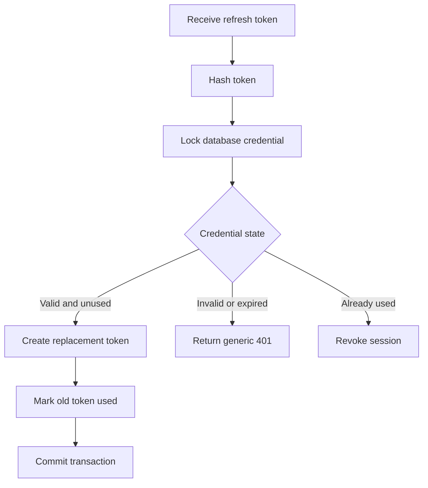

# Multi-User TODO Platform API

## 1. Overview

The Multi-User TODO Platform is being migrated from a single application to independently deployable services.

Clients access the platform through the API Gateway.

The API Gateway is the only public application entry point. Internal services are not directly reachable from a client.

This document contains only endpoints that are currently implemented and verified in the distributed platform.

The previous monolithic API documentation is preserved at:

```text
docs/legacy/day2-monolith-api.md
```

## 2. Public Base URL

```text
http://localhost:3000
```

Future versioned business endpoints will begin with:

```text
/api/v1
```

Operational health endpoints are not versioned.

## 3. Content Type

Endpoints that accept a request body require:

```http
Content-Type: application/json
```

JSON request bodies are limited to 100 KB.

## 4. Request IDs

The Gateway accepts an optional request ID:

```http
x-request-id: UUID
```

If the supplied value is a valid UUID, the Gateway preserves it.

If the value is missing or invalid, the Gateway generates a new UUID.

Every response includes:

```http
x-request-id: UUID
```

The same request ID is used in structured logs and error responses.

## 5. Standard Error Response

All platform errors use the following structure:

```json
{
  "error": {
    "code": "ERROR_CODE",
    "message": "Safe human-readable message",
    "requestId": "a4fcd832-4a93-45cf-aefe-71325d578ac6"
  }
}
```

Validation errors may include an optional `details` array:

```json
{
  "error": {
    "code": "VALIDATION_ERROR",
    "message": "Invalid request",
    "requestId": "a4fcd832-4a93-45cf-aefe-71325d578ac6",
    "details": [
      {
        "field": "body.email",
        "message": "Invalid email address"
      }
    ]
  }
}
```

### Error fields

| Field                     | Type        | Description                                        |
| ------------------------- | ----------- | -------------------------------------------------- |
| `error`                   | object      | Contains error information                         |
| `error.code`              | string      | Stable machine-readable error code                 |
| `error.message`           | string      | Safe human-readable message                        |
| `error.requestId`         | string/UUID | Identifier used to correlate the request with logs |
| `error.details`           | array       | Optional validation-error details                  |
| `error.details[].field`   | string      | Optional invalid request field                     |
| `error.details[].message` | string      | Validation failure message                         |

Internal stack traces, database credentials, passwords and tokens are not returned in error responses.

# Public Operational Endpoints

## 6. Gateway Health

Reports whether the Gateway process is available.

### Request

```http
GET /health
```

### Authentication

Not required.

### Path parameters

None.

### Query parameters

None.

### Request body

None.

### Example request

```powershell
curl.exe -i http://localhost:3000/health
```

### Successful response

```http
HTTP/1.1 200 OK
Content-Type: application/json
x-request-id: UUID
```

```json
{
  "status": "healthy",
  "service": "gateway"
}
```

### Response fields

| Field     | Type   | Description                  |
| --------- | ------ | ---------------------------- |
| `status`  | string | Current Gateway status       |
| `service` | string | Service reporting its health |

### Current behaviour

The Gateway does not yet use Redis or call the Account Service in the current implementation part.

Therefore, this endpoint reports the Gateway process health only.

Downstream dependency status will be added after those dependencies are integrated.

# Internal Operational Endpoints

Internal endpoints are available only through the Docker network. They are not public client APIs.

## 7. Account Service Health

Reports whether the Account Service can reach its owned PostgreSQL database.

### Internal address

```text
http://account-service:3001/health
```

### Request

```http
GET /health
```

### Authentication

Not required inside the development Docker network.

This endpoint is not published to a host port.

### Example internal request

Run the request from the Gateway container:

```powershell
docker compose exec gateway `
  wget `
  -qO- `
  http://account-service:3001/health
```

### Healthy response

```http
HTTP/1.1 200 OK
Content-Type: application/json
x-request-id: UUID
```

```json
{
  "status": "healthy",
  "service": "account-service",
  "dependencies": {
    "database": "available"
  }
}
```

### Database-unavailable response

```http
HTTP/1.1 503 Service Unavailable
Content-Type: application/json
x-request-id: UUID
```

```json
{
  "status": "unhealthy",
  "service": "account-service",
  "dependencies": {
    "database": "unavailable"
  }
}
```

### Response fields

| Field                   | Type   | Description                                               |
| ----------------------- | ------ | --------------------------------------------------------- |
| `status`                | string | `healthy` or `unhealthy`                                  |
| `service`               | string | Service reporting its health                              |
| `dependencies`          | object | Availability of dependencies owned or used by the service |
| `dependencies.database` | string | `available` or `unavailable`                              |

### Failure behaviour

If PostgreSQL is unavailable:

* The Account Service process remains running.
* The endpoint remains reachable through the Docker network.
* The endpoint returns `503`.
* The database is reported as unavailable.
* The Account Service does not expose database credentials.
* The Account Service can recover after PostgreSQL returns without requiring a process restart.

# Gateway Error Responses

## 8. Unknown Public Route

### Example request

```powershell
curl.exe -i http://localhost:3000/unknown
```

### Response

```http
HTTP/1.1 404 Not Found
```

```json
{
  "error": {
    "code": "ROUTE_NOT_FOUND",
    "message": "Route GET /unknown was not found",
    "requestId": "UUID"
  }
}
```

## 9. Invalid JSON

### Response

```http
HTTP/1.1 400 Bad Request
```

```json
{
  "error": {
    "code": "INVALID_JSON",
    "message": "Request body contains invalid JSON",
    "requestId": "UUID"
  }
}
```

## 10. Payload Too Large

A JSON body larger than 100 KB is rejected.

### Response

```http
HTTP/1.1 413 Payload Too Large
```

```json
{
  "error": {
    "code": "PAYLOAD_TOO_LARGE",
    "message": "Request body is too large",
    "requestId": "UUID"
  }
}
```

# Implementation Status

| Endpoint                         | Exposure               | Status                                          |
| -------------------------------- | ---------------------- | ----------------------------------------------- |
| `GET /health` on Gateway         | Public                 | Implemented and tested                          |
| `GET /health` on Account Service | Internal               | Implemented and tested                          |
| `POST /api/v1/auth/register`     | Public through Gateway | Not implemented in the distributed platform yet |
| `POST /api/v1/auth/login`        | Public through Gateway | Not implemented in the distributed platform yet |
| `GET /api/v1/auth/me`            | Public through Gateway | Not implemented in the distributed platform yet |
| Todo endpoints                   | Public through Gateway | Not migrated to the distributed platform yet    |

An endpoint must be changed to `Implemented and tested` only after its implementation, automated tests and manual verification are complete.

# Multi-User TODO Platform API

## 1. Document Status

This document describes the HTTP API implemented through Part 7.

Current implementation status:

| Capability | Status |
|---|---|
| Gateway health endpoint | Implemented |
| Account Service internal health endpoint | Implemented |
| Account database migrations | Implemented |
| Users table | Implemented |
| Transactional outbox table | Implemented |
| Public Registration API | Implemented |
| Internal Account Registration API | Implemented |
| Login API | Not implemented |
| Logout API | Not implemented |
| Token refresh API | Not implemented |
| Current-user API | Not implemented |
| TODO APIs | Not implemented in the microservice platform |
| Outbox publisher | Not implemented |
| RabbitMQ event publishing | Not implemented |

---

## 2. Base URLs

### Public API Gateway

External clients must communicate only with the Gateway.

```text
http://localhost:3000
```

### Internal Account Service

The Account Service is available only inside the Docker network.

```text
http://account-service:3001
```

The Account Service port must not be published to external clients.

---

## 3. Public API Summary

| Method | Endpoint | Authentication | Status |
|---|---|---|---|
| `GET` | `/health` | Not required | Implemented |
| `POST` | `/api/v1/auth/register` | Not required | Implemented |

---

## 4. Internal API Summary

| Method | Endpoint | Authentication | Status |
|---|---|---|---|
| `GET` | `/health` | Docker network access | Implemented |
| `POST` | `/internal/v1/accounts/register` | Internal service key | Implemented |

Internal endpoints are not intended for browsers, mobile clients or external API consumers.

---

## 5. Common Headers

### Content-Type

JSON requests must include:

```http
Content-Type: application/json
```

### Request ID

A client may send:

```http
X-Request-ID: 42c06bb5-a32d-4da8-8050-ddc480972b20
```

When a valid request ID is not provided, the Gateway creates one.

The response includes the request ID:

```http
X-Request-ID: 42c06bb5-a32d-4da8-8050-ddc480972b20
```

The same request ID is forwarded to internal services.

### Internal service key

The Gateway uses the following header when calling a protected Account Service internal endpoint:

```http
X-Internal-Service-Key: configured-internal-secret
```

External clients must not send or receive this value.

---

## 6. Standard Error Format

All public errors use the following structure:

```json
{
  "error": {
    "code": "ERROR_CODE",
    "message": "Human-readable error message",
    "requestId": "42c06bb5-a32d-4da8-8050-ddc480972b20"
  }
}
```

Validation errors may include field details:

```json
{
  "error": {
    "code": "VALIDATION_ERROR",
    "message": "Request validation failed",
    "requestId": "42c06bb5-a32d-4da8-8050-ddc480972b20",
    "details": [
      {
        "field": "email",
        "message": "A valid email address is required"
      }
    ]
  }
}
```

The API never returns:

- Stack traces
- SQL statements
- Raw PostgreSQL errors
- Passwords
- Password hashes
- Internal service secrets
- Database credentials

---

# Public Endpoints

## 7. Gateway Health

### `GET /health`

Checks whether the Gateway process is running.

### Authentication

Not required.

### Request

```http
GET /health HTTP/1.1
Host: localhost:3000
```

### Successful response

Status:

```text
200 OK
```

Example:

```json
{
  "status": "healthy",
  "service": "gateway"
}
```

### cURL

```bash
curl --request GET \
  --url http://localhost:3000/health
```

### PowerShell

```powershell
curl.exe -i http://localhost:3000/health
```

The Gateway health endpoint confirms only that the Gateway process is responding. It does not guarantee that every downstream service is available.

---

## 8. Register User

### `POST /api/v1/auth/register`

Creates a new user account.

The public request must be sent through the Gateway.

### Authentication

Not required.

### Request headers

```http
Content-Type: application/json
```

Optional:

```http
X-Request-ID: 42c06bb5-a32d-4da8-8050-ddc480972b20
```

### Request body

```json
{
  "email": "user@example.com",
  "password": "StrongPassword123!"
}
```

### Request fields

| Field | Type | Required | Rules |
|---|---|---|---|
| `email` | String | Yes | Valid email, maximum 254 characters |
| `password` | String | Yes | Between 12 and 128 characters |

### Email normalization

The service trims the email and converts it to lowercase.

Input:

```json
{
  "email": "  User@Example.COM  ",
  "password": "StrongPassword123!"
}
```

Stored email:

```text
user@example.com
```

### Successful response

Status:

```text
201 Created
```

Example body:

```json
{
  "data": {
    "user": {
      "id": "a95fd118-f777-4500-9ea9-7d1a650fdadb",
      "email": "user@example.com",
      "createdAt": "2026-09-21T08:30:00.000Z"
    }
  }
}
```

Example response headers:

```http
HTTP/1.1 201 Created
Content-Type: application/json
X-Request-ID: 42c06bb5-a32d-4da8-8050-ddc480972b20
```

The response does not contain:

- Password
- Password hash
- Access token
- Refresh token
- Session ID
- Outbox event ID

Registration creates the account only. The client must use the future Login API to create an authenticated session.

### cURL

```bash
curl --request POST \
  --url http://localhost:3000/api/v1/auth/register \
  --header "Content-Type: application/json" \
  --header "X-Request-ID: 42c06bb5-a32d-4da8-8050-ddc480972b20" \
  --data '{
    "email": "user@example.com",
    "password": "StrongPassword123!"
  }'
```

### Windows PowerShell

```powershell
$body = @{
  email = "user@example.com"
  password = "StrongPassword123!"
} | ConvertTo-Json

Invoke-RestMethod `
  -Method Post `
  -Uri "http://localhost:3000/api/v1/auth/register" `
  -ContentType "application/json" `
  -Headers @{
    "X-Request-ID" = "42c06bb5-a32d-4da8-8050-ddc480972b20"
  } `
  -Body $body
```

### Windows `curl.exe`

```powershell
curl.exe -i `
  -X POST `
  "http://localhost:3000/api/v1/auth/register" `
  -H "Content-Type: application/json" `
  -H "X-Request-ID: 42c06bb5-a32d-4da8-8050-ddc480972b20" `
  -d '{\"email\":\"user@example.com\",\"password\":\"StrongPassword123!\"}'
```

---

## 9. Registration Validation Errors

### Invalid email

Request:

```json
{
  "email": "not-an-email",
  "password": "StrongPassword123!"
}
```

Response status:

```text
400 Bad Request
```

Example response:

```json
{
  "error": {
    "code": "VALIDATION_ERROR",
    "message": "Request validation failed",
    "requestId": "42c06bb5-a32d-4da8-8050-ddc480972b20",
    "details": [
      {
        "field": "email",
        "message": "A valid email address is required"
      }
    ]
  }
}
```

### Password too short

Request:

```json
{
  "email": "user@example.com",
  "password": "short"
}
```

Response status:

```text
400 Bad Request
```

Example response:

```json
{
  "error": {
    "code": "VALIDATION_ERROR",
    "message": "Request validation failed",
    "requestId": "42c06bb5-a32d-4da8-8050-ddc480972b20",
    "details": [
      {
        "field": "password",
        "message": "Password must contain at least 12 characters"
      }
    ]
  }
}
```

### Password too long

A password containing more than 128 characters returns:

```text
400 Bad Request
```

### Missing email

Request:

```json
{
  "password": "StrongPassword123!"
}
```

Response status:

```text
400 Bad Request
```

### Missing password

Request:

```json
{
  "email": "user@example.com"
}
```

Response status:

```text
400 Bad Request
```

### Empty body

Request:

```json
{}
```

Response status:

```text
400 Bad Request
```

### Unexpected fields

If strict request validation is enabled, unexpected fields are rejected.

Request:

```json
{
  "email": "user@example.com",
  "password": "StrongPassword123!",
  "role": "admin"
}
```

Response status:

```text
400 Bad Request
```

A client cannot assign its own role through registration.

---

## 10. Duplicate Email

When the normalized email already exists:

Status:

```text
409 Conflict
```

Example response:

```json
{
  "error": {
    "code": "EMAIL_ALREADY_REGISTERED",
    "message": "An account with this email already exists",
    "requestId": "42c06bb5-a32d-4da8-8050-ddc480972b20"
  }
}
```

Email comparison uses the normalized stored value.

Therefore, these values represent the same account:

```text
user@example.com
User@Example.com
  USER@EXAMPLE.COM
```

The database unique index is the authoritative duplicate-email protection.

---

## 11. Invalid JSON

Malformed JSON returns:

Status:

```text
400 Bad Request
```

Example request:

```text
{"email":"user@example.com","password":
```

Example response:

```json
{
  "error": {
    "code": "INVALID_JSON",
    "message": "Request body contains invalid JSON",
    "requestId": "42c06bb5-a32d-4da8-8050-ddc480972b20"
  }
}
```

---

## 12. Account Service Unavailable

When the Gateway cannot connect to the Account Service:

Status:

```text
503 Service Unavailable
```

Example response:

```json
{
  "error": {
    "code": "SERVICE_UNAVAILABLE",
    "message": "Account service is temporarily unavailable",
    "requestId": "42c06bb5-a32d-4da8-8050-ddc480972b20"
  }
}
```

The Gateway does not expose the internal URL or raw network error.

---

## 13. Account Service Timeout

When the Account Service does not respond before the configured deadline:

Status:

```text
504 Gateway Timeout
```

Example response:

```json
{
  "error": {
    "code": "DOWNSTREAM_TIMEOUT",
    "message": "Account service did not respond in time",
    "requestId": "42c06bb5-a32d-4da8-8050-ddc480972b20"
  }
}
```

Registration is not automatically retried because no registration idempotency key has been implemented.

---

## 14. Unexpected Registration Failure

An unexpected internal failure returns:

Status:

```text
500 Internal Server Error
```

Example response:

```json
{
  "error": {
    "code": "INTERNAL_ERROR",
    "message": "An unexpected error occurred",
    "requestId": "42c06bb5-a32d-4da8-8050-ddc480972b20"
  }
}
```

The response must not reveal whether the failure came from hashing, SQL, transaction handling or another internal component.

---

# Internal Endpoints

## 15. Account Service Health

### `GET /health`

Checks the Account Service and PostgreSQL dependency.

This endpoint is intended for internal health checks.

### Healthy response

Status:

```text
200 OK
```

Example:

```json
{
  "status": "healthy",
  "service": "account-service",
  "dependencies": {
    "database": "available"
  }
}
```

### Database unavailable response

Status:

```text
503 Service Unavailable
```

Example:

```json
{
  "status": "unhealthy",
  "service": "account-service",
  "dependencies": {
    "database": "unavailable"
  }
}
```

A database outage must not cause an unhandled PostgreSQL pool error.

---

## 16. Internal Account Registration

### `POST /internal/v1/accounts/register`

Creates a user and its outbox event inside one PostgreSQL transaction.

This endpoint is called by the Gateway.

It is not a public client endpoint.

### Required headers

```http
Content-Type: application/json
X-Internal-Service-Key: configured-internal-secret
X-Request-ID: 42c06bb5-a32d-4da8-8050-ddc480972b20
```

### Request body

```json
{
  "email": "user@example.com",
  "password": "StrongPassword123!"
}
```

### Successful response

Status:

```text
201 Created
```

Example:

```json
{
  "data": {
    "user": {
      "id": "a95fd118-f777-4500-9ea9-7d1a650fdadb",
      "email": "user@example.com",
      "createdAt": "2026-09-21T08:30:00.000Z"
    }
  }
}
```

### Missing or incorrect internal service key

Status:

```text
401 Unauthorized
```

Example:

```json
{
  "error": {
    "code": "INTERNAL_SERVICE_UNAUTHORIZED",
    "message": "Internal service authentication failed",
    "requestId": "42c06bb5-a32d-4da8-8050-ddc480972b20"
  }
}
```

The response does not indicate whether the header was missing or had an incorrect value.

---

## 17. Registration Database Effects

A successful registration creates one user row:

```sql
SELECT
  id,
  email,
  password_hash,
  created_at,
  updated_at
FROM users
WHERE email = 'user@example.com';
```

It also creates one pending outbox event:

```sql
SELECT
  id,
  aggregate_type,
  aggregate_id,
  event_type,
  event_version,
  payload,
  request_id,
  occurred_at,
  published_at
FROM outbox_events
WHERE aggregate_id = '<USER_ID>';
```

Expected event properties:

| Property | Expected value |
|---|---|
| `aggregate_type` | `account` |
| `aggregate_id` | Created user ID |
| `event_type` | `account.registered` |
| `event_version` | `1` |
| `request_id` | Registration request ID |
| `published_at` | `NULL` |

The payload contains only:

```json
{
  "userId": "a95fd118-f777-4500-9ea9-7d1a650fdadb",
  "email": "user@example.com"
}
```

It must not contain password information.

---

## 18. Registration Status Codes

| Status | Code | Meaning |
|---|---|---|
| `201` | Not applicable | Account created |
| `400` | `VALIDATION_ERROR` | Request data is invalid |
| `400` | `INVALID_JSON` | Request JSON is malformed |
| `401` | `INTERNAL_SERVICE_UNAUTHORIZED` | Internal service authentication failed |
| `404` | `ROUTE_NOT_FOUND` | Endpoint does not exist |
| `409` | `EMAIL_ALREADY_REGISTERED` | Normalized email already exists |
| `413` | Framework-dependent | Request body exceeds configured limit |
| `500` | `INTERNAL_ERROR` | Unexpected internal failure |
| `503` | `SERVICE_UNAVAILABLE` | Required downstream service is unavailable |
| `504` | `DOWNSTREAM_TIMEOUT` | Account Service exceeded its deadline |

---

## 19. Registration Failure Guarantees

| Failure | User created | Outbox event created |
|---|---:|---:|
| Request validation fails | No | No |
| Internal authentication fails | No | No |
| Password hashing fails | No | No |
| User insert fails | No | No |
| Duplicate email | No new user | No |
| Outbox insert fails | No, user insert is rolled back | No |
| Transaction commit fails | No confirmed registration | No confirmed event |
| Successful transaction | Yes | Yes |
| RabbitMQ is unavailable | Yes | Yes, remains pending |
| Redis is unavailable | Yes | Yes |
| Mailpit is unavailable | Yes | Yes |

Registration succeeds only after the database transaction commits.

---

## 20. Unknown Route

An unknown public route returns:

Status:

```text
404 Not Found
```

Example response:

```json
{
  "error": {
    "code": "ROUTE_NOT_FOUND",
    "message": "Route not found",
    "requestId": "42c06bb5-a32d-4da8-8050-ddc480972b20"
  }
}
```

---

## 21. Security Notes

Registration follows these rules:

- Clients access registration only through the Gateway.
- The Account Service remains private.
- Internal calls require service authentication.
- Passwords are accepted only over trusted HTTP boundaries.
- Production environments must use TLS.
- Passwords are never logged.
- Passwords are never stored as plain text.
- Password hashes are never returned.
- Password data is never placed in an event.
- Emails are normalized before storage.
- Duplicate emails are protected by a database unique index.
- Raw database errors are not returned.
- The Gateway does not trust client-provided roles.
- The internal service secret is never returned to clients.

---

## 22. Current API Limitations

After registration, the user cannot log in yet because the following endpoints are not part of Part 7:

```text
POST /api/v1/auth/login
POST /api/v1/auth/refresh
POST /api/v1/auth/logout
GET  /api/v1/users/me
```

The Registration API does not return authentication tokens.

The `account.registered` event is stored in the outbox but is not published to RabbitMQ until the outbox publisher is implemented.

# Multi-User TODO Platform API

## 1. Document Status

This document describes the HTTP API implemented through Part 8.

| Capability | Status |
|---|---|
| Gateway health endpoint | Implemented |
| Account Service health endpoint | Implemented |
| Public Registration API | Implemented |
| Transactional registration outbox | Implemented |
| Public Login API | Implemented |
| Persistent sessions | Implemented |
| JWT access-token creation | Implemented |
| Opaque refresh-token creation | Implemented |
| Token refresh API | Not implemented |
| Logout API | Not implemented |
| Current-user API | Not implemented |
| TODO APIs | Not implemented in the microservice platform |
| Outbox event publisher | Not implemented |

---

## 2. Base URLs

### Public API Gateway

External clients must communicate only with:

```text
http://localhost:3000
```

### Internal Account Service

The Account Service is accessible only inside the Docker network:

```text
http://account-service:3001
```

External clients must not call the Account Service directly.

---

## 3. Public API Summary

| Method | Endpoint | Authentication | Status |
|---|---|---|---|
| `GET` | `/health` | Not required | Implemented |
| `POST` | `/api/v1/auth/register` | Not required | Implemented |
| `POST` | `/api/v1/auth/login` | Not required | Implemented |

---

## 4. Internal API Summary

| Method | Endpoint | Authentication | Status |
|---|---|---|---|
| `GET` | `/health` | Internal network | Implemented |
| `POST` | `/internal/v1/accounts/register` | Internal service key | Implemented |
| `POST` | `/internal/v1/auth/login` | Internal service key | Implemented |

---

## 5. Standard Headers

JSON requests must include:

```http
Content-Type: application/json
```

Clients may provide:

```http
X-Request-ID: 42c06bb5-a32d-4da8-8050-ddc480972b20
```

If a valid request ID is not supplied, the Gateway creates one.

The response includes:

```http
X-Request-ID: 42c06bb5-a32d-4da8-8050-ddc480972b20
```

Internal Gateway requests also include:

```http
X-Internal-Service-Key: configured-secret
```

External clients must not send or receive the internal service secret.

---

## 6. Standard Error Response

```json
{
  "error": {
    "code": "ERROR_CODE",
    "message": "Human-readable error message",
    "requestId": "42c06bb5-a32d-4da8-8050-ddc480972b20"
  }
}
```

Validation responses may include:

```json
{
  "error": {
    "code": "VALIDATION_ERROR",
    "message": "Request validation failed",
    "requestId": "42c06bb5-a32d-4da8-8050-ddc480972b20",
    "details": [
      {
        "field": "email",
        "message": "A valid email address is required"
      }
    ]
  }
}
```

The API never returns:

- Stack traces
- Raw SQL errors
- Passwords
- Password hashes
- JWT secrets
- Internal service secrets
- Database credentials

---

# Login API

## 7. Login

### `POST /api/v1/auth/login`

Authenticates an existing user and creates a persistent session.

### Authentication

Not required.

### Request

```http
POST /api/v1/auth/login HTTP/1.1
Host: localhost:3000
Content-Type: application/json
X-Request-ID: 42c06bb5-a32d-4da8-8050-ddc480972b20
```

### Request body

```json
{
  "email": "user@example.com",
  "password": "StrongPassword123!"
}
```

### Request fields

| Field | Type | Required | Rules |
|---|---|---|---|
| `email` | String | Yes | Valid email, maximum 254 characters |
| `password` | String | Yes | Non-empty, maximum 128 characters |

The email is trimmed and converted to lowercase before account lookup.

---

## 8. Successful Login

Status:

```text
200 OK
```

Example response:

```json
{
  "data": {
    "user": {
      "id": "a95fd118-f777-4500-9ea9-7d1a650fdadb",
      "email": "user@example.com"
    },
    "accessToken": "eyJhbGciOiJIUzI1NiIsInR5cCI6IkpXVCJ9.example-signature",
    "refreshToken": "random-opaque-refresh-token",
    "accessTokenExpiresIn": 900,
    "refreshTokenExpiresIn": 604800
  }
}
```

### Response fields

| Field | Description |
|---|---|
| `data.user.id` | Authenticated user ID |
| `data.user.email` | Normalized email |
| `data.accessToken` | Short-lived JWT |
| `data.refreshToken` | Long-lived opaque credential |
| `data.accessTokenExpiresIn` | Access-token lifetime in seconds |
| `data.refreshTokenExpiresIn` | Refresh-token lifetime in seconds |

The response never contains the password or password hash.

---

## 9. PowerShell Login Example

```powershell
$body = @{
  email = "user@example.com"
  password = "StrongPassword123!"
} | ConvertTo-Json

Invoke-RestMethod `
  -Method Post `
  -Uri "http://localhost:3000/api/v1/auth/login" `
  -ContentType "application/json" `
  -Headers @{
    "X-Request-ID" =
      "42c06bb5-a32d-4da8-8050-ddc480972b20"
  } `
  -Body $body
```

---

## 10. cURL Login Example

```bash
curl --request POST \
  --url http://localhost:3000/api/v1/auth/login \
  --header "Content-Type: application/json" \
  --data '{
    "email": "user@example.com",
    "password": "StrongPassword123!"
  }'
```

---

## 11. Invalid Credentials

Unknown email and incorrect password return exactly the same response.

Status:

```text
401 Unauthorized
```

```json
{
  "error": {
    "code": "INVALID_CREDENTIALS",
    "message": "Email or password is incorrect",
    "requestId": "42c06bb5-a32d-4da8-8050-ddc480972b20"
  }
}
```

The API does not reveal whether:

- The email exists
- The password was incorrect
- The account lookup returned no record

---

## 12. Login Validation Failure

Status:

```text
400 Bad Request
```

Example invalid email:

```json
{
  "email": "invalid-email",
  "password": "StrongPassword123!"
}
```

Example response:

```json
{
  "error": {
    "code": "VALIDATION_ERROR",
    "message": "Request validation failed",
    "requestId": "42c06bb5-a32d-4da8-8050-ddc480972b20",
    "details": [
      {
        "field": "email",
        "message": "A valid email address is required"
      }
    ]
  }
}
```

An empty password also returns `400`.

Unexpected properties are rejected:

```json
{
  "email": "user@example.com",
  "password": "StrongPassword123!",
  "role": "admin"
}
```

---

## 13. Account Service Unavailable

If the Gateway immediately determines that the Account Service is unavailable:

```text
503 Service Unavailable
```

```json
{
  "error": {
    "code": "SERVICE_UNAVAILABLE",
    "message": "Account service is temporarily unavailable",
    "requestId": "42c06bb5-a32d-4da8-8050-ddc480972b20"
  }
}
```

---

## 14. Account Service Timeout

If the Account Service does not respond before the configured deadline:

```text
504 Gateway Timeout
```

```json
{
  "error": {
    "code": "DOWNSTREAM_TIMEOUT",
    "message": "Account service did not respond in time",
    "requestId": "42c06bb5-a32d-4da8-8050-ddc480972b20"
  }
}
```

Login is not automatically retried because an unsuccessful response does not prove that the Account Service failed before creating the session.

---

# Internal Login API

## 15. Internal Login

### `POST /internal/v1/auth/login`

Used by the Gateway to authenticate a user.

This endpoint is not publicly accessible.

### Required headers

```http
Content-Type: application/json
X-Request-ID: 42c06bb5-a32d-4da8-8050-ddc480972b20
X-Internal-Service-Key: configured-secret
```

### Request body

```json
{
  "email": "user@example.com",
  "password": "StrongPassword123!"
}
```

### Successful response

Status:

```text
200 OK
```

```json
{
  "data": {
    "user": {
      "id": "a95fd118-f777-4500-9ea9-7d1a650fdadb",
      "email": "user@example.com"
    },
    "accessToken": "signed-access-token",
    "refreshToken": "opaque-refresh-token",
    "accessTokenExpiresIn": 900,
    "refreshTokenExpiresIn": 604800
  }
}
```

### Internal authentication failure

Status:

```text
401 Unauthorized
```

```json
{
  "error": {
    "code": "INTERNAL_SERVICE_UNAUTHORIZED",
    "message": "Internal service authentication failed",
    "requestId": "42c06bb5-a32d-4da8-8050-ddc480972b20"
  }
}
```

---

## 16. Token Security

### Access token

The access token:

- Is a signed JWT
- Has a short lifetime
- Contains the user and session identifiers
- Must be sent using the Bearer authentication scheme on future protected endpoints

Example:

```http
Authorization: Bearer ACCESS_TOKEN
```

### Refresh token

The refresh token:

- Is an opaque random credential
- Has a longer lifetime
- Is returned only after successful Login
- Must be stored securely by the client
- Is stored only as a hash by the Account Service

The current API does not yet provide a token-refresh endpoint.

---

## 17. Login Status Codes

| Status | Error code | Meaning |
|---|---|---|
| `200` | Not applicable | Login succeeded |
| `400` | `VALIDATION_ERROR` | Invalid Login request |
| `400` | `INVALID_JSON` | Malformed JSON |
| `401` | `INVALID_CREDENTIALS` | Unknown email or incorrect password |
| `401` | `INTERNAL_SERVICE_UNAUTHORIZED` | Internal service authentication failed |
| `413` | `PAYLOAD_TOO_LARGE` | Request exceeds the body-size limit |
| `500` | `INTERNAL_SERVER_ERROR` | Unexpected internal failure |
| `502` | `INVALID_DOWNSTREAM_RESPONSE` | Invalid Account Service response |
| `503` | `SERVICE_UNAVAILABLE` | Account Service is unavailable |
| `504` | `DOWNSTREAM_TIMEOUT` | Account Service exceeded the deadline |

---

## 18. Login Database Effects

Successful Login creates:

- One `sessions` row
- One `refresh_tokens` row

Verify sessions:

```sql
SELECT
  id,
  user_id,
  expires_at,
  revoked_at,
  created_at
FROM sessions
ORDER BY created_at DESC;
```

Verify refresh-token records:

```sql
SELECT
  id,
  session_id,
  family_id,
  token_hash,
  expires_at,
  used_at,
  created_at
FROM refresh_tokens
ORDER BY created_at DESC;
```

The `token_hash` value must not equal the refresh token returned to the client.

Failed Login must not create either row.

---

## 19. Login Limitations

Part 8 creates persistent sessions and credentials, but the following operations are not implemented yet:

```text
POST /api/v1/auth/refresh
POST /api/v1/auth/logout
POST /api/v1/auth/logout-all
GET  /api/v1/users/me
```

Refresh-token rotation, reuse detection and session revocation are implemented in later parts.

# Part 9 — Refresh-Token Rotation and Reuse Detection

## Purpose

Part 9 implements single-use refresh-token rotation.

A valid refresh token is exchanged for:

- A new JWT access token
- A new opaque refresh token

The old refresh token is permanently marked as used.

## Security Flow



## Concurrency Protection

PostgreSQL `SELECT ... FOR UPDATE` locks the refresh-token and session rows.

Two concurrent requests cannot both rotate the same token successfully.

## Reuse Detection

A refresh token may be used only once.

If a token with a non-null `used_at` value is submitted again:

1. The Account Service treats it as possible credential theft.
2. The complete session is revoked.
3. The API returns the generic `INVALID_REFRESH_TOKEN` error.
4. Tokens belonging to the revoked session can no longer be refreshed.

## Persistence Guarantee

The replacement token insert and previous-token update occur in one transaction.

Valid outcomes:

| Previous token | Replacement token | Result |
|---|---|---|
| Marked used | Created | Rotation succeeds |
| Unchanged | Not created | Rotation fails |
| Already used | Session revoked | Reuse detected |

## Token Storage

The raw refresh token is never stored.

Only its SHA-256 hash is persisted in `refresh_tokens.token_hash`.

## Sliding Session Expiration

A successful rotation extends the session expiry to match the newly issued refresh token.

## Public Error Behaviour

Unknown, expired, revoked and reused refresh tokens return the same response:

```text
401 INVALID_REFRESH_TOKEN
```

This avoids exposing internal credential state.

## Part 9 Scope

Implemented:

- Public refresh endpoint
- Internal refresh endpoint
- Refresh-token rotation
- Row-level locking
- Token-family preservation
- Token reuse detection
- Session revocation
- Sliding session expiry
- Unit and validation tests

Not implemented:

- Logout
- Logout all devices
- Current-user endpoint
- Gateway session projection

# Logout APIs

## Logout Current Session

### `POST /api/v1/auth/logout`

Revokes the session identified by the Bearer access token.

### Required header

```http
Authorization: Bearer ACCESS_TOKEN
```

### Success

```text
204 No Content
```

The response has no body.

### Missing or invalid token

```text
401 Unauthorized
```

```json
{
  "error": {
    "code": "UNAUTHORIZED",
    "message": "A valid access token is required",
    "requestId": "request-uuid"
  }
}
```

Logout is idempotent. Repeating a valid Logout request does not produce a server error.

---

## Logout All Sessions

### `POST /api/v1/auth/logout-all`

Revokes every active session belonging to the authenticated user.

### Required header

```http
Authorization: Bearer ACCESS_TOKEN
```

### Success

```text
204 No Content
```

The response has no body.

### Security effect

After successful Logout:

- Current-session refresh token fails.
- Rotated refresh tokens for the revoked session fail.
- Logout-all invalidates refresh capability for all user sessions.
- Existing short-lived access tokens expire naturally.

### Status codes

| Status | Code | Meaning |
|---|---|---|
| `204` | Not applicable | Logout succeeded |
| `401` | `UNAUTHORIZED` | Access token missing or invalid |
| `500` | `INTERNAL_SERVER_ERROR` | Unexpected internal failure |
| `503` | `SERVICE_UNAVAILABLE` | Account Service unavailable |
| `504` | `DOWNSTREAM_TIMEOUT` | Account Service timeout |

# Current User Profile

## `GET /api/v1/users/me`

Returns the profile belonging to the authenticated user.

### Authentication

Required:

```http
Authorization: Bearer ACCESS_TOKEN
```

### Successful response

Status:

```text
200 OK
```

```json
{
  "data": {
    "user": {
      "id": "a95fd118-f777-4500-9ea9-7d1a650fdadb",
      "email": "user@example.com",
      "createdAt": "2026-09-21T08:00:00.000Z",
      "updatedAt": "2026-09-21T08:00:00.000Z"
    }
  }
}
```

### Missing or invalid access token

Status:

```text
401 Unauthorized
```

```json
{
  "error": {
    "code": "UNAUTHORIZED",
    "message": "A valid access token is required",
    "requestId": "request-uuid"
  }
}
```

### Revoked, expired or missing session

Status:

```text
401 Unauthorized
```

```json
{
  "error": {
    "code": "SESSION_INVALID",
    "message": "Session is invalid or expired",
    "requestId": "request-uuid"
  }
}
```

### Security rules

- A valid JWT alone is not enough.
- The Account Service verifies the persistent session.
- Revoked sessions are rejected.
- Expired sessions are rejected.
- A session cannot access another user's profile.
- Password hashes are never returned.

### Status codes

| Status | Code | Meaning |
|---|---|---|
| `200` | Not applicable | Profile returned |
| `401` | `UNAUTHORIZED` | Access token invalid |
| `401` | `SESSION_INVALID` | Persistent session invalid |
| `500` | `INTERNAL_SERVER_ERROR` | Unexpected internal failure |
| `503` | `SERVICE_UNAVAILABLE` | Account Service unavailable |
| `504` | `DOWNSTREAM_TIMEOUT` | Account Service timeout |

# Current User Profile

## `GET /api/v1/users/me`

Returns the profile belonging to the authenticated user.

### Authentication

Required:

```http
Authorization: Bearer ACCESS_TOKEN
```

### Successful response

Status:

```text
200 OK
```

```json
{
  "data": {
    "user": {
      "id": "a95fd118-f777-4500-9ea9-7d1a650fdadb",
      "email": "user@example.com",
      "createdAt": "2026-09-21T08:00:00.000Z",
      "updatedAt": "2026-09-21T08:00:00.000Z"
    }
  }
}
```

### Missing or invalid access token

Status:

```text
401 Unauthorized
```

```json
{
  "error": {
    "code": "UNAUTHORIZED",
    "message": "A valid access token is required",
    "requestId": "request-uuid"
  }
}
```

### Revoked, expired or missing session

Status:

```text
401 Unauthorized
```

```json
{
  "error": {
    "code": "SESSION_INVALID",
    "message": "Session is invalid or expired",
    "requestId": "request-uuid"
  }
}
```

### Security rules

- A valid JWT alone is not enough.
- The Account Service verifies the persistent session.
- Revoked sessions are rejected.
- Expired sessions are rejected.
- A session cannot access another user's profile.
- Password hashes are never returned.

### Status codes

| Status | Code | Meaning |
|---|---|---|
| `200` | Not applicable | Profile returned |
| `401` | `UNAUTHORIZED` | Access token invalid |
| `401` | `SESSION_INVALID` | Persistent session invalid |
| `500` | `INTERNAL_SERVER_ERROR` | Unexpected internal failure |
| `503` | `SERVICE_UNAVAILABLE` | Account Service unavailable |
| `504` | `DOWNSTREAM_TIMEOUT` | Account Service timeout |

# Change Email

## `PATCH /api/v1/users/me/email`

Changes the authenticated user's email address.

### Authentication

```http
Authorization: Bearer ACCESS_TOKEN
```

### Request

```json
{
  "email": "new@example.com",
  "currentPassword": "StrongPassword123!"
}
```

### Success

Status:

```text
200 OK
```

```json
{
  "data": {
    "user": {
      "id": "user-uuid",
      "email": "new@example.com",
      "updatedAt": "2026-09-21T10:00:00.000Z"
    },
    "reauthenticationRequired": true
  }
}
```

All existing sessions are revoked. The user must log in again using the new email.

### Incorrect current password

```text
401 Unauthorized
```

```json
{
  "error": {
    "code": "INVALID_CREDENTIALS",
    "message": "Current password is incorrect",
    "requestId": "request-uuid"
  }
}
```

### Duplicate email

```text
409 Conflict
```

```json
{
  "error": {
    "code": "EMAIL_ALREADY_REGISTERED",
    "message": "An account with this email already exists",
    "requestId": "request-uuid"
  }
}
```

### Same email

```text
409 Conflict
```

```json
{
  "error": {
    "code": "EMAIL_UNCHANGED",
    "message": "New email must be different from the current email",
    "requestId": "request-uuid"
  }
}
```

### Status codes

| Status | Code | Meaning |
|---|---|---|
| `200` | Not applicable | Email changed |
| `400` | `VALIDATION_ERROR` | Invalid request |
| `401` | `UNAUTHORIZED` | Invalid access token |
| `401` | `SESSION_INVALID` | Session invalid |
| `401` | `INVALID_CREDENTIALS` | Current password incorrect |
| `409` | `EMAIL_UNCHANGED` | New email equals current email |
| `409` | `EMAIL_ALREADY_REGISTERED` | Email belongs to another account |
| `500` | `INTERNAL_SERVER_ERROR` | Unexpected failure |
| `503` | `SERVICE_UNAVAILABLE` | Account Service unavailable |
| `504` | `DOWNSTREAM_TIMEOUT` | Account Service timeout |

## Password Reset Request API

The Password Reset Request API allows a user to request instructions for resetting their password.

The endpoint always returns the same successful response regardless of whether the supplied email address belongs to an account. This behaviour prevents attackers from discovering registered email addresses.

---

### Public endpoint

```http
POST /api/v1/auth/password-reset/request
```

This endpoint is exposed through the API Gateway.

### Internal endpoint

```http
POST /internal/v1/auth/password-reset/request
```

This endpoint belongs to the Account Service and must not be exposed publicly.

The API Gateway calls the internal endpoint using the configured internal service credential.

---

### Authentication

Authentication is not required.

This endpoint is used when a user cannot sign in and therefore does not have a valid access token.

---

### Request headers

| Header | Required | Description |
|---|---:|---|
| `Content-Type` | Yes | Must be `application/json`. |
| `X-Request-ID` | No | Optional UUID used to trace the request across services. The Gateway generates one when it is not provided. |

Example:

```http
Content-Type: application/json
X-Request-ID: 67dd883e-0ca4-4101-9a11-5bf22dbfcaf0
```

---

### Request body

```json
{
  "email": "user@example.com"
}
```

### Request fields

| Field | Type | Required | Validation |
|---|---|---:|---|
| `email` | string | Yes | Must be a valid email address and must not exceed 254 characters. |

The email address is trimmed and converted to lowercase before it is processed.

Additional request properties are rejected.

---

### Successful response

Status:

```http
202 Accepted
```

Body:

```json
{
  "message": "If an account exists for this email, password reset instructions will be sent"
}
```

The response does not confirm whether the email address belongs to an account.

The same status code, response body and message are returned for both registered and unregistered email addresses.

---

### Registered email behaviour

When the email belongs to an active account, the Account Service performs the following operations:

1. Generates a cryptographically secure opaque reset token.
2. Calculates the SHA-256 hash of the token.
3. Invalidates previous unused password-reset tokens belonging to the user.
4. Stores the new token hash and expiration time.
5. Creates an `account.password-reset-requested` transactional outbox event.
6. Commits the token and outbox event in one PostgreSQL transaction.
7. Returns the generic `202 Accepted` response.

Only the token hash is stored in the `password_reset_tokens` table.

The public API never returns the reset token.

---

### Unregistered email behaviour

When the email does not belong to an active account:

1. No password-reset token is created.
2. No outbox event is created.
3. The same generic `202 Accepted` response is returned.

This behaviour prevents account enumeration.

---

### Password-reset token rules

Password-reset tokens have the following properties:

- Tokens are generated using a cryptographically secure random generator.
- Only the SHA-256 token hash is stored in the password-reset token table.
- Tokens expire after the configured password-reset TTL.
- Requesting a newer token invalidates previous unused tokens.
- Tokens are never written to normal application logs.
- Tokens are never returned through the public API.
- A token can only be used for the password-reset operation.
- Token validation and password replacement are handled by the password-reset confirmation API.

---

### Transactional outbox event

When the email belongs to an active account, the Account Service creates this event:

```text
account.password-reset-requested
```

Example event payload:

```json
{
  "userId": "11da4df1-b840-4f1b-a6e0-e191b65c46df",
  "email": "user@example.com",
  "resetToken": "secure-generated-reset-token",
  "expiresAt": "2026-09-22T10:30:00.000Z"
}
```

The outbox publisher processes this event asynchronously and forwards it to the message broker.

The notification component uses the event to send password-reset instructions to the user.

The reset token is sensitive information. It must not be included in application logs, error responses or monitoring labels.

---

## Password Reset Request Examples

### Request with a registered email

```http
POST /api/v1/auth/password-reset/request HTTP/1.1
Host: localhost:3000
Content-Type: application/json
X-Request-ID: 67dd883e-0ca4-4101-9a11-5bf22dbfcaf0

{
  "email": "user@example.com"
}
```

Response:

```http
HTTP/1.1 202 Accepted
Content-Type: application/json
X-Request-ID: 67dd883e-0ca4-4101-9a11-5bf22dbfcaf0
```

```json
{
  "message": "If an account exists for this email, password reset instructions will be sent"
}
```

---

### Request with an unregistered email

```http
POST /api/v1/auth/password-reset/request HTTP/1.1
Host: localhost:3000
Content-Type: application/json

{
  "email": "unknown@example.com"
}
```

Response:

```http
HTTP/1.1 202 Accepted
Content-Type: application/json
```

```json
{
  "message": "If an account exists for this email, password reset instructions will be sent"
}
```

The response intentionally does not reveal that the email address is unregistered.

---

## Error Responses

All error responses follow the common API error structure:

```json
{
  "error": {
    "code": "ERROR_CODE",
    "message": "Human-readable error message",
    "requestId": "67dd883e-0ca4-4101-9a11-5bf22dbfcaf0",
    "details": [
      {
        "field": "email",
        "message": "Validation error message"
      }
    ]
  }
}
```

The `details` property is only included when field-level error information is available.

---

### Invalid email address

Status:

```http
400 Bad Request
```

Request:

```json
{
  "email": "not-an-email"
}
```

Response:

```json
{
  "error": {
    "code": "VALIDATION_ERROR",
    "message": "Request validation failed",
    "requestId": "67dd883e-0ca4-4101-9a11-5bf22dbfcaf0",
    "details": [
      {
        "field": "email",
        "message": "A valid email address is required"
      }
    ]
  }
}
```

---

### Missing email address

Status:

```http
400 Bad Request
```

Request:

```json
{}
```

Response:

```json
{
  "error": {
    "code": "VALIDATION_ERROR",
    "message": "Request validation failed",
    "requestId": "67dd883e-0ca4-4101-9a11-5bf22dbfcaf0",
    "details": [
      {
        "field": "email",
        "message": "Invalid input: expected string, received undefined"
      }
    ]
  }
}
```

The exact validation message may depend on the configured Zod error mapper.

---

### Unknown request property

Status:

```http
400 Bad Request
```

Request:

```json
{
  "email": "user@example.com",
  "role": "admin"
}
```

Response:

```json
{
  "error": {
    "code": "VALIDATION_ERROR",
    "message": "Request validation failed",
    "requestId": "67dd883e-0ca4-4101-9a11-5bf22dbfcaf0",
    "details": [
      {
        "field": "",
        "message": "Unrecognized key: \"role\""
      }
    ]
  }
}
```

---

### Malformed JSON

Status:

```http
400 Bad Request
```

Response:

```json
{
  "error": {
    "code": "INVALID_JSON",
    "message": "Request body contains invalid JSON",
    "requestId": "67dd883e-0ca4-4101-9a11-5bf22dbfcaf0"
  }
}
```

---

### Payload too large

Status:

```http
413 Payload Too Large
```

Response:

```json
{
  "error": {
    "code": "PAYLOAD_TOO_LARGE",
    "message": "Request body is too large",
    "requestId": "67dd883e-0ca4-4101-9a11-5bf22dbfcaf0"
  }
}
```

---

### Account Service unavailable

Status:

```http
503 Service Unavailable
```

Response:

```json
{
  "error": {
    "code": "SERVICE_UNAVAILABLE",
    "message": "Account service is temporarily unavailable",
    "requestId": "67dd883e-0ca4-4101-9a11-5bf22dbfcaf0"
  }
}
```

This response can occur when the Gateway cannot establish a connection to the Account Service.

---

### Account Service timeout

Status:

```http
504 Gateway Timeout
```

Response:

```json
{
  "error": {
    "code": "DOWNSTREAM_TIMEOUT",
    "message": "Account service did not respond in time",
    "requestId": "67dd883e-0ca4-4101-9a11-5bf22dbfcaf0"
  }
}
```

---

### Unexpected server error

Status:

```http
500 Internal Server Error
```

Response:

```json
{
  "error": {
    "code": "INTERNAL_SERVER_ERROR",
    "message": "An unexpected error occurred",
    "requestId": "67dd883e-0ca4-4101-9a11-5bf22dbfcaf0"
  }
}
```

Internal database errors, stack traces, SQL statements and sensitive token values must not be returned to the client.

---

## PowerShell verification

### Registered email

```powershell
curl.exe -i `
  -X POST `
  "http://localhost:3000/api/v1/auth/password-reset/request" `
  -H "Content-Type: application/json" `
  -H "X-Request-ID: 67dd883e-0ca4-4101-9a11-5bf22dbfcaf0" `
  -d '{\"email\":\"user@example.com\"}'
```

Expected status:

```http
202 Accepted
```

---

### Unregistered email

```powershell
curl.exe -i `
  -X POST `
  "http://localhost:3000/api/v1/auth/password-reset/request" `
  -H "Content-Type: application/json" `
  -d '{\"email\":\"unknown@example.com\"}'
```

Expected status:

```http
202 Accepted
```

The response must be identical to the response returned for a registered email.

---

### Invalid email

```powershell
curl.exe -i `
  -X POST `
  "http://localhost:3000/api/v1/auth/password-reset/request" `
  -H "Content-Type: application/json" `
  -d '{\"email\":\"invalid-email\"}'
```

Expected status:

```http
400 Bad Request
```

---

### Verify the token record

```powershell
docker compose exec account-postgres `
  psql `
  -U account_user `
  -d account_db `
  -c "SELECT user_id, token_hash, expires_at, used_at, created_at FROM password_reset_tokens ORDER BY created_at DESC LIMIT 5;"
```

The `token_hash` must contain a 64-character SHA-256 hexadecimal value.

The raw reset token must not appear in the `password_reset_tokens` table.

---

### Verify the outbox event

```powershell
docker compose exec account-postgres `
  psql `
  -U account_user `
  -d account_db `
  -c "SELECT event_type, aggregate_id, request_id, occurred_at, publish_attempts FROM outbox_events WHERE event_type = 'account.password-reset-requested' ORDER BY occurred_at DESC LIMIT 5;"
```

Expected event type:

```text
account.password-reset-requested
```

---

## Security considerations

- The endpoint uses a generic response to prevent account enumeration.
- Email addresses are normalized before lookup.
- Reset tokens are generated using a cryptographically secure generator.
- Only token hashes are stored in the password-reset token table.
- Tokens have a short expiration period.
- Previous unused tokens are invalidated when a new token is requested.
- Token creation and outbox creation use one database transaction.
- Raw tokens must not appear in normal application logs.
- Internal service credentials must never be returned to clients.
- Database errors and stack traces must not be exposed.
- Rate limiting should be applied to reduce password-reset abuse.
- Production systems should encrypt sensitive reset-token information stored inside outbox event payloads.

---

## Reliability behaviour

| Failure | Expected behaviour |
|---|---|
| Email does not exist | Return the generic `202 Accepted` response without creating a token. |
| Token insert fails | Roll back the token and outbox transaction. |
| Outbox insert fails | Roll back the reset-token insert. |
| PostgreSQL is unavailable | Return a controlled server error; do not create partial data. |
| Account Service is unavailable | Gateway returns `503 Service Unavailable`. |
| Account Service times out | Gateway returns `504 Gateway Timeout`. |
| Email delivery is temporarily unavailable | The committed outbox event remains available for a later retry. |
| Duplicate reset request | Invalidate the previous unused token and create a new token. |

---

## Related events

| Event | Producer | Purpose |
|---|---|---|
| `account.password-reset-requested` | Account Service | Requests asynchronous delivery of password-reset instructions. |

---

## Related future endpoint

The password-reset request endpoint only creates and delivers the reset token.

The token is consumed by the password-reset confirmation endpoint:

```http
POST /api/v1/auth/password-reset/confirm
```

The confirmation endpoint validates the token, replaces the password, marks the token as used and revokes existing user sessions.

## Confirm Password Reset

Confirms a password-reset request and replaces the account password.

### Public endpoint

```http
POST /api/v1/auth/password-reset/confirm
```

### Internal endpoint

```http
POST /internal/v1/auth/password-reset/confirm
```

The internal endpoint is called by the API Gateway and must not be exposed publicly.

### Authentication

Authentication is not required.

The password-reset token acts as a short-lived, single-use credential.

### Request headers

| Header | Required | Description |
|---|---:|---|
| `Content-Type` | Yes | Must be `application/json`. |
| `X-Request-ID` | No | Optional UUID used for distributed request tracing. |

### Request body

```json
{
  "token": "secure-password-reset-token",
  "newPassword": "StrongPassword123!"
}
```

### Request fields

| Field | Type | Required | Validation |
|---|---|---:|---|
| `token` | string | Yes | Must contain between 32 and 512 characters. |
| `newPassword` | string | Yes | Must contain between 12 and 128 characters, including uppercase, lowercase, number and special character. |

Additional request properties are rejected.

### Successful response

Status:

```http
204 No Content
```

The successful response does not contain a response body.

After a successful password reset:

- the password is replaced with the new password hash;
- the reset token is marked as used;
- all remaining reset tokens for the user are invalidated;
- all existing sessions belonging to the user are revoked;
- an `account.password-reset-completed` event is created;
- the user must sign in again using the new password.

### Invalid, expired or previously used token

Status:

```http
400 Bad Request
```

Response:

```json
{
  "error": {
    "code": "INVALID_PASSWORD_RESET_TOKEN",
    "message": "The password reset token is invalid or has expired",
    "requestId": "67dd883e-0ca4-4101-9a11-5bf22dbfcaf0"
  }
}
```

The same response is returned for:

- an unknown token;
- an expired token;
- an already-used token;
- a token invalidated by a newer password-reset request.

This prevents the API from revealing the internal state of a reset token.

### Weak password

Status:

```http
400 Bad Request
```

Example response:

```json
{
  "error": {
    "code": "VALIDATION_ERROR",
    "message": "Request validation failed",
    "requestId": "67dd883e-0ca4-4101-9a11-5bf22dbfcaf0",
    "details": [
      {
        "field": "newPassword",
        "message": "Password must contain at least 12 characters"
      }
    ]
  }
}
```

### Malformed JSON

Status:

```http
400 Bad Request
```

Response:

```json
{
  "error": {
    "code": "INVALID_JSON",
    "message": "Request body contains invalid JSON",
    "requestId": "67dd883e-0ca4-4101-9a11-5bf22dbfcaf0"
  }
}
```

### Account Service unavailable

Status:

```http
503 Service Unavailable
```

### Account Service timeout

Status:

```http
504 Gateway Timeout
```

### Transaction behaviour

Password replacement, reset-token consumption, session revocation and outbox-event creation are performed in one PostgreSQL transaction.

If any operation fails, the entire transaction is rolled back.

### Concurrent request behaviour

The Account Service locks the reset-token row using PostgreSQL `FOR UPDATE`.

If two requests attempt to consume the same reset token concurrently, only one request succeeds. The other request receives `INVALID_PASSWORD_RESET_TOKEN`.

### Outbox event

A successful reset creates:

```text
account.password-reset-completed
```

Example payload:

```json
{
  "userId": "11da4df1-b840-4f1b-a6e0-e191b65c46df",
  "completedAt": "2026-09-22T10:45:00.000Z"
}
```

The event never contains the reset token, new password or password hash.

## Asynchronous Account Events

The Account Service uses the transactional outbox pattern to publish account-domain events reliably.

These events are not public REST endpoints. They are internal asynchronous messages published to RabbitMQ.

### Exchange

```text
todo.events
```

Exchange type:

```text
topic
```

### Notification queue

```text
todo.notifications
```

### Dead-letter exchange

```text
todo.events.dlx
```

### Dead-letter queue

```text
todo.notifications.dlq
```

### Published event envelope

```json
{
  "eventId": "5403d006-532f-4d5f-8200-9893fe84e00d",
  "eventType": "account.password-reset-requested",
  "eventVersion": 1,
  "aggregateType": "account",
  "aggregateId": "3bf53c86-0932-43d0-85ed-bd536c694677",
  "occurredAt": "2026-09-22T10:00:00.000Z",
  "requestId": "67dd883e-0ca4-4101-9a11-5bf22dbfcaf0",
  "producer": "account-service",
  "payload": {}
}
```

### Account events

| Event type | Purpose |
|---|---|
| `account.registered` | Indicates that an account was created. |
| `account.email-changed` | Indicates that an account email address changed. |
| `account.password-reset-requested` | Requests delivery of password-reset instructions. |
| `account.password-reset-completed` | Indicates that a password reset completed successfully. |

### Delivery guarantee

The platform provides at-least-once event delivery.

A message may be published more than once if the worker publishes the message successfully but fails before marking the outbox row as published.

Consumers must use `eventId` as their idempotency key.

### Failure behaviour

When RabbitMQ is unavailable:

1. The account transaction remains committed.
2. The outbox event remains unpublished.
3. The publisher records the failure.
4. The publisher schedules a retry using exponential backoff.
5. The public Account Service API remains available.

RabbitMQ failure does not roll back an already committed account operation.

## TODO Service health

The TODO Service exposes separate liveness and readiness endpoints.

These endpoints are used internally by Docker and deployment infrastructure.

### Liveness

```http
GET /health/live
```

Liveness reports whether the TODO Service process is running.

It does not check PostgreSQL or Redis.

#### Authentication

Authentication is not required.

#### Successful response

```http
200 OK
```

```json
{
  "status": "healthy",
  "service": "todo-service"
}
```

#### Response fields

| Field | Type | Meaning |
|---|---|---|
| `status` | string | Process status. The liveness value is `healthy`. |
| `service` | string | The responding service name. |

---

### Readiness

```http
GET /health/ready
```

Readiness checks PostgreSQL and Redis separately.

#### Authentication

Authentication is not required.

#### Healthy response

```http
200 OK
```

```json
{
  "status": "healthy",
  "service": "todo-service",
  "dependencies": {
    "database": "available",
    "cache": "available"
  }
}
```

#### Degraded response

Redis is an optional performance dependency. If PostgreSQL is available but Redis is unavailable, the service remains operational.

```http
200 OK
```

```json
{
  "status": "degraded",
  "service": "todo-service",
  "dependencies": {
    "database": "available",
    "cache": "unavailable"
  }
}
```

#### Unhealthy response

PostgreSQL is a required dependency.

```http
503 Service Unavailable
```

```json
{
  "status": "unhealthy",
  "service": "todo-service",
  "dependencies": {
    "database": "unavailable",
    "cache": "available"
  }
}
```

#### Response fields

| Field | Type | Allowed values | Meaning |
|---|---|---|---|
| `status` | string | `healthy`, `degraded`, `unhealthy` | Overall readiness state. |
| `service` | string | `todo-service` | The responding service. |
| `dependencies.database` | string | `available`, `unavailable` | PostgreSQL availability. |
| `dependencies.cache` | string | `available`, `unavailable` | Redis availability. |

#### Status codes

| Status | Cause |
|---:|---|
| `200` | Service is healthy or operating without Redis in degraded mode. |
| `503` | PostgreSQL is unavailable. |
| `500` | An unexpected internal health-check failure occurred. |

## Create a TODO

Creates a TODO item owned by the authenticated account.

### Endpoint

```http
POST /api/v1/todos
```

### Authentication

A valid access token is required.

```http
Authorization: Bearer <access-token>
```

The authenticated account becomes the TODO owner. The client cannot supply or override `ownerId`.

### Request headers

| Header | Required | Meaning |
|---|---:|---|
| `Authorization` | Yes | Bearer access token. |
| `Content-Type` | Yes | Must be `application/json`. |
| `X-Request-ID` | No | Optional UUID used for request tracing. |

### Request body

```json
{
  "title": "Complete backend task",
  "description": "Implement the TODO creation endpoint",
  "state": "pending",
  "dueDate": "2026-09-25T12:00:00.000Z"
}
```

### Request fields

| Field | Type | Required | Meaning |
|---|---|---:|---|
| `title` | string | Yes | TODO title. Leading and trailing spaces are removed. Maximum 200 characters. |
| `description` | string or null | No | Optional description. Maximum 5000 characters. Blank descriptions become `null`. |
| `state` | string | No | TODO state. Defaults to `pending`. |
| `dueDate` | ISO 8601 string or null | No | Optional due date. Defaults to `null`. |

### Allowed state values

| State | Meaning |
|---|---|
| `pending` | Work has not started. |
| `in_progress` | Work is currently in progress. |
| `completed` | Work has completed. |
| `cancelled` | Work was intentionally cancelled. |

### Successful response

```http
201 Created
```

```json
{
  "id": "18437c16-e15d-46fb-91d8-b369a73739ce",
  "ownerId": "3bf53c86-0932-43d0-85ed-bd536c694677",
  "title": "Complete backend task",
  "description": "Implement the TODO creation endpoint",
  "state": "pending",
  "dueDate": "2026-09-25T12:00:00.000Z",
  "createdAt": "2026-09-22T12:00:00.000Z",
  "updatedAt": "2026-09-22T12:00:00.000Z"
}
```

### Response fields

| Field | Type | Meaning |
|---|---|---|
| `id` | UUID string | TODO identifier. |
| `ownerId` | UUID string | Authenticated owner identifier. |
| `title` | string | TODO title. |
| `description` | string or null | TODO description. |
| `state` | string | Current TODO state. |
| `dueDate` | ISO 8601 string or null | Optional due date. |
| `createdAt` | ISO 8601 string | Creation timestamp. |
| `updatedAt` | ISO 8601 string | Last-update timestamp. |

### Status codes

| Status | Code | Cause |
|---:|---|---|
| `201` | — | TODO created successfully. |
| `400` | `VALIDATION_ERROR` | Request body is invalid. |
| `400` | `INVALID_JSON` | Request body contains malformed JSON. |
| `401` | Authentication error | Access token is missing, invalid or expired. |
| `409` | `TODO_TITLE_ALREADY_EXISTS` | The owner already has an active TODO with the same normalized title. |
| `413` | `PAYLOAD_TOO_LARGE` | Request body exceeds the configured limit. |
| `503` | `OWNER_PROJECTION_NOT_READY` | The account has not yet been synchronized into the TODO Service. |
| `503` | `SERVICE_UNAVAILABLE` | The TODO Service is unavailable. |
| `504` | `DOWNSTREAM_TIMEOUT` | The TODO Service did not respond before the Gateway timeout. |
| `500` | `INTERNAL_SERVER_ERROR` | An unexpected internal error occurred. |

### Duplicate-title response

```http
409 Conflict
```

```json
{
  "error": {
    "code": "TODO_TITLE_ALREADY_EXISTS",
    "message": "An active TODO with this title already exists",
    "requestId": "67dd883e-0ca4-4101-9a11-5bf22dbfcaf0"
  }
}
```

Title uniqueness is case-insensitive and ignores leading and trailing spaces for the same owner.

Two different owners may use the same title.

# Part 6 — List TODOs API

## 1. Endpoint summary

| Method | Public endpoint | Authentication | Purpose |
|---|---|---|---|
| `GET` | `/api/v1/todos` | Bearer access token | Return the authenticated user’s TODOs with pagination |

Internal service endpoint:

```http
GET /internal/v1/todos
```

Clients must use only the public Gateway endpoint.

---

## 2. List TODOs

Returns active TODOs owned by the authenticated user.

The authenticated owner is derived from the access token. The client cannot provide an `ownerId`.

### Request

```http
GET /api/v1/todos
```

### Authentication

Required:

```http
Authorization: Bearer <access-token>
```

### Optional request ID

The client may provide:

```http
X-Request-ID: 42c06bb5-a32d-4da8-8050-ddc480972b20
```

When it is absent, the Gateway creates a request ID.

The same request ID is propagated to the TODO Service and included in error responses.

---

## 3. Query parameters

| Parameter | Type | Required | Default | Minimum | Maximum |
|---|---|---:|---:|---:|---:|
| `page` | Integer | No | `1` | `1` | No explicit maximum |
| `pageSize` | Integer | No | `20` | `1` | `100` |

Unknown query parameters are rejected.

### Default request

```http
GET /api/v1/todos
```

Equivalent request:

```http
GET /api/v1/todos?page=1&pageSize=20
```

### Second-page request

```http
GET /api/v1/todos?page=2&pageSize=20
```

### Maximum page-size request

```http
GET /api/v1/todos?page=1&pageSize=100
```

---

## 4. Complete example request

```http
GET /api/v1/todos?page=1&pageSize=20 HTTP/1.1
Host: localhost:3000
Authorization: Bearer <access-token>
X-Request-ID: 42c06bb5-a32d-4da8-8050-ddc480972b20
Accept: application/json
```

PowerShell example:

```powershell
curl.exe -i `
  "http://localhost:3000/api/v1/todos?page=1&pageSize=20" `
  -H "Authorization: Bearer YOUR_ACCESS_TOKEN" `
  -H "X-Request-ID: 42c06bb5-a32d-4da8-8050-ddc480972b20"
```

---

## 5. Successful response

Status:

```http
200 OK
```

Body:

```json
{
  "items": [
    {
      "id": "9f134ed0-4503-4a23-a189-f065fe9fd838",
      "ownerId": "70668eae-dac5-4b75-9bd3-02c963eb5b99",
      "title": "Finish TODO API",
      "description": "Complete the paginated list operation",
      "state": "pending",
      "dueDate": "2026-09-25T10:00:00.000Z",
      "createdAt": "2026-09-22T08:00:00.000Z",
      "updatedAt": "2026-09-22T08:00:00.000Z"
    },
    {
      "id": "67ac15ee-f42e-4bb0-8470-a60414e8b22f",
      "ownerId": "70668eae-dac5-4b75-9bd3-02c963eb5b99",
      "title": "Write API documentation",
      "description": null,
      "state": "in_progress",
      "dueDate": null,
      "createdAt": "2026-09-22T07:30:00.000Z",
      "updatedAt": "2026-09-22T07:45:00.000Z"
    }
  ],
  "pagination": {
    "page": 1,
    "pageSize": 20,
    "totalItems": 2,
    "totalPages": 1
  }
}
```

---

## 6. Response fields

### TODO item

| Field | Type | Nullable | Description |
|---|---|---:|---|
| `id` | UUID string | No | Unique TODO identifier |
| `ownerId` | UUID string | No | Authenticated owner identifier |
| `title` | String | No | TODO title |
| `description` | String | Yes | Optional TODO description |
| `state` | String | No | Current TODO state |
| `dueDate` | ISO-8601 string | Yes | Optional due date |
| `createdAt` | ISO-8601 string | No | Creation timestamp |
| `updatedAt` | ISO-8601 string | No | Last-update timestamp |

### Pagination object

| Field | Type | Description |
|---|---|---|
| `page` | Integer | Requested page number |
| `pageSize` | Integer | Number of items requested per page |
| `totalItems` | Integer | Total active TODOs owned by the authenticated user |
| `totalPages` | Integer | Total pages calculated from `totalItems` and `pageSize` |

---

## 7. Supported TODO states

A returned TODO state is one of:

```text
pending
in_progress
completed
cancelled
```

State filtering is not included in Part 6.

---

## 8. Fixed ordering

Part 6 uses fixed ordering:

1. Newest `createdAt` first.
2. Descending `id` when timestamps are identical.

Equivalent database order:

```sql
ORDER BY
  created_at DESC,
  id DESC
```

Client-selectable sorting is introduced in Part 7.

---

## 9. Empty collection response

If the authenticated user has no active TODOs, the API returns:

Status:

```http
200 OK
```

Body:

```json
{
  "items": [],
  "pagination": {
    "page": 1,
    "pageSize": 20,
    "totalItems": 0,
    "totalPages": 0
  }
}
```

An empty collection is not a `404` response.

---

## 10. Page beyond the final page

If the client requests a page beyond the available data, the API returns an empty collection with the correct totals.

Request:

```http
GET /api/v1/todos?page=10&pageSize=20
```

Response:

```http
200 OK
```

```json
{
  "items": [],
  "pagination": {
    "page": 10,
    "pageSize": 20,
    "totalItems": 3,
    "totalPages": 1
  }
}
```

---

## 11. Standard error structure

Every controlled error uses:

```json
{
  "error": {
    "code": "ERROR_CODE",
    "message": "Human-readable message",
    "requestId": "42c06bb5-a32d-4da8-8050-ddc480972b20"
  }
}
```

Validation errors can additionally contain:

```json
{
  "details": [
    {
      "field": "page",
      "message": "Validation message"
    }
  ]
}
```

---

## 12. Missing access token

Request:

```http
GET /api/v1/todos
```

Response status:

```http
401 Unauthorized
```

Example body:

```json
{
  "error": {
    "code": "AUTHENTICATION_REQUIRED",
    "message": "An access token is required",
    "requestId": "42c06bb5-a32d-4da8-8050-ddc480972b20"
  }
}
```

---

## 13. Invalid authorization header

Request:

```http
Authorization: Basic invalid-value
```

Response status:

```http
401 Unauthorized
```

Example body:

```json
{
  "error": {
    "code": "INVALID_AUTHORIZATION_HEADER",
    "message": "Authorization header must use the Bearer scheme",
    "requestId": "42c06bb5-a32d-4da8-8050-ddc480972b20"
  }
}
```

---

## 14. Invalid or expired access token

Response status:

```http
401 Unauthorized
```

Example body:

```json
{
  "error": {
    "code": "INVALID_ACCESS_TOKEN",
    "message": "The access token is invalid or expired",
    "requestId": "42c06bb5-a32d-4da8-8050-ddc480972b20"
  }
}
```

The response does not reveal whether the failure was caused by:

- Token expiry.
- Invalid signature.
- Invalid issuer.
- Invalid audience.
- Missing JWT claims.

---

## 15. Invalid page

Request:

```http
GET /api/v1/todos?page=0
```

Response status:

```http
400 Bad Request
```

Example body:

```json
{
  "error": {
    "code": "VALIDATION_ERROR",
    "message": "Request query parameters are invalid",
    "requestId": "42c06bb5-a32d-4da8-8050-ddc480972b20",
    "details": [
      {
        "field": "page",
        "message": "Too small: expected number to be >=1"
      }
    ]
  }
}
```

The exact Zod validation message can vary slightly between versions. The stable API values are:

```text
HTTP status: 400
Error code: VALIDATION_ERROR
Field: page
```

---

## 16. Invalid page size

Request:

```http
GET /api/v1/todos?pageSize=101
```

Response status:

```http
400 Bad Request
```

Example body:

```json
{
  "error": {
    "code": "VALIDATION_ERROR",
    "message": "Request query parameters are invalid",
    "requestId": "42c06bb5-a32d-4da8-8050-ddc480972b20",
    "details": [
      {
        "field": "pageSize",
        "message": "Too big: expected number to be <=100"
      }
    ]
  }
}
```

---

## 17. Decimal pagination value

Request:

```http
GET /api/v1/todos?page=1.5
```

Response status:

```http
400 Bad Request
```

Pagination values must be integers.

---

## 18. Unknown query parameter

Request:

```http
GET /api/v1/todos?ownerId=another-user
```

Response status:

```http
400 Bad Request
```

Example body:

```json
{
  "error": {
    "code": "VALIDATION_ERROR",
    "message": "Request query parameters are invalid",
    "requestId": "42c06bb5-a32d-4da8-8050-ddc480972b20",
    "details": [
      {
        "field": "query",
        "message": "Unrecognized key: \"ownerId\""
      }
    ]
  }
}
```

Clients cannot select the TODO owner.

---

## 19. TODO Service unavailable

When the Gateway cannot connect to the TODO Service:

Status:

```http
503 Service Unavailable
```

Example body:

```json
{
  "error": {
    "code": "SERVICE_UNAVAILABLE",
    "message": "TODO service is temporarily unavailable",
    "requestId": "42c06bb5-a32d-4da8-8050-ddc480972b20"
  }
}
```

---

## 20. TODO Service timeout

When the TODO Service exceeds the Gateway downstream timeout:

Status:

```http
504 Gateway Timeout
```

Example body:

```json
{
  "error": {
    "code": "DOWNSTREAM_TIMEOUT",
    "message": "TODO service did not respond in time",
    "requestId": "42c06bb5-a32d-4da8-8050-ddc480972b20"
  }
}
```

---

## 21. Unexpected internal failure

Status:

```http
500 Internal Server Error
```

Example body:

```json
{
  "error": {
    "code": "INTERNAL_SERVER_ERROR",
    "message": "An unexpected error occurred",
    "requestId": "42c06bb5-a32d-4da8-8050-ddc480972b20"
  }
}
```

The API never returns:

- PostgreSQL SQL statements.
- Table names.
- Database hostnames.
- Database credentials.
- Internal service secrets.
- Access tokens.
- Stack traces.

---

## 22. Ownership rules

The endpoint follows these ownership rules:

1. The authenticated access token identifies the user.
2. The Gateway creates a signed internal identity.
3. The TODO Service verifies the identity.
4. The repository applies `owner_id = authenticated user ID`.
5. TODOs belonging to other users are excluded.
6. Soft-deleted TODOs are excluded.
7. `totalItems` counts only the authenticated user’s active TODOs.
8. The client cannot override the owner.

---

## 23. Status-code summary

| Situation | HTTP status | Error code |
|---|---:|---|
| TODOs returned | 200 | Not applicable |
| No TODOs found | 200 | Not applicable |
| Requested page is empty | 200 | Not applicable |
| Invalid page | 400 | `VALIDATION_ERROR` |
| Invalid page size | 400 | `VALIDATION_ERROR` |
| Unknown query parameter | 400 | `VALIDATION_ERROR` |
| Missing access token | 401 | `AUTHENTICATION_REQUIRED` |
| Malformed authorization header | 401 | `INVALID_AUTHORIZATION_HEADER` |
| Invalid or expired access token | 401 | `INVALID_ACCESS_TOKEN` |
| TODO Service unavailable | 503 | `SERVICE_UNAVAILABLE` |
| TODO Service timeout | 504 | `DOWNSTREAM_TIMEOUT` |
| Unexpected failure | 500 | `INTERNAL_SERVER_ERROR` |

---

## 24. Current limitations

Part 6 does not provide:

- State filtering.
- Client-selectable sorting.
- Due-date sorting.
- Redis response caching.

These capabilities are introduced in later parts.

The current supported request is:

```http
GET /api/v1/todos?page=<integer>&pageSize=<integer>
```

# Part 7 — TODO Filtering and Sorting

## List TODOs with filtering and sorting

```http
GET /api/v1/todos
```

### Authentication

```http
Authorization: Bearer <access-token>
```

### Query parameters

| Parameter | Type | Required | Default | Allowed values |
|---|---|---:|---|---|
| `page` | Integer | No | `1` | Minimum `1` |
| `pageSize` | Integer | No | `20` | `1` to `100` |
| `state` | String | No | All states | `pending`, `in_progress`, `completed`, `cancelled` |
| `sortBy` | String | No | `createdAt` | `createdAt`, `dueDate` |
| `sortOrder` | String | No | `desc` | `asc`, `desc` |

Unknown query parameters are rejected.

### Default request

```http
GET /api/v1/todos
```

The default behaviour is equivalent to:

```http
GET /api/v1/todos?page=1&pageSize=20&sortBy=createdAt&sortOrder=desc
```

### Filter pending TODOs

```http
GET /api/v1/todos?state=pending
```

### Filter completed TODOs

```http
GET /api/v1/todos?state=completed
```

### Oldest TODOs first

```http
GET /api/v1/todos?sortBy=createdAt&sortOrder=asc
```

### Newest TODOs first

```http
GET /api/v1/todos?sortBy=createdAt&sortOrder=desc
```

### Earliest due date first

```http
GET /api/v1/todos?sortBy=dueDate&sortOrder=asc
```

TODOs without a due date appear after TODOs with a due date.

### Latest due date first

```http
GET /api/v1/todos?sortBy=dueDate&sortOrder=desc
```

TODOs without a due date appear after TODOs with a due date.

### Complete request

```http
GET /api/v1/todos?page=2&pageSize=10&state=in_progress&sortBy=dueDate&sortOrder=asc
Authorization: Bearer <access-token>
```

### Successful response

```http
200 OK
```

```json
{
  "items": [
    {
      "id": "9f134ed0-4503-4a23-a189-f065fe9fd838",
      "ownerId": "70668eae-dac5-4b75-9bd3-02c963eb5b99",
      "title": "Complete API filtering",
      "description": null,
      "state": "in_progress",
      "dueDate": "2026-09-25T10:00:00.000Z",
      "createdAt": "2026-09-22T08:00:00.000Z",
      "updatedAt": "2026-09-22T08:00:00.000Z"
    }
  ],
  "pagination": {
    "page": 2,
    "pageSize": 10,
    "totalItems": 15,
    "totalPages": 2
  }
}
```

`totalItems` and `totalPages` describe only the records matching the selected state.

### Invalid state

```http
GET /api/v1/todos?state=deleted
```

Response:

```http
400 Bad Request
```

```json
{
  "error": {
    "code": "VALIDATION_ERROR",
    "message": "Request query parameters are invalid",
    "requestId": "42c06bb5-a32d-4da8-8050-ddc480972b20",
    "details": [
      {
        "field": "state",
        "message": "Invalid option"
      }
    ]
  }
}
```

### Invalid sort field

```http
GET /api/v1/todos?sortBy=title
```

Response:

```http
400 Bad Request
```

### Invalid sort order

```http
GET /api/v1/todos?sortOrder=descending
```

Response:

```http
400 Bad Request
```

### Sorting behaviour

| `sortBy` | `sortOrder` | Result |
|---|---|---|
| `createdAt` | `asc` | Oldest TODOs first |
| `createdAt` | `desc` | Newest TODOs first |
| `dueDate` | `asc` | Earliest due dates first; null due dates last |
| `dueDate` | `desc` | Latest due dates first; null due dates last |

### Ownership behaviour

Filtering and sorting never change ownership enforcement.

The API always returns only TODOs belonging to the authenticated user.


# Part 8 — Get One TODO

## Endpoint

Returns one active TODO owned by the authenticated user.

```http
GET /api/v1/todos/{todoId}
```

## Authentication

```http
Authorization: Bearer <access-token>
```

## Path parameters

| Parameter | Type | Required | Description |
|---|---|---:|---|
| `todoId` | UUID | Yes | TODO identifier |

## Example request

```http
GET /api/v1/todos/9f134ed0-4503-4a23-a189-f065fe9fd838
Authorization: Bearer <access-token>
X-Request-ID: 42c06bb5-a32d-4da8-8050-ddc480972b20
```

## PowerShell example

```powershell
curl.exe -i `
  "http://localhost:3000/api/v1/todos/9f134ed0-4503-4a23-a189-f065fe9fd838" `
  -H "Authorization: Bearer YOUR_ACCESS_TOKEN" `
  -H "X-Request-ID: 42c06bb5-a32d-4da8-8050-ddc480972b20"
```

## Successful response

```http
200 OK
```

```json
{
  "id": "9f134ed0-4503-4a23-a189-f065fe9fd838",
  "ownerId": "70668eae-dac5-4b75-9bd3-02c963eb5b99",
  "title": "Test owner-scoped retrieval",
  "description": null,
  "state": "pending",
  "dueDate": null,
  "createdAt": "2026-09-22T08:00:00.000Z",
  "updatedAt": "2026-09-22T08:00:00.000Z"
}
```

## Invalid TODO ID

```http
GET /api/v1/todos/not-a-uuid
```

Response:

```http
400 Bad Request
```

```json
{
  "error": {
    "code": "VALIDATION_ERROR",
    "message": "Request path parameters are invalid",
    "requestId": "42c06bb5-a32d-4da8-8050-ddc480972b20",
    "details": [
      {
        "field": "todoId",
        "message": "Invalid UUID"
      }
    ]
  }
}
```

## TODO not found

The same response is returned when:

- The TODO does not exist.
- The TODO belongs to another user.
- The TODO was deleted.

Response:

```http
404 Not Found
```

```json
{
  "error": {
    "code": "TODO_NOT_FOUND",
    "message": "TODO was not found",
    "requestId": "42c06bb5-a32d-4da8-8050-ddc480972b20"
  }
}
```

The API does not reveal whether another user owns the requested TODO.

## Missing access token

```http
401 Unauthorized
```

```json
{
  "error": {
    "code": "AUTHENTICATION_REQUIRED",
    "message": "An access token is required",
    "requestId": "42c06bb5-a32d-4da8-8050-ddc480972b20"
  }
}
```

## Invalid or expired token

```http
401 Unauthorized
```

```json
{
  "error": {
    "code": "INVALID_ACCESS_TOKEN",
    "message": "The access token is invalid or expired",
    "requestId": "42c06bb5-a32d-4da8-8050-ddc480972b20"
  }
}
```

## TODO Service unavailable

```http
503 Service Unavailable
```

```json
{
  "error": {
    "code": "SERVICE_UNAVAILABLE",
    "message": "TODO service is temporarily unavailable",
    "requestId": "42c06bb5-a32d-4da8-8050-ddc480972b20"
  }
}
```

## TODO Service timeout

```http
504 Gateway Timeout
```

```json
{
  "error": {
    "code": "DOWNSTREAM_TIMEOUT",
    "message": "TODO service did not respond in time",
    "requestId": "42c06bb5-a32d-4da8-8050-ddc480972b20"
  }
}
```

## Status summary

| Situation | HTTP status | Error code |
|---|---:|---|
| Owned TODO found | 200 | Not applicable |
| Invalid UUID | 400 | `VALIDATION_ERROR` |
| Missing token | 401 | `AUTHENTICATION_REQUIRED` |
| Invalid token | 401 | `INVALID_ACCESS_TOKEN` |
| TODO missing | 404 | `TODO_NOT_FOUND` |
| TODO belongs to another user | 404 | `TODO_NOT_FOUND` |
| TODO soft-deleted | 404 | `TODO_NOT_FOUND` |
| TODO Service unavailable | 503 | `SERVICE_UNAVAILABLE` |
| TODO Service timeout | 504 | `DOWNSTREAM_TIMEOUT` |


# Part 9 — Partially Update a TODO

## Endpoint

Updates one or more editable fields of an active TODO owned by the authenticated user.

```http
PATCH /api/v1/todos/{todoId}
```

## Authentication

```http
Authorization: Bearer <access-token>
```

## Path parameter

| Parameter | Type | Required |
|---|---|---:|
| `todoId` | UUID | Yes |

## Request fields

| Field | Type | Required | Behaviour |
|---|---|---:|---|
| `title` | String | No | Trimmed, non-empty, maximum 200 characters |
| `description` | String or null | No | Trimmed; blank becomes null |
| `state` | String | No | `pending`, `in_progress`, `completed`, `cancelled` |
| `dueDate` | ISO-8601 string or null | No | Null removes the due date |

At least one field is required.

Unknown and protected fields are rejected.

## Title-only update

```http
PATCH /api/v1/todos/9f134ed0-4503-4a23-a189-f065fe9fd838
Content-Type: application/json
Authorization: Bearer <access-token>
```

```json
{
  "title": "Updated TODO title"
}
```

## State-only update

```json
{
  "state": "completed"
}
```

## Clear description

```json
{
  "description": null
}
```

## Clear due date

```json
{
  "dueDate": null
}
```

## Multiple-field update

```json
{
  "title": "Updated TODO",
  "description": "Updated description",
  "state": "in_progress",
  "dueDate": "2026-09-30T10:00:00.000Z"
}
```

## Successful response

```http
200 OK
```

```json
{
  "id": "9f134ed0-4503-4a23-a189-f065fe9fd838",
  "ownerId": "70668eae-dac5-4b75-9bd3-02c963eb5b99",
  "title": "Updated TODO",
  "description": "Updated description",
  "state": "in_progress",
  "dueDate": "2026-09-30T10:00:00.000Z",
  "createdAt": "2026-09-22T08:00:00.000Z",
  "updatedAt": "2026-09-23T08:00:00.000Z"
}
```

## Empty update

```json
{}
```

Response:

```http
400 Bad Request
```

```json
{
  "error": {
    "code": "VALIDATION_ERROR",
    "message": "Request body is invalid",
    "requestId": "42c06bb5-a32d-4da8-8050-ddc480972b20"
  }
}
```

## Invalid state

```json
{
  "state": "deleted"
}
```

Response:

```http
400 Bad Request
```

## Duplicate active title

```http
409 Conflict
```

```json
{
  "error": {
    "code": "TODO_TITLE_ALREADY_EXISTS",
    "message": "An active TODO with this title already exists",
    "requestId": "42c06bb5-a32d-4da8-8050-ddc480972b20"
  }
}
```

The same title remains allowed for different owners.

## Not found response

The same response is used when:

- The TODO does not exist.
- The TODO belongs to another owner.
- The TODO was soft-deleted.

```http
404 Not Found
```

```json
{
  "error": {
    "code": "TODO_NOT_FOUND",
    "message": "TODO was not found",
    "requestId": "42c06bb5-a32d-4da8-8050-ddc480972b20"
  }
}
```

## Status summary

| Situation | HTTP status | Error code |
|---|---:|---|
| Update succeeded | 200 | Not applicable |
| Invalid UUID | 400 | `VALIDATION_ERROR` |
| Invalid or empty body | 400 | `VALIDATION_ERROR` |
| Missing token | 401 | `AUTHENTICATION_REQUIRED` |
| Invalid token | 401 | `INVALID_ACCESS_TOKEN` |
| TODO not found | 404 | `TODO_NOT_FOUND` |
| Cross-owner update | 404 | `TODO_NOT_FOUND` |
| Duplicate active title | 409 | `TODO_TITLE_ALREADY_EXISTS` |
| TODO Service unavailable | 503 | `SERVICE_UNAVAILABLE` |
| TODO Service timeout | 504 | `DOWNSTREAM_TIMEOUT` |

# Part 10 — Delete a TODO

## Endpoint

Soft-deletes an active TODO owned by the authenticated user.

```http
DELETE /api/v1/todos/{todoId}
```

## Authentication

```http
Authorization: Bearer <access-token>
```

## Path parameter

| Parameter | Type | Required | Description |
|---|---|---:|---|
| `todoId` | UUID | Yes | Identifier of the TODO to delete |

## Example request

```http
DELETE /api/v1/todos/9f134ed0-4503-4a23-a189-f065fe9fd838
Authorization: Bearer <access-token>
X-Request-ID: 42c06bb5-a32d-4da8-8050-ddc480972b20
```

## PowerShell example

```powershell
curl.exe -i `
  -X DELETE `
  "http://localhost:3000/api/v1/todos/9f134ed0-4503-4a23-a189-f065fe9fd838" `
  -H "Authorization: Bearer YOUR_ACCESS_TOKEN" `
  -H "X-Request-ID: 42c06bb5-a32d-4da8-8050-ddc480972b20"
```

## Successful response

```http
204 No Content
```

The response has no JSON body.

## Invalid TODO ID

```http
DELETE /api/v1/todos/not-a-uuid
```

Response:

```http
400 Bad Request
```

```json
{
  "error": {
    "code": "VALIDATION_ERROR",
    "message": "Request path parameters are invalid",
    "requestId": "42c06bb5-a32d-4da8-8050-ddc480972b20",
    "details": [
      {
        "field": "todoId",
        "message": "Invalid UUID"
      }
    ]
  }
}
```

## TODO not found

The same response is returned when:

- The TODO does not exist.
- The TODO belongs to another owner.
- The TODO was already deleted.

```http
404 Not Found
```

```json
{
  "error": {
    "code": "TODO_NOT_FOUND",
    "message": "TODO was not found",
    "requestId": "42c06bb5-a32d-4da8-8050-ddc480972b20"
  }
}
```

## Missing access token

```http
401 Unauthorized
```

```json
{
  "error": {
    "code": "AUTHENTICATION_REQUIRED",
    "message": "An access token is required",
    "requestId": "42c06bb5-a32d-4da8-8050-ddc480972b20"
  }
}
```

## Invalid or expired token

```http
401 Unauthorized
```

```json
{
  "error": {
    "code": "INVALID_ACCESS_TOKEN",
    "message": "The access token is invalid or expired",
    "requestId": "42c06bb5-a32d-4da8-8050-ddc480972b20"
  }
}
```

## TODO Service unavailable

```http
503 Service Unavailable
```

```json
{
  "error": {
    "code": "SERVICE_UNAVAILABLE",
    "message": "TODO service is temporarily unavailable",
    "requestId": "42c06bb5-a32d-4da8-8050-ddc480972b20"
  }
}
```

## TODO Service timeout

```http
504 Gateway Timeout
```

```json
{
  "error": {
    "code": "DOWNSTREAM_TIMEOUT",
    "message": "TODO service did not respond in time",
    "requestId": "42c06bb5-a32d-4da8-8050-ddc480972b20"
  }
}
```

## Behaviour after deletion

After successful deletion:

- `GET /api/v1/todos/{todoId}` returns `404`.
- `PATCH /api/v1/todos/{todoId}` returns `404`.
- Repeating the same `DELETE` returns `404`.
- The TODO is excluded from list results.
- The TODO is excluded from pagination totals.
- The original title can be used by a new active TODO.

## Status summary

| Situation | HTTP status | Error code |
|---|---:|---|
| Delete succeeded | 204 | Not applicable |
| Invalid UUID | 400 | `VALIDATION_ERROR` |
| Missing token | 401 | `AUTHENTICATION_REQUIRED` |
| Invalid token | 401 | `INVALID_ACCESS_TOKEN` |
| TODO missing | 404 | `TODO_NOT_FOUND` |
| Cross-owner delete | 404 | `TODO_NOT_FOUND` |
| TODO already deleted | 404 | `TODO_NOT_FOUND` |
| TODO Service unavailable | 503 | `SERVICE_UNAVAILABLE` |
| TODO Service timeout | 504 | `DOWNSTREAM_TIMEOUT` |

# Part 11 — TODO Read Caching

## Cached endpoints

The following endpoints use Redis cache-aside reads:

```http
GET /api/v1/todos
GET /api/v1/todos/{todoId}
```

The public request and response formats do not change.

## Cache behaviour

For each request:

1. The TODO Service reads the owner’s cache version.
2. It builds an owner-scoped cache key.
3. It checks Redis.
4. On a cache hit, it returns the validated cached value.
5. On a cache miss, it reads PostgreSQL.
6. The PostgreSQL result is stored with a TTL.
7. If Redis is unavailable, PostgreSQL is used directly.

## Cache isolation

Cache keys contain the authenticated owner ID.

A user cannot read another user’s TODO cache entries.

Cached item values are also checked to ensure:

```text
cached ownerId = authenticated ownerId
cached TODO id = requested TODO id
```

## List cache identity

The list cache key varies by:

- Owner ID.
- Page.
- Page size.
- State filter.
- Sort field.
- Sort order.
- Cache version.

Different queries therefore receive different cache entries.

## TTL

Cache entries expire after:

```env
CACHE_TTL_SECONDS=60
```

## Redis failure

Redis is an optimization, not the source of truth.

If Redis is unavailable:

- Read requests continue through PostgreSQL.
- The API does not return stale data from a local process cache.
- Cache failures are logged.
- PostgreSQL failures still return the normal internal error response.

## Cache logging

The TODO Service logs:

- Cache resource type.
- Cache operation.
- Cache availability.
- Cache hit or miss.
- Cache TTL on writes.

Access tokens and Redis credentials are never logged.

# Part 12 — TODO Cache Invalidation

## Affected write endpoints

Successful operations on these endpoints invalidate the authenticated owner’s TODO cache:

```http
POST /api/v1/todos
PATCH /api/v1/todos/{todoId}
DELETE /api/v1/todos/{todoId}
```

The public response structures do not change.

## Invalidation behaviour

After a successful database mutation, the TODO Service increments:

```text
todo:version:{ownerId}
```

Future reads use the new version and no longer access cache entries created before the mutation.

## Successful create

After:

```http
POST /api/v1/todos
```

the following cached data becomes unreachable:

- Cached TODO lists.
- Cached state-filtered lists.
- Cached sorted lists.
- Cached pagination pages.
- Cached individual TODO values under the earlier owner version.

## Successful update

After:

```http
PATCH /api/v1/todos/{todoId}
```

both item and list caches are invalidated.

This is necessary because an update may affect:

- The item representation.
- State filters.
- Due-date sorting.
- Creation-date list contents.
- Duplicate-title behaviour.

## Successful delete

After:

```http
DELETE /api/v1/todos/{todoId}
```

both item and list caches are invalidated.

Deleted TODOs therefore disappear from future item and list reads.

## Failed mutations

Cache invalidation does not run when the business operation fails.

Examples:

- Invalid request.
- TODO not found.
- Cross-owner update.
- Cross-owner delete.
- Duplicate title conflict.
- Database failure before mutation completion.

## Old cache entries

Old versioned entries are not synchronously deleted.

They become unreachable and expire through:

```env
CACHE_TTL_SECONDS
```

This avoids expensive Redis key scanning.

# Part 13 — Redis Outage Consistency

## Public API behaviour

The public API structures do not change.

Redis remains an optional performance dependency. PostgreSQL remains the source of truth.

## Mutation during Redis outage

If Redis is unavailable during a successful create, update or delete:

1. The PostgreSQL mutation succeeds.
2. PostgreSQL increments the owner’s durable cache version in the same transaction.
3. The API returns its normal successful response.
4. Reads use PostgreSQL while Redis is unavailable.
5. After Redis recovers, the service uses the PostgreSQL version.
6. Older cached generations remain unreachable.

## Read during Redis outage

Read endpoints continue using PostgreSQL:

```http
GET /api/v1/todos
GET /api/v1/todos/{todoId}
```

Redis unavailability does not produce incorrect cached data.

## Redis recovery

When Redis returns, its version marker is compared with PostgreSQL.

If the versions differ, Redis is synchronized to the PostgreSQL value.

PostgreSQL always wins.

## Consistency guarantee

An old cached value cannot become valid again after Redis recovery because cache keys contain the durable PostgreSQL version.


# Part 14 — API Verification Coverage

The TODO API is verified through unit and end-to-end tests.

## Automated endpoint coverage

| Endpoint | Covered behaviours |
|---|---|
| `POST /api/v1/auth/register` | Successful account creation |
| `POST /api/v1/auth/login` | Access-token creation |
| `POST /api/v1/todos` | Creation, normalization, duplicate titles and concurrency |
| `GET /api/v1/todos` | Isolation, pagination, filtering, sorting and cache freshness |
| `GET /api/v1/todos/{todoId}` | Owner access, missing resource and cross-owner protection |
| `PATCH /api/v1/todos/{todoId}` | Partial update, cache freshness and cross-owner protection |
| `DELETE /api/v1/todos/{todoId}` | Soft deletion, repeated deletion and cross-owner protection |

## Uniform ownership failures

The tests confirm that missing, deleted and cross-owner resources return:

```http
404 Not Found
```

```json
{
  "error": {
    "code": "TODO_NOT_FOUND",
    "message": "TODO was not found",
    "requestId": "<request-id>"
  }
}
```

## Dependency failure verification

Redis, PostgreSQL and downstream service outages are verified separately because these tests intentionally alter the running Docker environment.

## Internal Service Authentication

Internal Account Service and TODO Service endpoints are not public client APIs. Public clients access business operations through the Gateway.

Service-only internal requests use:

```http
X-Internal-Service-Key: configured-service-secret
X-Request-ID: trusted-request-id
```

Authenticated internal requests additionally use:

```http
X-Internal-Identity: base64url-encoded-identity
X-Internal-Signature: hexadecimal-hmac-sha256-signature
```

The signed identity is short-lived and bound to the target service and request ID.

Invalid internal authentication returns:

```http
HTTP/1.1 401 Unauthorized
```

Example:

```json
{
  "error": {
    "code": "UNAUTHORIZED_INTERNAL_REQUEST",
    "message": "Internal request authentication failed",
    "requestId": "9d591bcc-859c-4e88-b95c-bf391ead793d"
  }
}
```

An invalid or expired caller identity may return:

```json
{
  "error": {
    "code": "INTERNAL_IDENTITY_INVALID",
    "message": "Internal identity authentication failed",
    "requestId": "9d591bcc-859c-4e88-b95c-bf391ead793d"
  }
}
```

Internal authentication headers must never be accepted from a public client as proof of authentication. The Gateway creates the trusted internal identity only after validating the public access token.

## Rate Limiting

Public API routes are protected by distributed Redis-backed rate limiting.

A successful response may include:

```http
RateLimit-Limit: 100
RateLimit-Remaining: 99
RateLimit-Reset: 60
```

When a client exceeds a configured limit, the Gateway returns:

```http
HTTP/1.1 429 Too Many Requests
Retry-After: 42
```

```json
{
  "error": {
    "code": "RATE_LIMIT_EXCEEDED",
    "message": "Too many requests; try again later",
    "requestId": "9d591bcc-859c-4e88-b95c-bf391ead793d"
  }
}
```

Authentication and password-reset endpoints use stricter policies than general API routes.

Rate-limit counters are shared through Redis across Gateway instances.

## Internal Account Resolution

### Resolve account by email

```http
POST /internal/v1/accounts/resolve
```

This is an internal service endpoint and requires:

```http
X-Internal-Service-Key: configured-internal-secret
X-Request-ID: trusted-request-id
Content-Type: application/json
```

Request:

```json
{
  "email": "recipient@example.com"
}
```

Successful response:

```http
HTTP/1.1 200 OK
```

```json
{
  "data": {
    "account": {
      "id": "29159e6a-3dc0-4415-ac22-d75aec4b3069",
      "email": "recipient@example.com"
    }
  }
}
```

Missing account:

```http
HTTP/1.1 404 Not Found
```

```json
{
  "error": {
    "code": "ACCOUNT_NOT_FOUND",
    "message": "The requested account was not found",
    "requestId": "9d591bcc-859c-4e88-b95c-bf391ead793d"
  }
}
```

Validation failure:

```http
HTTP/1.1 400 Bad Request
```

The endpoint is not available directly through the public Gateway API.

## TODO Sharing Foundation

TODO-sharing endpoints are implemented in subsequent parts.

The sharing model supports:

- sharing an owned TODO with another registered user;
- preventing self-sharing;
- preventing duplicate active shares;
- granting state-update permission;
- listing shared TODOs;
- withdrawing access;
- sharing again after withdrawal.

Recipient identity is represented by the stable Account Service user ID rather than a copied email address.


## Share a TODO

```http
POST /api/v1/todos/{todoId}/shares
```

Authentication is required.

Request:

```json
{
  "recipientEmail": "recipient@example.com"
}
```

Successful response:

```http
HTTP/1.1 201 Created
```

```json
{
  "id": "22222222-2222-4222-8222-222222222222",
  "todoId": "11111111-1111-4111-8111-111111111111",
  "ownerId": "33333333-3333-4333-8333-333333333333",
  "recipientId": "44444444-4444-4444-8444-444444444444",
  "permission": "state-update",
  "sharedAt": "2026-09-23T17:30:00.000Z"
}
```

Possible errors:

| Status | Code | Meaning |
|---:|---|---|
| 400 | `VALIDATION_ERROR` | Invalid TODO ID, email or request shape |
| 401 | authentication error | Missing or invalid access token |
| 404 | `ACCOUNT_NOT_FOUND` | Recipient account does not exist |
| 404 | `TODO_NOT_FOUND` | TODO missing or not owned by caller |
| 409 | `TODO_SELF_SHARE_NOT_ALLOWED` | Owner attempted to share with themselves |
| 409 | `TODO_ALREADY_SHARED` | Active share already exists |
| 429 | `RATE_LIMIT_EXCEEDED` | Gateway rate limit exceeded |


## Get a TODO

Returns a TODO when the authenticated caller is either:

- the TODO owner; or
- a recipient with an active share.

The response contains the current email address of the owner and every active share recipient.

### Request

```http
GET /api/v1/todos/{todoId}
Authorization: Bearer <access-token>