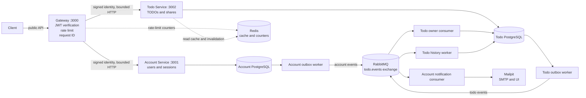

# Architecture Diagram

The diagram shows the public boundary, synchronous calls, owned datastores, asynchronous event paths, and independent workers.

The account and todo databases have no cross-database foreign keys. `todo_owners` is the Todo Service's event-built account projection. The Gateway does not contain TODO or account business rules; it authenticates, limits, routes, and translates transport errors.
