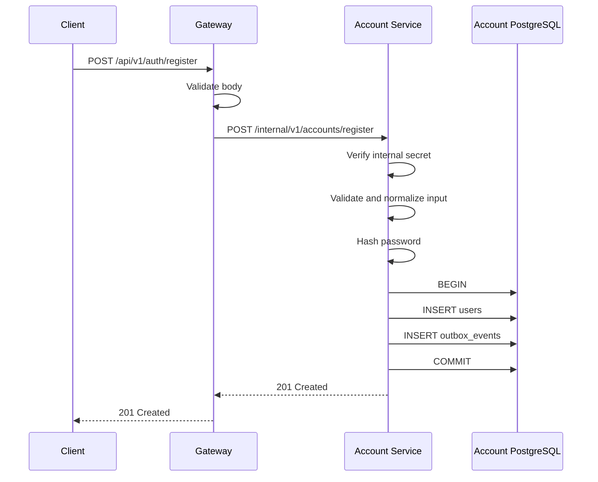
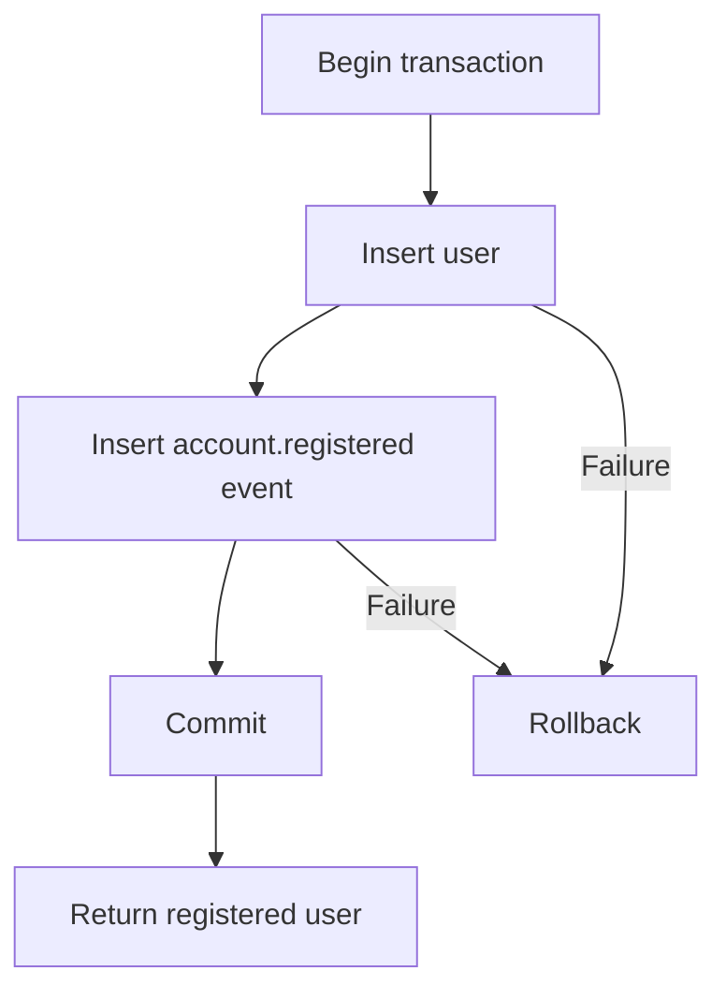

# Architecture

## Project Overview

The Multi-User Todo Platform is being converted from a single Node.js application into a microservice-based system.

Day 1 Part 1 establishes the monorepo structure required to develop separate applications and shared packages.

## Current Repository Structure

```text
MultiUserTodoService/
├── apps/
│   ├── account-service/
│   └── gateway/
├── packages/
│   ├── common/
│   └── contracts/
├── docs/
├── scripts/
├── package.json
├── package-lock.json
└── tsconfig.base.json
```

## Workspace Responsibilities

### Gateway

Location:

```text
apps/gateway
```

The Gateway workspace will become the single public entry point to the platform.

The HTTP server and routing logic are not implemented in Part 1.

### Account Service

Location:

```text
apps/account-service
```

The Account Service workspace will own account and authentication responsibilities.

The HTTP server, database and account APIs are not implemented in Part 1.

### Contracts Package

Location:

```text
packages/contracts
```

The Contracts package contains data structures shared across service boundaries.

Part 1 defines the common error-response and health-response contracts.

The package must not contain:

* Database queries
* Database row types
* Controllers
* Repositories
* Business logic

### Common Package

Location:

```text
packages/common
```

The Common package is reserved for small reusable technical utilities.

Business logic must remain inside the service that owns it.

## Monorepo Decision

The project uses npm workspaces.

Each application and shared package has its own:

* `package.json`
* `tsconfig.json`
* source directory
* build command

The monorepo allows the services and shared contracts to be developed in one repository without mixing their responsibilities.

## TypeScript Rules

The project uses strict TypeScript.

The shared configuration enables:

* Strict type checking
* No implicit `any`
* Strict null checking
* Unknown error variables
* Checked array access
* Explicit return checking
* Node.js ESM module resolution

Every workspace extends the root `tsconfig.base.json`.

## Dependency Rule

Applications may import shared contracts and technical utilities:

```text
Gateway --------> Contracts
Gateway --------> Common

Account Service -> Contracts
Account Service -> Common
```

Applications must not import each other's internal source code.

For example, the Gateway must not import an Account Service repository or service class.

## Current Implementation Status

Completed in Day 1 Part 1:

* npm workspace configuration
* Gateway workspace
* Account Service workspace
* Contracts package
* Common package
* Strict TypeScript configuration
* ESLint configuration
* Repository build command
* Repository test command
* Repository check command
* Clean script

Not implemented in Part 1:

* HTTP servers
* Docker
* Docker Compose
* PostgreSQL
* Redis
* RabbitMQ
* Authentication
* Registration
* Login
* Events

These items will be documented only after their relevant implementation parts are completed.

## Shared Packages

### Contracts Package

Location:

```text
packages/contracts
```

The Contracts package contains data structures shared across service boundaries.

Current structure:

```text
src/
├── events/
│   ├── account-event.contract.ts
│   └── event-envelope.contract.ts
├── http/
│   ├── error.contract.ts
│   └── health.contract.ts
├── identity/
│   └── caller-identity.contract.ts
└── index.ts
```

Each contract is stored in a file related to its responsibility.

The root `index.ts` contains no contract definitions or implementation. It only exposes the package's supported public exports.

Applications must import contracts using:

```typescript
import type {
  HealthResponse,
} from "@todo/contracts";
```

Applications must not import internal contract files directly.

The Contracts package must not contain:

* Controllers
* Services
* Repositories
* Database queries
* Database row models
* Business logic

### Common Package

Location:

```text
packages/common
```

The Common package contains small reusable technical utilities.

Current structure:

```text
src/
├── constants/
│   └── platform.constants.ts
├── errors/
│   └── app-error.ts
├── http/
│   └── async-handler.ts
├── request-context/
│   └── request-context.ts
├── security/
│   ├── identity-signature.ts
│   └── opaque-token.ts
└── index.ts
```

The Common package currently provides:

* Shared technical constants
* Standard application errors
* Async Express error forwarding
* Request-scoped context
* Secure opaque-token generation
* Opaque-token hashing
* Internal identity encoding
* Internal identity signing and verification

The root `index.ts` contains no implementation. It only exposes the package's supported public exports.

Business logic, controllers, repositories and database models must remain inside the service that owns them.

## Internal Identity Security

The Gateway will create an internal identity after authenticating a request.

The internal identity contains:

* User ID
* Session ID
* Email address
* Request ID
* Issued time

The Gateway signs the encoded identity using HMAC-SHA256.

An internal service must verify the signature before trusting or decoding the identity.

A modified identity, incorrect secret or malformed signature must be rejected.

Signature values are compared using a timing-safe comparison.

## Sensitive Credential Storage

Refresh tokens and password-reset credentials will use opaque random values.

Opaque credentials are generated using cryptographically secure random bytes.

The raw credential will be returned only to the appropriate caller or delivery process. It must not be stored in the database or written to logs.

Only a SHA-256 hash of the credential will be stored.

If an attacker obtains a database copy, the stored hash cannot be used directly as the original credential.

## Request Context

The Common package uses asynchronous request context to store:

* Request ID
* Service name

The context remains available during asynchronous operations belonging to the same request.

Concurrent requests must retain separate contexts and must not leak request information to each other.

## Part 2 Implementation Status

Completed:

* Standard error-response contracts
* Health-response contracts
* Internal caller-identity contracts
* Versioned event-envelope contract
* Account-event contracts
* Standard application error
* Async controller error forwarding
* Request-scoped context
* Opaque-token generation and hashing
* Internal identity signing and verification
* Unit tests for shared security utilities

Not implemented in Part 2:

* HTTP servers
* Authentication middleware
* Registration API
* Database persistence
* Docker infrastructure
* RabbitMQ publishing

The account-event types currently define contracts only. They must not be considered operational events until publishing and delivery are implemented and tested.


## API Gateway Foundation

### Responsibility

The API Gateway is the planned single public entry point to the platform.

The Gateway foundation currently provides:

* Environment-variable validation
* Structured JSON logging
* Sensitive-field log redaction
* Request-ID generation and propagation
* Request-scoped asynchronous context
* HTTP request logging
* Security headers
* JSON request-size limits
* Gateway health reporting
* Standard not-found responses
* Standard global error handling
* Graceful process shutdown

Authentication, rate limiting, Redis and downstream service communication are not implemented in this part.

### Gateway Structure

```text
apps/gateway/src/
├── __tests__/
│   └── app.test.ts
├── config/
│   ├── env.ts
│   └── logger.ts
├── middleware/
│   ├── error-handler.middleware.ts
│   ├── not-found.middleware.ts
│   ├── request-context.middleware.ts
│   └── request-logger.middleware.ts
├── modules/
│   └── health/
│       ├── health.controller.ts
│       ├── health.routes.ts
│       ├── health.service.test.ts
│       └── health.service.ts
├── app.ts
└── server.ts
```

### Health Module

The health feature follows this flow:

```text
GET /health
    ↓
health.routes.ts
    ↓
health.controller.ts
    ↓
health.service.ts
    ↓
HTTP response
```

Each file has one responsibility:

| File                     | Responsibility                                  |
| ------------------------ | ----------------------------------------------- |
| `health.routes.ts`       | Maps the HTTP method and path to the controller |
| `health.controller.ts`   | Handles the HTTP request and response           |
| `health.service.ts`      | Produces the Gateway health result              |
| `health.service.test.ts` | Verifies the health-service behaviour           |

The health module does not use a repository because it does not currently read or write database data.

### Middleware Order

Gateway middleware runs in the following order:

```text
Security headers
→ Request context
→ Request logging
→ JSON body parser
→ Application routes
→ Not-found middleware
→ Global error middleware
```

The middleware order is important.

Request context runs before body parsing so that malformed JSON errors also receive a request ID.

The not-found middleware runs after all valid routes.

The global error middleware runs last so errors from all earlier middleware and routes use the standard error-response format.

### Request ID

The Gateway accepts an optional `x-request-id` request header.

If the supplied value is a valid UUID, the Gateway preserves it.

If the header is missing or invalid, the Gateway generates a new UUID.

The request ID is:

* Returned in the `x-request-id` response header
* Stored in asynchronous request context
* Added to structured logs
* Added to error responses

Invalid request-ID values are replaced instead of being trusted.

### Request Context

The Gateway uses `AsyncLocalStorage` through the Common package.

The request context stores:

* Request ID
* Service name

Each concurrent request receives a separate context. Request information must not leak between requests.

### Logging

Gateway logs use structured JSON.

Request logs include:

* HTTP method
* Request path
* Response status
* Request ID
* Request duration

Sensitive values such as passwords, access tokens, refresh tokens, reset tokens and authorization headers are configured for redaction.

Request bodies are not written to request logs.

### Error Handling

The Gateway uses one standard error-response shape:

```json
{
  "error": {
    "code": "ERROR_CODE",
    "message": "Safe error message",
    "requestId": "UUID"
  }
}
```

Optional validation details may be included when appropriate.

The Gateway currently handles:

| Condition                | Status | Error code              |
| ------------------------ | -----: | ----------------------- |
| Unknown route            |    404 | `ROUTE_NOT_FOUND`       |
| Malformed JSON           |    400 | `INVALID_JSON`          |
| Request body over 100 KB |    413 | `PAYLOAD_TOO_LARGE`     |
| Unexpected error         |    500 | `INTERNAL_SERVER_ERROR` |

Unexpected internal error details and stack traces are logged but are not returned to the client.

### Security

The Gateway currently applies the following HTTP protections:

* Helmet security headers
* Disabled `x-powered-by` header
* JSON body-size limit
* Request-ID validation
* Safe error messages
* Sensitive-field log redaction

Authentication and authorization will be added in their relevant implementation parts.

### Health Behaviour

The Gateway exposes:

```http
GET /health
```

Part 3 does not integrate Redis or downstream services. Therefore, the endpoint currently reports only the health of the Gateway process.

Current response:

```json
{
  "status": "healthy",
  "service": "gateway"
}
```

Dependency health checks will be added only after those dependencies are integrated.

### Graceful Shutdown

The Gateway listens for:

* `SIGINT`
* `SIGTERM`

When either signal is received, the Gateway:

1. Stops accepting new connections.
2. Allows active connections to finish.
3. Closes the HTTP server.
4. Exits normally.

A forced-shutdown timeout prevents the process from hanging indefinitely.

### TypeScript Configuration

The Gateway uses two TypeScript configurations:

| Configuration         | Purpose                                                         |
| --------------------- | --------------------------------------------------------------- |
| `tsconfig.json`       | Type-checks application and test files without producing output |
| `tsconfig.build.json` | Builds production source files into `dist` and excludes tests   |

This prevents automated tests from being included in the production build.

### Current Implementation Status

Completed:

* Gateway HTTP server
* Health route, controller and service
* Request-ID middleware
* Request-context middleware
* Request logging
* Structured logger
* Security headers
* JSON body-size limit
* Not-found handling
* Global error handling
* Graceful shutdown
* Gateway unit and HTTP integration tests

Not implemented:

* Redis connection
* Distributed rate limiting
* JWT authentication
* Session validation
* Account Service communication
* Signed internal identity forwarding
* Downstream timeout handling
* Circuit breaker behaviour

## Local Container Architecture

The Part 4 development environment runs through Docker Compose.

Current containers:

| Container | Responsibility |
|---|---|
| `gateway` | Public HTTP entry point |
| `account-postgres` | Future Account Service datastore |
| `redis` | Future shared cache, projections and counters |
| `rabbitmq` | Future durable asynchronous message transport |
| `mailpit` | Future local email capture |

### Network Exposure

The Gateway is the only public application entry point.

Development infrastructure ports are bound to `127.0.0.1` so they are reachable only from the local machine.

Current local ports:

| Component | Local port |
|---|---:|
| Gateway | 3000 |
| Account PostgreSQL | 55432 |
| Redis | 56379 |
| RabbitMQ | 5672 |
| RabbitMQ Management | 15672 |
| Mailpit SMTP | 1025 |
| Mailpit UI | 8025 |

Internal containers will communicate using Docker service names rather than `localhost`.

Examples:

```text
account-postgres:5432
redis:6379
rabbitmq:5672
mailpit:1025

## Account Service Foundation

### Responsibility

The Account Service owns account, credential and session-related business responsibilities.

Part 5 establishes the Account Service runtime, PostgreSQL connection and independent health reporting.

Account business APIs are not implemented in this part.

### Source Structure

```text
apps/account-service/src/
├── __tests__/
│   └── app.test.ts
├── config/
│   ├── database.ts
│   ├── env.ts
│   └── logger.ts
├── middleware/
│   ├── error-handler.middleware.ts
│   ├── not-found.middleware.ts
│   └── request-context.middleware.ts
├── modules/
│   └── health/
│       ├── health.controller.ts
│       ├── health.routes.ts
│       ├── health.service.test.ts
│       └── health.service.ts
├── app.ts
└── server.ts
```

### Layer Responsibilities

| Component              | Responsibility                                          |
| ---------------------- | ------------------------------------------------------- |
| `health.routes.ts`     | Maps the internal health path to its controller         |
| `health.controller.ts` | Converts the health result into an HTTP response        |
| `health.service.ts`    | Evaluates Account Service and PostgreSQL health         |
| `database.ts`          | Manages the Account Service PostgreSQL connection pool  |
| `env.ts`               | Validates Account Service environment variables         |
| `logger.ts`            | Produces structured logs with sensitive-field redaction |
| `app.ts`               | Registers middleware and Account Service routes         |
| `server.ts`            | Starts and gracefully stops the Account Service process |

The health module does not use a repository because it does not read or modify business records.

### Data Ownership

The Account Service connects only to its own PostgreSQL database.

The database is identified as:

```text
account_db
```

The Account Service uses credentials created specifically for that database.

The Gateway does not:

* Hold Account Service database credentials
* Connect to the Account Service database
* Query Account Service tables
* Modify Account Service data

Other services must interact with the Account Service through approved HTTP or event contracts.

### PostgreSQL Connection Pool

The Account Service uses a PostgreSQL connection pool instead of opening a new connection for every request.

The pool configuration includes:

* Maximum connection count
* Connection timeout
* Idle connection timeout
* Query timeout
* Application name for database observability

The PostgreSQL application name is:

```text
todo-account-service
```

The pool registers an error listener for unexpected errors emitted by idle PostgreSQL connections.

Without this listener, an emitted pool error could become an unhandled Node.js error event and terminate the process.

The listener records the failure without exposing the database connection string or password.

### Startup Behaviour

The Account Service does not wait for a successful PostgreSQL connection before opening its HTTP server.

If PostgreSQL is unavailable when the Account Service starts:

* The Node.js process still starts.
* The health endpoint remains reachable inside the Docker network.
* The health endpoint reports PostgreSQL as unavailable.
* The health endpoint returns `503 Service Unavailable`.
* The process does not intentionally exit.
* The container does not enter an application-created restart loop.

When PostgreSQL becomes available again, the connection pool can establish a new connection during the next database operation.

The Account Service does not require a restart to recover from a temporary PostgreSQL outage.

### Health Module

The Account Service exposes this internal endpoint:

```http
GET /health
```

The request flow is:

```text
GET /health
    ↓
health.routes.ts
    ↓
health.controller.ts
    ↓
health.service.ts
    ↓
checkDatabaseHealth()
    ↓
PostgreSQL SELECT 1
```

When PostgreSQL is available, the endpoint returns:

```text
200 OK
```

```json
{
  "status": "healthy",
  "service": "account-service",
  "dependencies": {
    "database": "available"
  }
}
```

When PostgreSQL is unavailable, the endpoint returns:

```text
503 Service Unavailable
```

```json
{
  "status": "unhealthy",
  "service": "account-service",
  "dependencies": {
    "database": "unavailable"
  }
}
```

The health query has a finite timeout so the health request does not wait indefinitely for PostgreSQL.

### Internal Network Boundary

The Account Service listens on container port:

```text
3001
```

Docker Compose uses `expose` rather than publishing the port to the host.

The Account Service is reachable by other containers using:

```text
http://account-service:3001
```

A client running outside the Docker network cannot directly use:

```text
http://localhost:3001
```

The Gateway remains the only published application entry point.

### Request IDs

The Account Service accepts the internal `x-request-id` header.

If the supplied value is a valid UUID, the Account Service preserves it.

If the value is missing or invalid, the Account Service generates a new UUID.

The request ID is:

* Returned in the response header
* Stored in asynchronous request context
* Included in error responses
* Available to structured logging

### Error Handling

The Account Service uses the platform's standard error-response shape:

```json
{
  "error": {
    "code": "ERROR_CODE",
    "message": "Safe error message",
    "requestId": "UUID"
  }
}
```

The current foundation handles:

| Condition                              | HTTP status | Error code              |
| -------------------------------------- | ----------: | ----------------------- |
| Unknown internal route                 |         404 | `ROUTE_NOT_FOUND`       |
| Malformed JSON                         |         400 | `INVALID_JSON`          |
| Request body over the configured limit |         413 | `PAYLOAD_TOO_LARGE`     |
| Unexpected error                       |         500 | `INTERNAL_SERVER_ERROR` |

Internal stack traces, database connection strings and credentials are not returned to the caller.

### Logging

The Account Service uses structured JSON logging.

The logger includes:

* Service name
* Runtime environment
* Request ID when available
* Error information required for diagnosis

The logger is configured to redact:

* Passwords
* Authorization headers
* Access tokens
* Refresh tokens
* Reset tokens
* Database URLs
* Connection strings

### Graceful Shutdown

The Account Service listens for:

* `SIGINT`
* `SIGTERM`

During shutdown, it:

1. Stops accepting new HTTP connections.
2. Waits for active HTTP connections to finish.
3. Closes the PostgreSQL connection pool.
4. Completes the process shutdown.

A forced-shutdown timeout prevents the process from waiting indefinitely.

### Docker Runtime

The Account Service has its own production image target:

```text
account-service-runtime
```

The runtime image contains:

* Production dependencies
* Compiled Contracts package
* Compiled Common package
* Compiled Account Service code

The runtime image does not contain Account Service test files.

The process runs as the non-root Node.js user.

### Failure Behaviour

Stopping PostgreSQL must not terminate the Account Service process.

During the outage:

* The Account Service container remains running.
* The health endpoint returns `503`.
* The database dependency is reported as unavailable.
* Database credentials are not exposed.
* The process restart count does not increase because of the database outage.

After PostgreSQL restarts:

* The Account Service process remains the same process.
* The next health query reconnects through the pool.
* The health endpoint returns `200`.
* No Account Service restart is required.

### TypeScript Build Configuration

The Account Service uses two TypeScript configurations:

| Configuration         | Purpose                                                           |
| --------------------- | ----------------------------------------------------------------- |
| `tsconfig.json`       | Type-checks source files and test files without generating output |
| `tsconfig.build.json` | Produces the production `dist` output and excludes tests          |

The production build must create:

```text
apps/account-service/dist/server.js
```

The production build must not create:

```text
apps/account-service/dist/__tests__
```

### Current Implementation Status

Completed in Part 5:

* Account Service HTTP runtime
* Responsibility-based folder structure
* Environment validation
* Structured logging
* Sensitive-value redaction
* PostgreSQL connection pool
* PostgreSQL pool error listener
* Database connection timeout
* Database query timeout
* Internal health endpoint
* Database outage reporting
* Automatic recovery after PostgreSQL returns
* Request-ID handling
* Standard error handling
* Graceful shutdown
* Unit tests
* HTTP integration tests
* Account Service Docker runtime
* Internal-only Docker network exposure

Not implemented in Part 5:

* Account database migrations
* User table
* Transactional outbox table
* Registration API
* Password hashing
* Login
* Sessions
* Access tokens
* Refresh tokens
* Logout
* Password reset
* Email changes
* Account-event publishing

# System Architecture

## Part 6 — Account Database and Transactional Outbox

### 1. Purpose

Part 6 introduces the private PostgreSQL schema owned by the Account Service.

The Account Service uses this database to store:

- Registered user accounts
- Password hashes
- Account-related domain events waiting to be published

The schema is created using version-controlled database migrations.

No Registration API is implemented in Part 6. The database is being prepared for the Registration API that will be implemented in the next part.

---

### 2. Account Service Data Ownership

The Account Service owns its PostgreSQL database and migrations.

Other services must not:

- Connect directly to the Account Service database
- Read the `users` table
- Write to the `users` table
- Read or update the Account Service outbox
- Run the Account Service migrations

Other services must communicate with the Account Service through:

- Internal HTTP APIs
- Published domain events

This prevents tight coupling between services.

---

### 3. Database Structure

The Account Service database currently contains the following tables:

| Table | Responsibility |
|---|---|
| `users` | Stores registered user account information |
| `outbox_events` | Stores domain events that must be published reliably |

The migrations are stored inside:

```text
apps/account-service/migrations/
├── 001_create_users.cjs
└── 002_create_outbox_events.cjs

# Part 7 — User Registration with Transactional Outbox

## 1. Purpose

Part 7 implements user registration across the API Gateway and Account Service.

A registration request enters through the public API Gateway. The Gateway validates the public request and forwards it to the private Account Service. The Account Service validates the request again, hashes the password, creates the user, and stores an `account.registered` event in the transactional outbox.

The user and outbox event are created in one PostgreSQL transaction.

Registration does not:

- Return an access token
- Return a refresh token
- Create a login session
- Publish directly to RabbitMQ
- Send an email directly
- Store a plain-text password

Those capabilities are implemented in later parts.

---

## 2. Public and Internal Boundaries

### Public boundary

External clients communicate only with the Gateway:

```text
POST /api/v1/auth/register
```

Public address:

```text
http://localhost:3000/api/v1/auth/register
```

### Internal boundary

The Gateway forwards the validated request to the Account Service:

```text
POST /internal/v1/accounts/register
```

Internal Docker address:

```text
http://account-service:3001/internal/v1/accounts/register
```

The internal Account Service endpoint is not published to the host machine.

External clients must not call the Account Service directly.

---

## 3. Component Responsibilities

| Component | Responsibility |
|---|---|
| API Gateway route | Exposes the public registration endpoint |
| Gateway validation | Rejects malformed public requests |
| Account Service client | Calls the Account Service with a finite timeout |
| Internal authentication middleware | Rejects calls without the correct internal service secret |
| Account registration route | Defines the internal registration endpoint |
| Account validation | Revalidates the request at the service boundary |
| Registration controller | Converts HTTP input into a service call |
| Registration service | Coordinates normalization, hashing and persistence |
| Password hasher | Produces a secure password hash |
| Registration repository | Executes user and outbox inserts in one transaction |
| PostgreSQL | Stores users and pending outbox events |
| Error middleware | Converts failures into safe API responses |

---

## 4. Folder Structure

The Part 7 implementation is organized by responsibility.

```text
apps/
├── gateway/
│   └── src/
│       ├── clients/
│       │   └── account-service.client.ts
│       ├── config/
│       │   └── env.ts
│       ├── middleware/
│       │   ├── error-handler.middleware.ts
│       │   ├── not-found.middleware.ts
│       │   └── request-context.middleware.ts
│       ├── modules/
│       │   └── auth/
│       │       └── registration/
│       │           ├── registration.controller.ts
│       │           ├── registration.routes.ts
│       │           └── registration.validation.ts
│       ├── app.ts
│       └── server.ts
│
└── account-service/
    └── src/
        ├── config/
        │   ├── database.ts
        │   ├── env.ts
        │   └── logger.ts
        ├── middleware/
        │   ├── error-handler.middleware.ts
        │   ├── internal-service-auth.middleware.ts
        │   └── request-context.middleware.ts
        ├── modules/
        │   └── account/
        │       └── registration/
        │           ├── registration.controller.ts
        │           ├── registration.repository.ts
        │           ├── registration.routes.ts
        │           ├── registration.service.ts
        │           ├── registration.types.ts
        │           └── registration.validation.ts
        ├── security/
        │   └── password-hasher.ts
        ├── app.ts
        └── server.ts

packages/
└── contracts/
    └── src/
        └── account/
            ├── account-event.ts
            ├── register-account.ts
            └── index.ts
```

The `index.ts` files only export public module contracts. Business logic is kept in responsibility-specific files.

---

## 5. Registration Request Flow



The same request ID is propagated through the complete request flow.

---

## 6. Double Boundary Validation

The request is validated at both service boundaries.

### Gateway validation

The Gateway validates the public request to:

- Reject malformed input early
- Avoid unnecessary internal network calls
- Return a consistent public validation response
- Protect downstream services from clearly invalid input

### Account Service validation

The Account Service validates the request again because:

- A service must protect its own boundary
- Internal traffic must not automatically be trusted
- The Account Service may receive calls from another authorized service later
- Gateway validation rules could become outdated
- A malformed internal request must not reach the database

Gateway validation improves efficiency. Account Service validation preserves service independence and security.

---

## 7. Registration Input Rules

### Email rules

The email must:

- Be a string
- Be a valid email address
- Contain no more than 254 characters
- Be normalized before persistence

Email normalization performs:

```text
Trim surrounding whitespace
Convert the complete email address to lowercase
```

Example:

```text
Input:  "  User@Example.COM  "
Stored: "user@example.com"
```

The database also enforces normalized email storage.

### Password rules

The password must:

- Be a string
- Contain at least 12 characters
- Contain no more than 128 characters

The password is validated before hashing.

The plain-text password must never be:

- Stored in PostgreSQL
- Written to an outbox event
- Returned in a response
- Added to application logs
- Added to error logs

---

## 8. Password Hashing

The Account Service hashes the password before opening the database transaction.

The implementation uses a dedicated password-hashing component.

Responsibilities of the password hasher:

- Receive a valid plain-text password
- Generate a salted password hash
- Return only the hash
- Hide the hashing library from registration business logic

The password hasher uses the configured work factor:

```env
PASSWORD_HASH_ROUNDS=12
```

A higher work factor increases password protection but also increases CPU usage and response time.

The password hash is stored in:

```text
users.password_hash
```

The original password is never stored.

---

## 9. Internal Service Authentication

The internal registration endpoint is protected using an internal service secret.

The Gateway sends:

```http
X-Internal-Service-Key: configured-secret-value
```

The Account Service compares the received value with its configured secret.

Both services receive the secret through environment variables:

```env
INTERNAL_SERVICE_SECRET=replace-with-a-long-random-secret
```

Requirements:

- Use a secret containing at least 32 characters
- Do not hardcode the secret in source code
- Do not commit a real secret to Git
- Do not log the secret
- Use the same value in the Gateway and Account Service
- Reject missing or incorrect values
- Compare secrets using a timing-safe operation

The internal service secret authenticates the calling service. It does not authenticate an end user.

---

## 10. Request ID Propagation

The Gateway accepts or creates an `X-Request-ID`.

The same request ID is forwarded to the Account Service:

```http
X-Request-ID: 42c06bb5-a32d-4da8-8050-ddc480972b20
```

The Account Service stores this value in:

```text
outbox_events.request_id
```

The request ID connects:

- Gateway logs
- Account Service logs
- Database operation logs
- Outbox event records
- Future event-publisher logs
- Future event-consumer logs

Passwords and internal secrets must not be included in these logs.

---

## 11. Gateway-to-Account-Service Communication

The Gateway uses a dedicated Account Service client.

Configuration:

```env
ACCOUNT_SERVICE_URL=http://account-service:3001
DOWNSTREAM_TIMEOUT_MS=5000
```

The internal request has a finite timeout.

A registration request is not automatically retried because it is a non-idempotent write operation. Retrying without a defined idempotency mechanism could create duplicate operations or ambiguous responses.

If the Account Service times out, the Gateway returns:

```text
504 Gateway Timeout
```

If the Account Service cannot be reached, the Gateway returns:

```text
503 Service Unavailable
```

If the Account Service returns a known business error, the Gateway preserves its appropriate HTTP status and safe error response.

---

## 12. Transactional Registration

The Account Service creates the user and outbox event in one database transaction.



The transaction follows this order:

1. Acquire a PostgreSQL client from the pool.
2. Start the transaction using `BEGIN`.
3. Insert the user into `users`.
4. Insert the domain event into `outbox_events`.
5. Commit using `COMMIT`.
6. Return the created public user data.
7. Release the PostgreSQL client in a `finally` block.

When any transaction operation fails:

1. Execute `ROLLBACK`.
2. Translate known database failures.
3. Log safe operational information.
4. Release the PostgreSQL client.
5. Return a safe API error.

The PostgreSQL client must always be released.

---

## 13. Atomicity Guarantee

The following results are valid:

| User row | Outbox event | Result |
|---|---|---|
| Created | Created | Registration succeeds |
| Not created | Not created | Registration fails safely |

The following partial results must never occur:

| User row | Outbox event | Reason invalid |
|---|---|---|
| Created | Missing | Other services may never learn about the account |
| Missing | Created | Event describes an account that does not exist |

PostgreSQL provides the atomicity guarantee through the transaction.

---

## 14. Duplicate Email Protection

The service does not depend on a separate email existence query.

A sequence such as this is unsafe:

```text
SELECT user by email
If absent, INSERT user
```

Two concurrent requests could both observe that the email is absent and then attempt registration.

Instead, PostgreSQL's unique email index is the authoritative protection.

When PostgreSQL returns unique-constraint error code:

```text
23505
```

for the users email constraint, the Account Service translates it into:

```text
409 Conflict
```

Public error code:

```text
EMAIL_ALREADY_REGISTERED
```

The raw PostgreSQL error is never returned to the client.

---

## 15. Account Registered Outbox Event

Successful registration creates an outbox event with the following type:

```text
account.registered
```

Event version:

```text
1
```

Producer:

```text
account-service
```

Example event payload:

```json
{
  "userId": "a95fd118-f777-4500-9ea9-7d1a650fdadb",
  "email": "user@example.com"
}
```

Example logical event envelope:

```json
{
  "eventId": "16bd92d3-e2f2-4897-8235-abd77788c8a0",
  "eventType": "account.registered",
  "eventVersion": 1,
  "occurredAt": "2026-09-21T08:30:00.000Z",
  "requestId": "42c06bb5-a32d-4da8-8050-ddc480972b20",
  "producer": "account-service",
  "payload": {
    "userId": "a95fd118-f777-4500-9ea9-7d1a650fdadb",
    "email": "user@example.com"
  }
}
```

The event must not contain:

- Plain-text password
- Password hash
- Internal service secret
- Database credentials

Part 7 persists the event to the outbox. It does not publish the event to RabbitMQ yet.

---

## 16. Data Returned to the Client

The registration response contains only safe public account information:

- User ID
- Normalized email
- Account creation timestamp

The response must not contain:

- Password
- Password hash
- Access token
- Refresh token
- Session ID
- Internal event ID
- Internal service secret
- Database information

---

## 17. Error Ownership

### Gateway-owned errors

The Gateway creates errors for:

- Invalid public request body
- Invalid JSON
- Account Service connection failure
- Account Service timeout
- Unknown public route

### Account Service-owned errors

The Account Service creates errors for:

- Invalid internal request
- Missing internal service key
- Incorrect internal service key
- Duplicate email
- Database failure
- Password-hashing failure
- Transaction failure

The Gateway must not convert every downstream error into `500 Internal Server Error`. Known safe errors retain their meaningful status codes.

---

## 18. Failure Behaviour

| Failure | Expected result |
|---|---|
| Email is invalid | `400 VALIDATION_ERROR` |
| Password is shorter than 12 characters | `400 VALIDATION_ERROR` |
| Password is longer than 128 characters | `400 VALIDATION_ERROR` |
| Request contains malformed JSON | `400 INVALID_JSON` |
| Email already exists | `409 EMAIL_ALREADY_REGISTERED` |
| Internal service key is missing | Internal request receives `401 INTERNAL_SERVICE_UNAUTHORIZED` |
| Internal service key is incorrect | Internal request receives `401 INTERNAL_SERVICE_UNAUTHORIZED` |
| Password hashing fails | No user or outbox record is created |
| User insert fails | Transaction rolls back |
| Outbox insert fails | User insert is rolled back |
| PostgreSQL is unavailable | Registration fails safely with no partial data |
| Account Service is unavailable | Gateway returns `503 SERVICE_UNAVAILABLE` |
| Account Service exceeds the timeout | Gateway returns `504 DOWNSTREAM_TIMEOUT` |
| RabbitMQ is unavailable | Registration can still commit to PostgreSQL |
| Redis is unavailable | Registration continues because registration does not require Redis |
| Mailpit is unavailable | Registration continues because email is asynchronous |
| Client disconnects | Server safely completes or rolls back its active operation |
| Two concurrent requests use the same email | One succeeds and the other receives `409` |

---

## 19. Logging Requirements

A successful registration log may contain:

- Request ID
- User ID
- Service name
- HTTP status
- Request duration

An error log may contain:

- Request ID
- Safe application error code
- PostgreSQL error code
- Service name
- Operation name

Logs must not contain:

- Request password
- Password hash
- Internal service secret
- PostgreSQL password
- Complete sensitive request body

---

## 20. Performance Decisions

Part 7 follows these performance decisions:

- Request validation occurs before internal communication.
- Password hashing occurs before the database transaction.
- The database transaction is kept short.
- No email is sent inside the request.
- No RabbitMQ connection is required to complete registration.
- One database transaction creates both the user and event.
- The database unique index handles concurrency safely.
- Internal HTTP calls use a finite timeout.
- PostgreSQL connections are reused through the connection pool.
- No unnecessary email existence query is executed.

Password hashing is intentionally CPU-expensive. It protects credentials and must not be replaced by a fast general-purpose hash.

---

## 21. SOLID and Design Decisions

### Single Responsibility Principle

Each component has one main responsibility:

- Controller handles HTTP concerns.
- Validator handles input rules.
- Service coordinates the use case.
- Password hasher handles password hashing.
- Repository handles SQL and transactions.
- Account Service client handles downstream HTTP communication.

### Open/Closed Principle

The password-hashing and persistence implementations can be replaced without rewriting the controller.

### Liskov Substitution Principle

Implementations that satisfy the defined interfaces can replace one another without changing registration behaviour.

### Interface Segregation Principle

Registration components depend only on the operations they require.

### Dependency Inversion Principle

Business orchestration depends on abstractions such as a password hasher and registration repository instead of directly depending on library details.

### Repository Pattern

Raw SQL and PostgreSQL transaction handling remain inside the registration repository.

### Service Layer Pattern

Registration business workflow remains inside the registration service.

### Gateway Pattern

External clients access the platform through one public entry point.

### Transactional Outbox Pattern

Business data and its event are committed in one local transaction.

---

## 22. Part 7 Security Checklist

- [x] Public registration is available only through the Gateway.
- [x] Internal Account Service port is not published publicly.
- [x] Gateway input is validated.
- [x] Account Service input is independently validated.
- [x] Email is normalized before persistence.
- [x] Password length is restricted.
- [x] Password is securely hashed.
- [x] Plain-text password is not stored.
- [x] Password hash is not returned.
- [x] Password data is not written to the outbox.
- [x] Internal endpoint requires service authentication.
- [x] Internal secret is loaded through configuration.
- [x] Errors do not reveal internal implementation details.
- [x] Database constraint protects against concurrent duplicates.
- [x] Internal calls use a timeout.
- [x] Registration is not retried automatically.

---

## 23. Part 7 Reliability Checklist

- [x] User and event are stored atomically.
- [x] Transaction failures are rolled back.
- [x] PostgreSQL clients are always released.
- [x] RabbitMQ outage does not prevent database commit.
- [x] Redis outage does not prevent registration.
- [x] Mailpit outage does not prevent registration.
- [x] Duplicate concurrent registration is handled safely.
- [x] Downstream timeout produces a controlled error.
- [x] Downstream unavailability produces a controlled error.
- [x] Request ID is propagated and persisted.
- [x] Outbox events survive service restarts.

---

## 24. Part 7 Scope

Implemented in Part 7:

- Public Gateway registration endpoint
- Internal Account Service registration endpoint
- Shared registration request and response contracts
- Gateway request validation
- Account Service request validation
- Internal service authentication
- Email normalization
- Password hashing
- Duplicate-email handling
- Raw SQL persistence
- User and outbox atomic transaction
- `account.registered` outbox event creation
- Request ID propagation
- Downstream timeout handling
- Registration success-path tests
- Registration failure-path tests
- Registration API documentation

Not implemented in Part 7:

- Login
- Logout
- Access tokens
- Refresh tokens
- User sessions
- Email verification
- Password reset
- Outbox publishing worker
- RabbitMQ event publishing
- Notification consumer
- Registration email delivery
- Registration idempotency key