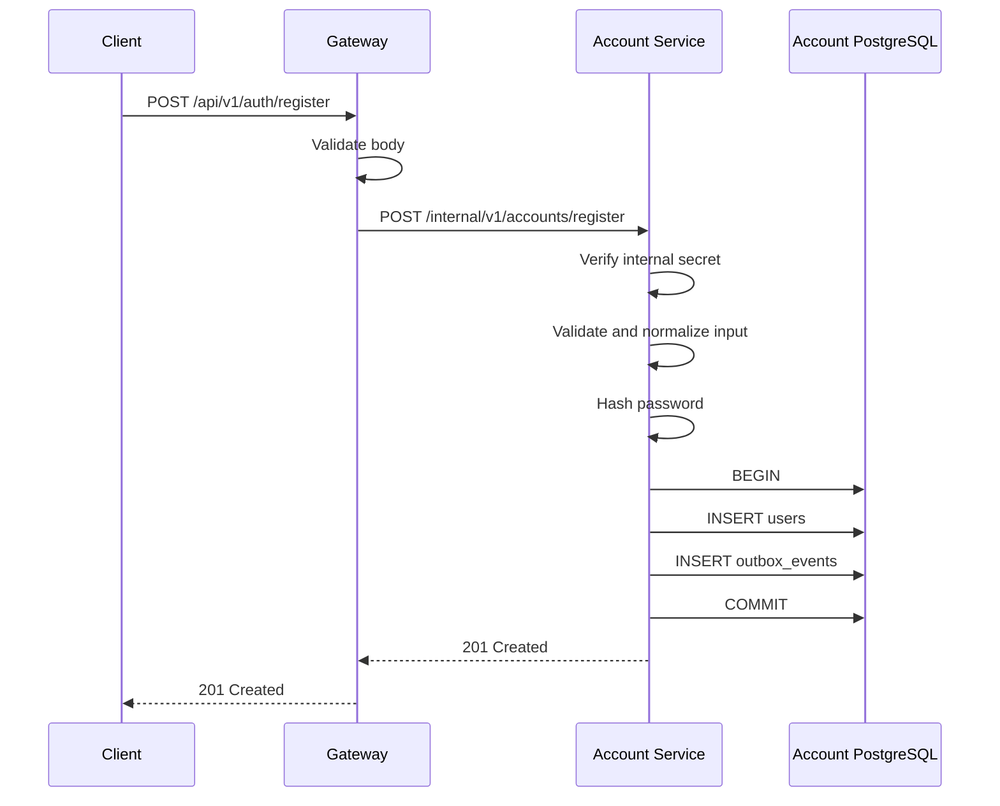
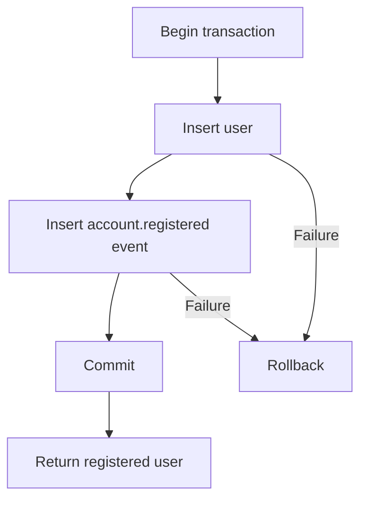
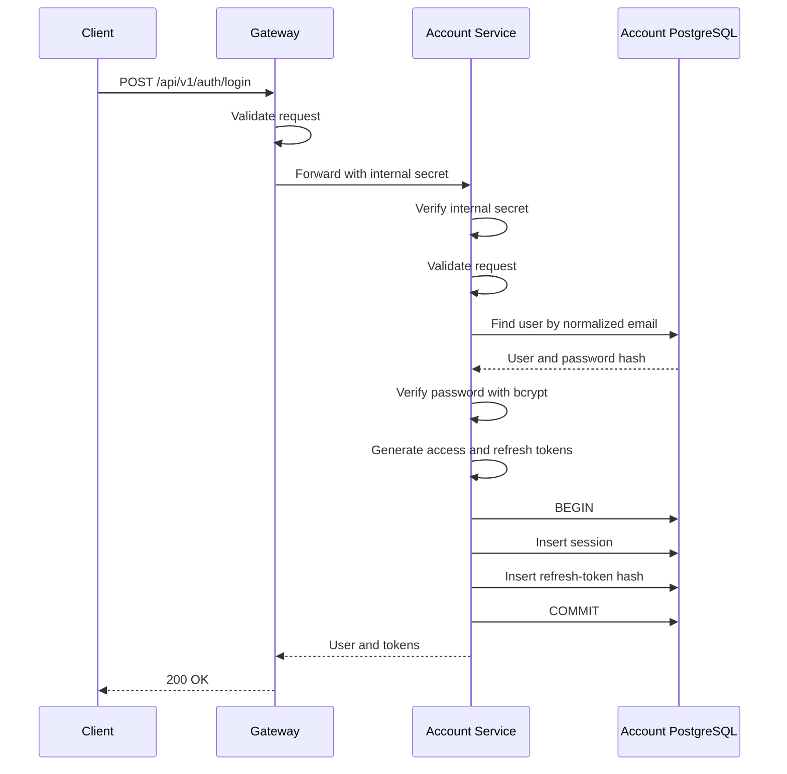
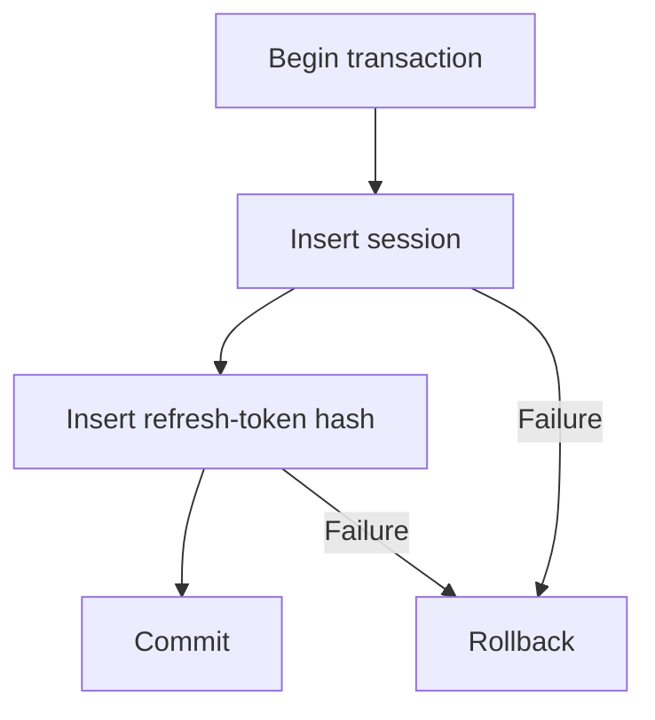
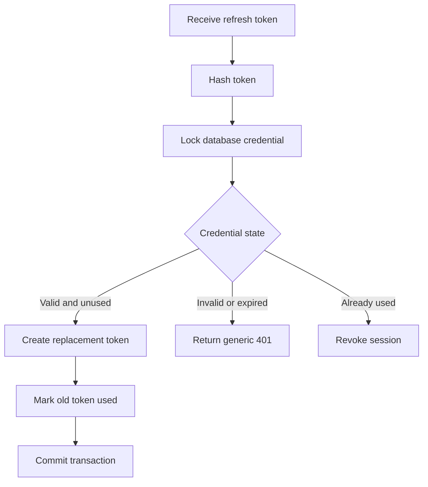
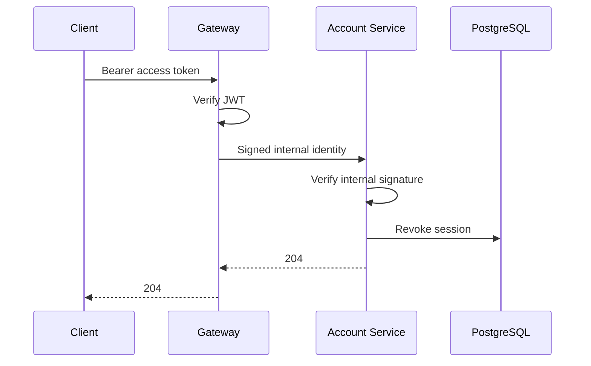
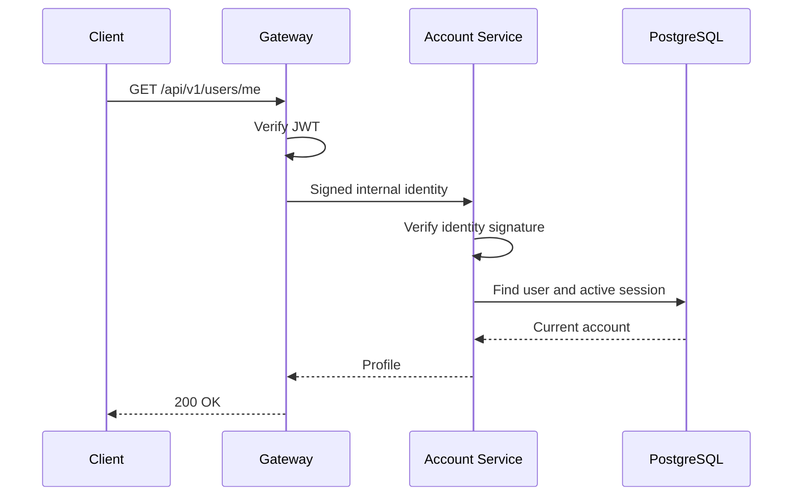
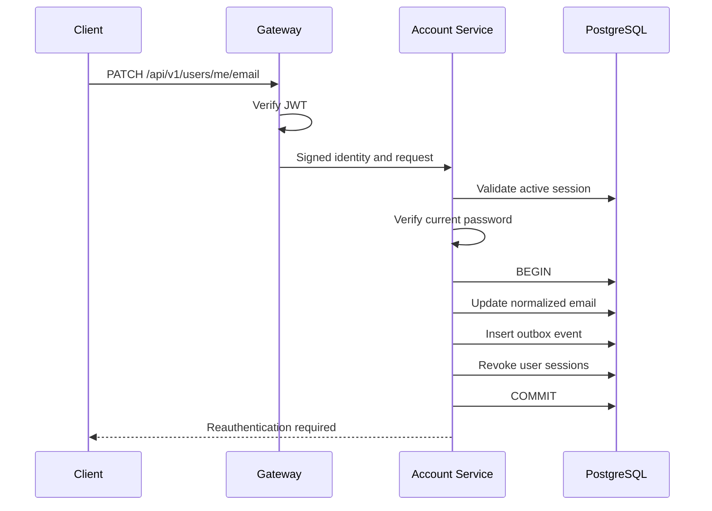

# Architecture

## Project Overview

The Multi-User Todo Platform is being converted from a single Node.js application into a microservice-based system.

Day 1 Part 1 establishes the monorepo structure required to develop separate applications and shared packages.

## Current Repository Structure

```text
MultiUserTodoService/
├── apps/
│   ├── account-service/
│   └── gateway/
├── packages/
│   ├── common/
│   └── contracts/
├── docs/
├── scripts/
├── package.json
├── package-lock.json
└── tsconfig.base.json
```

## Workspace Responsibilities

### Gateway

Location:

```text
apps/gateway
```

The Gateway workspace will become the single public entry point to the platform.

The HTTP server and routing logic are not implemented in Part 1.

### Account Service

Location:

```text
apps/account-service
```

The Account Service workspace will own account and authentication responsibilities.

The HTTP server, database and account APIs are not implemented in Part 1.

### Contracts Package

Location:

```text
packages/contracts
```

The Contracts package contains data structures shared across service boundaries.

Part 1 defines the common error-response and health-response contracts.

The package must not contain:

* Database queries
* Database row types
* Controllers
* Repositories
* Business logic

### Common Package

Location:

```text
packages/common
```

The Common package is reserved for small reusable technical utilities.

Business logic must remain inside the service that owns it.

## Monorepo Decision

The project uses npm workspaces.

Each application and shared package has its own:

* `package.json`
* `tsconfig.json`
* source directory
* build command

The monorepo allows the services and shared contracts to be developed in one repository without mixing their responsibilities.

## TypeScript Rules

The project uses strict TypeScript.

The shared configuration enables:

* Strict type checking
* No implicit `any`
* Strict null checking
* Unknown error variables
* Checked array access
* Explicit return checking
* Node.js ESM module resolution

Every workspace extends the root `tsconfig.base.json`.

## Dependency Rule

Applications may import shared contracts and technical utilities:

```text
Gateway --------> Contracts
Gateway --------> Common

Account Service -> Contracts
Account Service -> Common
```

Applications must not import each other's internal source code.

For example, the Gateway must not import an Account Service repository or service class.

## Current Implementation Status

Completed in Day 1 Part 1:

* npm workspace configuration
* Gateway workspace
* Account Service workspace
* Contracts package
* Common package
* Strict TypeScript configuration
* ESLint configuration
* Repository build command
* Repository test command
* Repository check command
* Clean script

Not implemented in Part 1:

* HTTP servers
* Docker
* Docker Compose
* PostgreSQL
* Redis
* RabbitMQ
* Authentication
* Registration
* Login
* Events

These items will be documented only after their relevant implementation parts are completed.

## Shared Packages

### Contracts Package

Location:

```text
packages/contracts
```

The Contracts package contains data structures shared across service boundaries.

Current structure:

```text
src/
├── events/
│   ├── account-event.contract.ts
│   └── event-envelope.contract.ts
├── http/
│   ├── error.contract.ts
│   └── health.contract.ts
├── identity/
│   └── caller-identity.contract.ts
└── index.ts
```

Each contract is stored in a file related to its responsibility.

The root `index.ts` contains no contract definitions or implementation. It only exposes the package's supported public exports.

Applications must import contracts using:

```typescript
import type {
  HealthResponse,
} from "@todo/contracts";
```

Applications must not import internal contract files directly.

The Contracts package must not contain:

* Controllers
* Services
* Repositories
* Database queries
* Database row models
* Business logic

### Common Package

Location:

```text
packages/common
```

The Common package contains small reusable technical utilities.

Current structure:

```text
src/
├── constants/
│   └── platform.constants.ts
├── errors/
│   └── app-error.ts
├── http/
│   └── async-handler.ts
├── request-context/
│   └── request-context.ts
├── security/
│   ├── identity-signature.ts
│   └── opaque-token.ts
└── index.ts
```

The Common package currently provides:

* Shared technical constants
* Standard application errors
* Async Express error forwarding
* Request-scoped context
* Secure opaque-token generation
* Opaque-token hashing
* Internal identity encoding
* Internal identity signing and verification

The root `index.ts` contains no implementation. It only exposes the package's supported public exports.

Business logic, controllers, repositories and database models must remain inside the service that owns them.

## Internal Identity Security

The Gateway will create an internal identity after authenticating a request.

The internal identity contains:

* User ID
* Session ID
* Email address
* Request ID
* Issued time

The Gateway signs the encoded identity using HMAC-SHA256.

An internal service must verify the signature before trusting or decoding the identity.

A modified identity, incorrect secret or malformed signature must be rejected.

Signature values are compared using a timing-safe comparison.

## Sensitive Credential Storage

Refresh tokens and password-reset credentials will use opaque random values.

Opaque credentials are generated using cryptographically secure random bytes.

The raw credential will be returned only to the appropriate caller or delivery process. It must not be stored in the database or written to logs.

Only a SHA-256 hash of the credential will be stored.

If an attacker obtains a database copy, the stored hash cannot be used directly as the original credential.

## Request Context

The Common package uses asynchronous request context to store:

* Request ID
* Service name

The context remains available during asynchronous operations belonging to the same request.

Concurrent requests must retain separate contexts and must not leak request information to each other.

## Part 2 Implementation Status

Completed:

* Standard error-response contracts
* Health-response contracts
* Internal caller-identity contracts
* Versioned event-envelope contract
* Account-event contracts
* Standard application error
* Async controller error forwarding
* Request-scoped context
* Opaque-token generation and hashing
* Internal identity signing and verification
* Unit tests for shared security utilities

Not implemented in Part 2:

* HTTP servers
* Authentication middleware
* Registration API
* Database persistence
* Docker infrastructure
* RabbitMQ publishing

The account-event types currently define contracts only. They must not be considered operational events until publishing and delivery are implemented and tested.


## API Gateway Foundation

### Responsibility

The API Gateway is the planned single public entry point to the platform.

The Gateway foundation currently provides:

* Environment-variable validation
* Structured JSON logging
* Sensitive-field log redaction
* Request-ID generation and propagation
* Request-scoped asynchronous context
* HTTP request logging
* Security headers
* JSON request-size limits
* Gateway health reporting
* Standard not-found responses
* Standard global error handling
* Graceful process shutdown

Authentication, rate limiting, Redis and downstream service communication are not implemented in this part.

### Gateway Structure

```text
apps/gateway/src/
├── __tests__/
│   └── app.test.ts
├── config/
│   ├── env.ts
│   └── logger.ts
├── middleware/
│   ├── error-handler.middleware.ts
│   ├── not-found.middleware.ts
│   ├── request-context.middleware.ts
│   └── request-logger.middleware.ts
├── modules/
│   └── health/
│       ├── health.controller.ts
│       ├── health.routes.ts
│       ├── health.service.test.ts
│       └── health.service.ts
├── app.ts
└── server.ts
```

### Health Module

The health feature follows this flow:

```text
GET /health
    ↓
health.routes.ts
    ↓
health.controller.ts
    ↓
health.service.ts
    ↓
HTTP response
```

Each file has one responsibility:

| File                     | Responsibility                                  |
| ------------------------ | ----------------------------------------------- |
| `health.routes.ts`       | Maps the HTTP method and path to the controller |
| `health.controller.ts`   | Handles the HTTP request and response           |
| `health.service.ts`      | Produces the Gateway health result              |
| `health.service.test.ts` | Verifies the health-service behaviour           |

The health module does not use a repository because it does not currently read or write database data.

### Middleware Order

Gateway middleware runs in the following order:

```text
Security headers
→ Request context
→ Request logging
→ JSON body parser
→ Application routes
→ Not-found middleware
→ Global error middleware
```

The middleware order is important.

Request context runs before body parsing so that malformed JSON errors also receive a request ID.

The not-found middleware runs after all valid routes.

The global error middleware runs last so errors from all earlier middleware and routes use the standard error-response format.

### Request ID

The Gateway accepts an optional `x-request-id` request header.

If the supplied value is a valid UUID, the Gateway preserves it.

If the header is missing or invalid, the Gateway generates a new UUID.

The request ID is:

* Returned in the `x-request-id` response header
* Stored in asynchronous request context
* Added to structured logs
* Added to error responses

Invalid request-ID values are replaced instead of being trusted.

### Request Context

The Gateway uses `AsyncLocalStorage` through the Common package.

The request context stores:

* Request ID
* Service name

Each concurrent request receives a separate context. Request information must not leak between requests.

### Logging

Gateway logs use structured JSON.

Request logs include:

* HTTP method
* Request path
* Response status
* Request ID
* Request duration

Sensitive values such as passwords, access tokens, refresh tokens, reset tokens and authorization headers are configured for redaction.

Request bodies are not written to request logs.

### Error Handling

The Gateway uses one standard error-response shape:

```json
{
  "error": {
    "code": "ERROR_CODE",
    "message": "Safe error message",
    "requestId": "UUID"
  }
}
```

Optional validation details may be included when appropriate.

The Gateway currently handles:

| Condition                | Status | Error code              |
| ------------------------ | -----: | ----------------------- |
| Unknown route            |    404 | `ROUTE_NOT_FOUND`       |
| Malformed JSON           |    400 | `INVALID_JSON`          |
| Request body over 100 KB |    413 | `PAYLOAD_TOO_LARGE`     |
| Unexpected error         |    500 | `INTERNAL_SERVER_ERROR` |

Unexpected internal error details and stack traces are logged but are not returned to the client.

### Security

The Gateway currently applies the following HTTP protections:

* Helmet security headers
* Disabled `x-powered-by` header
* JSON body-size limit
* Request-ID validation
* Safe error messages
* Sensitive-field log redaction

Authentication and authorization will be added in their relevant implementation parts.

### Health Behaviour

The Gateway exposes:

```http
GET /health
```

Part 3 does not integrate Redis or downstream services. Therefore, the endpoint currently reports only the health of the Gateway process.

Current response:

```json
{
  "status": "healthy",
  "service": "gateway"
}
```

Dependency health checks will be added only after those dependencies are integrated.

### Graceful Shutdown

The Gateway listens for:

* `SIGINT`
* `SIGTERM`

When either signal is received, the Gateway:

1. Stops accepting new connections.
2. Allows active connections to finish.
3. Closes the HTTP server.
4. Exits normally.

A forced-shutdown timeout prevents the process from hanging indefinitely.

### TypeScript Configuration

The Gateway uses two TypeScript configurations:

| Configuration         | Purpose                                                         |
| --------------------- | --------------------------------------------------------------- |
| `tsconfig.json`       | Type-checks application and test files without producing output |
| `tsconfig.build.json` | Builds production source files into `dist` and excludes tests   |

This prevents automated tests from being included in the production build.

### Current Implementation Status

Completed:

* Gateway HTTP server
* Health route, controller and service
* Request-ID middleware
* Request-context middleware
* Request logging
* Structured logger
* Security headers
* JSON body-size limit
* Not-found handling
* Global error handling
* Graceful shutdown
* Gateway unit and HTTP integration tests

Not implemented:

* Redis connection
* Distributed rate limiting
* JWT authentication
* Session validation
* Account Service communication
* Signed internal identity forwarding
* Downstream timeout handling
* Circuit breaker behaviour

## Local Container Architecture

The Part 4 development environment runs through Docker Compose.

Current containers:

| Container | Responsibility |
|---|---|
| `gateway` | Public HTTP entry point |
| `account-postgres` | Future Account Service datastore |
| `redis` | Future shared cache, projections and counters |
| `rabbitmq` | Future durable asynchronous message transport |
| `mailpit` | Future local email capture |

### Network Exposure

The Gateway is the only public application entry point.

Development infrastructure ports are bound to `127.0.0.1` so they are reachable only from the local machine.

Current local ports:

| Component | Local port |
|---|---:|
| Gateway | 3000 |
| Account PostgreSQL | 55432 |
| Redis | 56379 |
| RabbitMQ | 5672 |
| RabbitMQ Management | 15672 |
| Mailpit SMTP | 1025 |
| Mailpit UI | 8025 |

Internal containers will communicate using Docker service names rather than `localhost`.

Examples:

```text
account-postgres:5432
redis:6379
rabbitmq:5672
mailpit:1025

## Account Service Foundation

### Responsibility

The Account Service owns account, credential and session-related business responsibilities.

Part 5 establishes the Account Service runtime, PostgreSQL connection and independent health reporting.

Account business APIs are not implemented in this part.

### Source Structure

```text
apps/account-service/src/
├── __tests__/
│   └── app.test.ts
├── config/
│   ├── database.ts
│   ├── env.ts
│   └── logger.ts
├── middleware/
│   ├── error-handler.middleware.ts
│   ├── not-found.middleware.ts
│   └── request-context.middleware.ts
├── modules/
│   └── health/
│       ├── health.controller.ts
│       ├── health.routes.ts
│       ├── health.service.test.ts
│       └── health.service.ts
├── app.ts
└── server.ts
```

### Layer Responsibilities

| Component              | Responsibility                                          |
| ---------------------- | ------------------------------------------------------- |
| `health.routes.ts`     | Maps the internal health path to its controller         |
| `health.controller.ts` | Converts the health result into an HTTP response        |
| `health.service.ts`    | Evaluates Account Service and PostgreSQL health         |
| `database.ts`          | Manages the Account Service PostgreSQL connection pool  |
| `env.ts`               | Validates Account Service environment variables         |
| `logger.ts`            | Produces structured logs with sensitive-field redaction |
| `app.ts`               | Registers middleware and Account Service routes         |
| `server.ts`            | Starts and gracefully stops the Account Service process |

The health module does not use a repository because it does not read or modify business records.

### Data Ownership

The Account Service connects only to its own PostgreSQL database.

The database is identified as:

```text
account_db
```

The Account Service uses credentials created specifically for that database.

The Gateway does not:

* Hold Account Service database credentials
* Connect to the Account Service database
* Query Account Service tables
* Modify Account Service data

Other services must interact with the Account Service through approved HTTP or event contracts.

### PostgreSQL Connection Pool

The Account Service uses a PostgreSQL connection pool instead of opening a new connection for every request.

The pool configuration includes:

* Maximum connection count
* Connection timeout
* Idle connection timeout
* Query timeout
* Application name for database observability

The PostgreSQL application name is:

```text
todo-account-service
```

The pool registers an error listener for unexpected errors emitted by idle PostgreSQL connections.

Without this listener, an emitted pool error could become an unhandled Node.js error event and terminate the process.

The listener records the failure without exposing the database connection string or password.

### Startup Behaviour

The Account Service does not wait for a successful PostgreSQL connection before opening its HTTP server.

If PostgreSQL is unavailable when the Account Service starts:

* The Node.js process still starts.
* The health endpoint remains reachable inside the Docker network.
* The health endpoint reports PostgreSQL as unavailable.
* The health endpoint returns `503 Service Unavailable`.
* The process does not intentionally exit.
* The container does not enter an application-created restart loop.

When PostgreSQL becomes available again, the connection pool can establish a new connection during the next database operation.

The Account Service does not require a restart to recover from a temporary PostgreSQL outage.

### Health Module

The Account Service exposes this internal endpoint:

```http
GET /health
```

The request flow is:

```text
GET /health
    ↓
health.routes.ts
    ↓
health.controller.ts
    ↓
health.service.ts
    ↓
checkDatabaseHealth()
    ↓
PostgreSQL SELECT 1
```

When PostgreSQL is available, the endpoint returns:

```text
200 OK
```

```json
{
  "status": "healthy",
  "service": "account-service",
  "dependencies": {
    "database": "available"
  }
}
```

When PostgreSQL is unavailable, the endpoint returns:

```text
503 Service Unavailable
```

```json
{
  "status": "unhealthy",
  "service": "account-service",
  "dependencies": {
    "database": "unavailable"
  }
}
```

The health query has a finite timeout so the health request does not wait indefinitely for PostgreSQL.

### Internal Network Boundary

The Account Service listens on container port:

```text
3001
```

Docker Compose uses `expose` rather than publishing the port to the host.

The Account Service is reachable by other containers using:

```text
http://account-service:3001
```

A client running outside the Docker network cannot directly use:

```text
http://localhost:3001
```

The Gateway remains the only published application entry point.

### Request IDs

The Account Service accepts the internal `x-request-id` header.

If the supplied value is a valid UUID, the Account Service preserves it.

If the value is missing or invalid, the Account Service generates a new UUID.

The request ID is:

* Returned in the response header
* Stored in asynchronous request context
* Included in error responses
* Available to structured logging

### Error Handling

The Account Service uses the platform's standard error-response shape:

```json
{
  "error": {
    "code": "ERROR_CODE",
    "message": "Safe error message",
    "requestId": "UUID"
  }
}
```

The current foundation handles:

| Condition                              | HTTP status | Error code              |
| -------------------------------------- | ----------: | ----------------------- |
| Unknown internal route                 |         404 | `ROUTE_NOT_FOUND`       |
| Malformed JSON                         |         400 | `INVALID_JSON`          |
| Request body over the configured limit |         413 | `PAYLOAD_TOO_LARGE`     |
| Unexpected error                       |         500 | `INTERNAL_SERVER_ERROR` |

Internal stack traces, database connection strings and credentials are not returned to the caller.

### Logging

The Account Service uses structured JSON logging.

The logger includes:

* Service name
* Runtime environment
* Request ID when available
* Error information required for diagnosis

The logger is configured to redact:

* Passwords
* Authorization headers
* Access tokens
* Refresh tokens
* Reset tokens
* Database URLs
* Connection strings

### Graceful Shutdown

The Account Service listens for:

* `SIGINT`
* `SIGTERM`

During shutdown, it:

1. Stops accepting new HTTP connections.
2. Waits for active HTTP connections to finish.
3. Closes the PostgreSQL connection pool.
4. Completes the process shutdown.

A forced-shutdown timeout prevents the process from waiting indefinitely.

### Docker Runtime

The Account Service has its own production image target:

```text
account-service-runtime
```

The runtime image contains:

* Production dependencies
* Compiled Contracts package
* Compiled Common package
* Compiled Account Service code

The runtime image does not contain Account Service test files.

The process runs as the non-root Node.js user.

### Failure Behaviour

Stopping PostgreSQL must not terminate the Account Service process.

During the outage:

* The Account Service container remains running.
* The health endpoint returns `503`.
* The database dependency is reported as unavailable.
* Database credentials are not exposed.
* The process restart count does not increase because of the database outage.

After PostgreSQL restarts:

* The Account Service process remains the same process.
* The next health query reconnects through the pool.
* The health endpoint returns `200`.
* No Account Service restart is required.

### TypeScript Build Configuration

The Account Service uses two TypeScript configurations:

| Configuration         | Purpose                                                           |
| --------------------- | ----------------------------------------------------------------- |
| `tsconfig.json`       | Type-checks source files and test files without generating output |
| `tsconfig.build.json` | Produces the production `dist` output and excludes tests          |

The production build must create:

```text
apps/account-service/dist/server.js
```

The production build must not create:

```text
apps/account-service/dist/__tests__
```

### Current Implementation Status

Completed in Part 5:

* Account Service HTTP runtime
* Responsibility-based folder structure
* Environment validation
* Structured logging
* Sensitive-value redaction
* PostgreSQL connection pool
* PostgreSQL pool error listener
* Database connection timeout
* Database query timeout
* Internal health endpoint
* Database outage reporting
* Automatic recovery after PostgreSQL returns
* Request-ID handling
* Standard error handling
* Graceful shutdown
* Unit tests
* HTTP integration tests
* Account Service Docker runtime
* Internal-only Docker network exposure

Not implemented in Part 5:

* Account database migrations
* User table
* Transactional outbox table
* Registration API
* Password hashing
* Login
* Sessions
* Access tokens
* Refresh tokens
* Logout
* Password reset
* Email changes
* Account-event publishing

# System Architecture

## Part 6 — Account Database and Transactional Outbox

### 1. Purpose

Part 6 introduces the private PostgreSQL schema owned by the Account Service.

The Account Service uses this database to store:

- Registered user accounts
- Password hashes
- Account-related domain events waiting to be published

The schema is created using version-controlled database migrations.

No Registration API is implemented in Part 6. The database is being prepared for the Registration API that will be implemented in the next part.

---

### 2. Account Service Data Ownership

The Account Service owns its PostgreSQL database and migrations.

Other services must not:

- Connect directly to the Account Service database
- Read the `users` table
- Write to the `users` table
- Read or update the Account Service outbox
- Run the Account Service migrations

Other services must communicate with the Account Service through:

- Internal HTTP APIs
- Published domain events

This prevents tight coupling between services.

---

### 3. Database Structure

The Account Service database currently contains the following tables:

| Table | Responsibility |
|---|---|
| `users` | Stores registered user account information |
| `outbox_events` | Stores domain events that must be published reliably |

The migrations are stored inside:

```text
apps/account-service/migrations/
├── 001_create_users.cjs
└── 002_create_outbox_events.cjs

# Part 7 — User Registration with Transactional Outbox

## 1. Purpose

Part 7 implements user registration across the API Gateway and Account Service.

A registration request enters through the public API Gateway. The Gateway validates the public request and forwards it to the private Account Service. The Account Service validates the request again, hashes the password, creates the user, and stores an `account.registered` event in the transactional outbox.

The user and outbox event are created in one PostgreSQL transaction.

Registration does not:

- Return an access token
- Return a refresh token
- Create a login session
- Publish directly to RabbitMQ
- Send an email directly
- Store a plain-text password

Those capabilities are implemented in later parts.

---

## 2. Public and Internal Boundaries

### Public boundary

External clients communicate only with the Gateway:

```text
POST /api/v1/auth/register
```

Public address:

```text
http://localhost:3000/api/v1/auth/register
```

### Internal boundary

The Gateway forwards the validated request to the Account Service:

```text
POST /internal/v1/accounts/register
```

Internal Docker address:

```text
http://account-service:3001/internal/v1/accounts/register
```

The internal Account Service endpoint is not published to the host machine.

External clients must not call the Account Service directly.

---

## 3. Component Responsibilities

| Component | Responsibility |
|---|---|
| API Gateway route | Exposes the public registration endpoint |
| Gateway validation | Rejects malformed public requests |
| Account Service client | Calls the Account Service with a finite timeout |
| Internal authentication middleware | Rejects calls without the correct internal service secret |
| Account registration route | Defines the internal registration endpoint |
| Account validation | Revalidates the request at the service boundary |
| Registration controller | Converts HTTP input into a service call |
| Registration service | Coordinates normalization, hashing and persistence |
| Password hasher | Produces a secure password hash |
| Registration repository | Executes user and outbox inserts in one transaction |
| PostgreSQL | Stores users and pending outbox events |
| Error middleware | Converts failures into safe API responses |

---

## 4. Folder Structure

The Part 7 implementation is organized by responsibility.

```text
apps/
├── gateway/
│   └── src/
│       ├── clients/
│       │   └── account-service.client.ts
│       ├── config/
│       │   └── env.ts
│       ├── middleware/
│       │   ├── error-handler.middleware.ts
│       │   ├── not-found.middleware.ts
│       │   └── request-context.middleware.ts
│       ├── modules/
│       │   └── auth/
│       │       └── registration/
│       │           ├── registration.controller.ts
│       │           ├── registration.routes.ts
│       │           └── registration.validation.ts
│       ├── app.ts
│       └── server.ts
│
└── account-service/
    └── src/
        ├── config/
        │   ├── database.ts
        │   ├── env.ts
        │   └── logger.ts
        ├── middleware/
        │   ├── error-handler.middleware.ts
        │   ├── internal-service-auth.middleware.ts
        │   └── request-context.middleware.ts
        ├── modules/
        │   └── account/
        │       └── registration/
        │           ├── registration.controller.ts
        │           ├── registration.repository.ts
        │           ├── registration.routes.ts
        │           ├── registration.service.ts
        │           ├── registration.types.ts
        │           └── registration.validation.ts
        ├── security/
        │   └── password-hasher.ts
        ├── app.ts
        └── server.ts

packages/
└── contracts/
    └── src/
        └── account/
            ├── account-event.ts
            ├── register-account.ts
            └── index.ts
```

The `index.ts` files only export public module contracts. Business logic is kept in responsibility-specific files.

---

## 5. Registration Request Flow



The same request ID is propagated through the complete request flow.

---

## 6. Double Boundary Validation

The request is validated at both service boundaries.

### Gateway validation

The Gateway validates the public request to:

- Reject malformed input early
- Avoid unnecessary internal network calls
- Return a consistent public validation response
- Protect downstream services from clearly invalid input

### Account Service validation

The Account Service validates the request again because:

- A service must protect its own boundary
- Internal traffic must not automatically be trusted
- The Account Service may receive calls from another authorized service later
- Gateway validation rules could become outdated
- A malformed internal request must not reach the database

Gateway validation improves efficiency. Account Service validation preserves service independence and security.

---

## 7. Registration Input Rules

### Email rules

The email must:

- Be a string
- Be a valid email address
- Contain no more than 254 characters
- Be normalized before persistence

Email normalization performs:

```text
Trim surrounding whitespace
Convert the complete email address to lowercase
```

Example:

```text
Input:  "  User@Example.COM  "
Stored: "user@example.com"
```

The database also enforces normalized email storage.

### Password rules

The password must:

- Be a string
- Contain at least 12 characters
- Contain no more than 128 characters

The password is validated before hashing.

The plain-text password must never be:

- Stored in PostgreSQL
- Written to an outbox event
- Returned in a response
- Added to application logs
- Added to error logs

---

## 8. Password Hashing

The Account Service hashes the password before opening the database transaction.

The implementation uses a dedicated password-hashing component.

Responsibilities of the password hasher:

- Receive a valid plain-text password
- Generate a salted password hash
- Return only the hash
- Hide the hashing library from registration business logic

The password hasher uses the configured work factor:

```env
PASSWORD_HASH_ROUNDS=12
```

A higher work factor increases password protection but also increases CPU usage and response time.

The password hash is stored in:

```text
users.password_hash
```

The original password is never stored.

---

## 9. Internal Service Authentication

The internal registration endpoint is protected using an internal service secret.

The Gateway sends:

```http
X-Internal-Service-Key: configured-secret-value
```

The Account Service compares the received value with its configured secret.

Both services receive the secret through environment variables:

```env
INTERNAL_SERVICE_SECRET=replace-with-a-long-random-secret
```

Requirements:

- Use a secret containing at least 32 characters
- Do not hardcode the secret in source code
- Do not commit a real secret to Git
- Do not log the secret
- Use the same value in the Gateway and Account Service
- Reject missing or incorrect values
- Compare secrets using a timing-safe operation

The internal service secret authenticates the calling service. It does not authenticate an end user.

---

## 10. Request ID Propagation

The Gateway accepts or creates an `X-Request-ID`.

The same request ID is forwarded to the Account Service:

```http
X-Request-ID: 42c06bb5-a32d-4da8-8050-ddc480972b20
```

The Account Service stores this value in:

```text
outbox_events.request_id
```

The request ID connects:

- Gateway logs
- Account Service logs
- Database operation logs
- Outbox event records
- Future event-publisher logs
- Future event-consumer logs

Passwords and internal secrets must not be included in these logs.

---

## 11. Gateway-to-Account-Service Communication

The Gateway uses a dedicated Account Service client.

Configuration:

```env
ACCOUNT_SERVICE_URL=http://account-service:3001
DOWNSTREAM_TIMEOUT_MS=5000
```

The internal request has a finite timeout.

A registration request is not automatically retried because it is a non-idempotent write operation. Retrying without a defined idempotency mechanism could create duplicate operations or ambiguous responses.

If the Account Service times out, the Gateway returns:

```text
504 Gateway Timeout
```

If the Account Service cannot be reached, the Gateway returns:

```text
503 Service Unavailable
```

If the Account Service returns a known business error, the Gateway preserves its appropriate HTTP status and safe error response.

---

## 12. Transactional Registration

The Account Service creates the user and outbox event in one database transaction.



The transaction follows this order:

1. Acquire a PostgreSQL client from the pool.
2. Start the transaction using `BEGIN`.
3. Insert the user into `users`.
4. Insert the domain event into `outbox_events`.
5. Commit using `COMMIT`.
6. Return the created public user data.
7. Release the PostgreSQL client in a `finally` block.

When any transaction operation fails:

1. Execute `ROLLBACK`.
2. Translate known database failures.
3. Log safe operational information.
4. Release the PostgreSQL client.
5. Return a safe API error.

The PostgreSQL client must always be released.

---

## 13. Atomicity Guarantee

The following results are valid:

| User row | Outbox event | Result |
|---|---|---|
| Created | Created | Registration succeeds |
| Not created | Not created | Registration fails safely |

The following partial results must never occur:

| User row | Outbox event | Reason invalid |
|---|---|---|
| Created | Missing | Other services may never learn about the account |
| Missing | Created | Event describes an account that does not exist |

PostgreSQL provides the atomicity guarantee through the transaction.

---

## 14. Duplicate Email Protection

The service does not depend on a separate email existence query.

A sequence such as this is unsafe:

```text
SELECT user by email
If absent, INSERT user
```

Two concurrent requests could both observe that the email is absent and then attempt registration.

Instead, PostgreSQL's unique email index is the authoritative protection.

When PostgreSQL returns unique-constraint error code:

```text
23505
```

for the users email constraint, the Account Service translates it into:

```text
409 Conflict
```

Public error code:

```text
EMAIL_ALREADY_REGISTERED
```

The raw PostgreSQL error is never returned to the client.

---

## 15. Account Registered Outbox Event

Successful registration creates an outbox event with the following type:

```text
account.registered
```

Event version:

```text
1
```

Producer:

```text
account-service
```

Example event payload:

```json
{
  "userId": "a95fd118-f777-4500-9ea9-7d1a650fdadb",
  "email": "user@example.com"
}
```

Example logical event envelope:

```json
{
  "eventId": "16bd92d3-e2f2-4897-8235-abd77788c8a0",
  "eventType": "account.registered",
  "eventVersion": 1,
  "occurredAt": "2026-09-21T08:30:00.000Z",
  "requestId": "42c06bb5-a32d-4da8-8050-ddc480972b20",
  "producer": "account-service",
  "payload": {
    "userId": "a95fd118-f777-4500-9ea9-7d1a650fdadb",
    "email": "user@example.com"
  }
}
```

The event must not contain:

- Plain-text password
- Password hash
- Internal service secret
- Database credentials

Part 7 persists the event to the outbox. It does not publish the event to RabbitMQ yet.

---

## 16. Data Returned to the Client

The registration response contains only safe public account information:

- User ID
- Normalized email
- Account creation timestamp

The response must not contain:

- Password
- Password hash
- Access token
- Refresh token
- Session ID
- Internal event ID
- Internal service secret
- Database information

---

## 17. Error Ownership

### Gateway-owned errors

The Gateway creates errors for:

- Invalid public request body
- Invalid JSON
- Account Service connection failure
- Account Service timeout
- Unknown public route

### Account Service-owned errors

The Account Service creates errors for:

- Invalid internal request
- Missing internal service key
- Incorrect internal service key
- Duplicate email
- Database failure
- Password-hashing failure
- Transaction failure

The Gateway must not convert every downstream error into `500 Internal Server Error`. Known safe errors retain their meaningful status codes.

---

## 18. Failure Behaviour

| Failure | Expected result |
|---|---|
| Email is invalid | `400 VALIDATION_ERROR` |
| Password is shorter than 12 characters | `400 VALIDATION_ERROR` |
| Password is longer than 128 characters | `400 VALIDATION_ERROR` |
| Request contains malformed JSON | `400 INVALID_JSON` |
| Email already exists | `409 EMAIL_ALREADY_REGISTERED` |
| Internal service key is missing | Internal request receives `401 INTERNAL_SERVICE_UNAUTHORIZED` |
| Internal service key is incorrect | Internal request receives `401 INTERNAL_SERVICE_UNAUTHORIZED` |
| Password hashing fails | No user or outbox record is created |
| User insert fails | Transaction rolls back |
| Outbox insert fails | User insert is rolled back |
| PostgreSQL is unavailable | Registration fails safely with no partial data |
| Account Service is unavailable | Gateway returns `503 SERVICE_UNAVAILABLE` |
| Account Service exceeds the timeout | Gateway returns `504 DOWNSTREAM_TIMEOUT` |
| RabbitMQ is unavailable | Registration can still commit to PostgreSQL |
| Redis is unavailable | Registration continues because registration does not require Redis |
| Mailpit is unavailable | Registration continues because email is asynchronous |
| Client disconnects | Server safely completes or rolls back its active operation |
| Two concurrent requests use the same email | One succeeds and the other receives `409` |

---

## 19. Logging Requirements

A successful registration log may contain:

- Request ID
- User ID
- Service name
- HTTP status
- Request duration

An error log may contain:

- Request ID
- Safe application error code
- PostgreSQL error code
- Service name
- Operation name

Logs must not contain:

- Request password
- Password hash
- Internal service secret
- PostgreSQL password
- Complete sensitive request body

---

## 20. Performance Decisions

Part 7 follows these performance decisions:

- Request validation occurs before internal communication.
- Password hashing occurs before the database transaction.
- The database transaction is kept short.
- No email is sent inside the request.
- No RabbitMQ connection is required to complete registration.
- One database transaction creates both the user and event.
- The database unique index handles concurrency safely.
- Internal HTTP calls use a finite timeout.
- PostgreSQL connections are reused through the connection pool.
- No unnecessary email existence query is executed.

Password hashing is intentionally CPU-expensive. It protects credentials and must not be replaced by a fast general-purpose hash.

---

## 21. SOLID and Design Decisions

### Single Responsibility Principle

Each component has one main responsibility:

- Controller handles HTTP concerns.
- Validator handles input rules.
- Service coordinates the use case.
- Password hasher handles password hashing.
- Repository handles SQL and transactions.
- Account Service client handles downstream HTTP communication.

### Open/Closed Principle

The password-hashing and persistence implementations can be replaced without rewriting the controller.

### Liskov Substitution Principle

Implementations that satisfy the defined interfaces can replace one another without changing registration behaviour.

### Interface Segregation Principle

Registration components depend only on the operations they require.

### Dependency Inversion Principle

Business orchestration depends on abstractions such as a password hasher and registration repository instead of directly depending on library details.

### Repository Pattern

Raw SQL and PostgreSQL transaction handling remain inside the registration repository.

### Service Layer Pattern

Registration business workflow remains inside the registration service.

### Gateway Pattern

External clients access the platform through one public entry point.

### Transactional Outbox Pattern

Business data and its event are committed in one local transaction.

---

## 22. Part 7 Security Checklist

- [x] Public registration is available only through the Gateway.
- [x] Internal Account Service port is not published publicly.
- [x] Gateway input is validated.
- [x] Account Service input is independently validated.
- [x] Email is normalized before persistence.
- [x] Password length is restricted.
- [x] Password is securely hashed.
- [x] Plain-text password is not stored.
- [x] Password hash is not returned.
- [x] Password data is not written to the outbox.
- [x] Internal endpoint requires service authentication.
- [x] Internal secret is loaded through configuration.
- [x] Errors do not reveal internal implementation details.
- [x] Database constraint protects against concurrent duplicates.
- [x] Internal calls use a timeout.
- [x] Registration is not retried automatically.

---

## 23. Part 7 Reliability Checklist

- [x] User and event are stored atomically.
- [x] Transaction failures are rolled back.
- [x] PostgreSQL clients are always released.
- [x] RabbitMQ outage does not prevent database commit.
- [x] Redis outage does not prevent registration.
- [x] Mailpit outage does not prevent registration.
- [x] Duplicate concurrent registration is handled safely.
- [x] Downstream timeout produces a controlled error.
- [x] Downstream unavailability produces a controlled error.
- [x] Request ID is propagated and persisted.
- [x] Outbox events survive service restarts.

---

## 24. Part 7 Scope

Implemented in Part 7:

- Public Gateway registration endpoint
- Internal Account Service registration endpoint
- Shared registration request and response contracts
- Gateway request validation
- Account Service request validation
- Internal service authentication
- Email normalization
- Password hashing
- Duplicate-email handling
- Raw SQL persistence
- User and outbox atomic transaction
- `account.registered` outbox event creation
- Request ID propagation
- Downstream timeout handling
- Registration success-path tests
- Registration failure-path tests
- Registration API documentation

Not implemented in Part 7:

- Login
- Logout
- Access tokens
- Refresh tokens
- User sessions
- Email verification
- Password reset
- Outbox publishing worker
- RabbitMQ event publishing
- Notification consumer
- Registration email delivery
- Registration idempotency key


# Part 8 — Secure Login and Session Creation

## 1. Purpose

Part 8 implements secure user login and persistent session creation.

A login request enters through the public API Gateway. The Gateway validates the request and forwards it to the private Account Service.

The Account Service:

1. Normalizes the email.
2. Finds the account using the normalized email.
3. Verifies the password using bcrypt.
4. Generates a session ID.
5. Generates an opaque refresh token.
6. Hashes the refresh token.
7. Creates a short-lived JWT access token.
8. Stores the session and refresh-token hash atomically.
9. Returns the raw refresh token only once.

Part 8 does not implement:

- Refresh-token rotation
- Token refresh endpoint
- Logout
- Current-user endpoint
- Gateway session projection
- Password reset
- Outbox publishing

---

## 2. Public and Internal Endpoints

### Public Gateway endpoint

External clients use:

```text
POST /api/v1/auth/login
```

Public URL:

```text
http://localhost:3000/api/v1/auth/login
```

### Internal Account Service endpoint

The Gateway forwards the request to:

```text
POST /internal/v1/auth/login
```

Internal Docker URL:

```text
http://account-service:3001/internal/v1/auth/login
```

The Account Service is not exposed directly to external clients.

---

## 3. Login Request Flow



---

## 4. Component Responsibilities

| Component | Responsibility |
|---|---|
| Gateway Login route | Exposes the public Login endpoint |
| Gateway Login validation | Rejects malformed client input early |
| Account Service client | Calls the private Account Service with a timeout |
| Internal authentication middleware | Authenticates the calling Gateway |
| Account Login validation | Independently validates the internal request |
| Login controller | Handles HTTP request and response concerns |
| Login service | Coordinates authentication and session creation |
| Password verifier | Verifies a password against the bcrypt hash |
| Access-token service | Creates the signed JWT access token |
| Login repository | Finds users and persists sessions using raw SQL |
| PostgreSQL | Stores users, sessions and refresh-token hashes |
| Error middleware | Converts failures into safe API responses |

---

## 5. Folder Structure

```text
packages/
└── contracts/
    └── src/
        └── account/
            ├── login-account.contract.ts
            └── index.ts

apps/
├── gateway/
│   └── src/
│       ├── clients/
│       │   └── account-service.client.ts
│       └── modules/
│           └── auth/
│               └── login/
│                   ├── __tests__/
│                   │   └── login.validation.test.ts
│                   ├── login.controller.ts
│                   ├── login.routes.ts
│                   └── login.validation.ts
│
└── account-service/
    ├── migrations/
    │   └── 003_create_sessions_and_refresh_tokens.cjs
    └── src/
        ├── security/
        │   ├── access-token.service.ts
        │   └── password-hasher.ts
        └── modules/
            └── account/
                └── login/
                    ├── __tests__/
                    │   ├── login.service.test.ts
                    │   └── login.validation.test.ts
                    ├── login.controller.ts
                    ├── login.module.ts
                    ├── login.repository.interface.ts
                    ├── login.repository.ts
                    ├── login.routes.ts
                    ├── login.service.ts
                    ├── login.types.ts
                    └── login.validation.ts
```

---

## 6. Double Boundary Validation

Login input is validated at both the Gateway and Account Service.

### Gateway validation

The Gateway:

- Rejects malformed public input early
- Avoids unnecessary internal network calls
- Prevents unexpected fields
- Normalizes the email before forwarding

### Account Service validation

The Account Service:

- Protects its own service boundary
- Does not automatically trust internal traffic
- Revalidates all required fields
- Rejects unexpected properties
- Applies the authoritative Login validation rules

Validation at the Gateway improves efficiency. Validation at the Account Service preserves security and service independence.

---

## 7. Login Input Rules

### Email

The email must:

- Be a string
- Be a valid email address
- Contain no more than 254 characters
- Be trimmed
- Be converted to lowercase

Example:

```text
Input:  "  User@Example.COM  "
Query:  "user@example.com"
```

### Password

The Login password must:

- Be a string
- Not be empty
- Contain no more than 128 characters

Login does not apply the Registration API's minimum password length.

Registration enforces the password policy when an account is created. Login verifies the credentials stored for an existing account.

---

## 8. Password Verification

The Account Service retrieves:

- User ID
- Normalized email
- Password hash

The service verifies the submitted password using bcrypt.

The application never:

- Decrypts the password hash
- Stores the submitted password
- Returns the password
- Returns the password hash
- Logs the password
- Adds the password to an event

A bcrypt password hash is one-way. Login verifies whether the supplied password produces a valid comparison result against the stored hash.

---

## 9. Account Enumeration Protection

Unknown email and incorrect password return the same response:

```text
401 Unauthorized
INVALID_CREDENTIALS
Email or password is incorrect
```

The API does not return separate messages such as:

```text
Email does not exist
Password is incorrect
```

Separate messages would allow an attacker to discover which email addresses are registered.

The service also does not return the password hash or database result.

---

## 10. Access Token

The access token is a short-lived JWT signed by the Account Service.

Default lifetime:

```text
900 seconds
```

Environment configuration:

```env
ACCESS_TOKEN_TTL_SECONDS=900
```

The access token contains:

| Claim | Meaning |
|---|---|
| `sub` | User ID |
| `sid` | Session ID |
| `email` | Normalized user email |
| `iss` | Token issuer |
| `aud` | Intended token audience |
| `iat` | Token issue time |
| `exp` | Token expiration time |

Example issuer:

```text
todo-account-service
```

Example audience:

```text
todo-platform
```

The access token does not contain:

- Password
- Password hash
- Refresh token
- Internal service secret
- Database credentials

The JWT secret is loaded from environment configuration and must contain at least 32 characters.

---

## 11. Refresh Token

The refresh token is an opaque random credential.

It does not contain readable user data or JWT claims.

A refresh token is generated using cryptographically secure random bytes.

The raw refresh token is:

- Returned to the client once
- Never stored directly in PostgreSQL
- Never written to application logs
- Never added to domain events

Before persistence, the Account Service creates a SHA-256 hash of the refresh token.

```text
Raw refresh token
        ↓
SHA-256
        ↓
64-character hexadecimal token hash
        ↓
Stored in PostgreSQL
```

When the refresh endpoint is implemented, the submitted token will be hashed and compared using the stored hash.

---

## 12. Session Table

The `sessions` table stores the persistent server-side session.

| Column | Type | Description |
|---|---|---|
| `id` | UUID | Unique session identifier |
| `user_id` | UUID | Owner of the session |
| `expires_at` | TIMESTAMPTZ | Session expiration time |
| `revoked_at` | TIMESTAMPTZ | Time at which the session was revoked |
| `created_at` | TIMESTAMPTZ | Session creation time |

A session is considered potentially active when:

```text
revoked_at IS NULL
AND expires_at > current time
```

Session enforcement on protected Gateway routes is implemented in a later part.

---

## 13. Refresh Tokens Table

The `refresh_tokens` table stores refresh-token credentials.

| Column | Type | Description |
|---|---|---|
| `id` | UUID | Refresh-token record ID |
| `session_id` | UUID | Parent session |
| `family_id` | UUID | Token rotation family |
| `token_hash` | VARCHAR(64) | SHA-256 hash of the raw token |
| `expires_at` | TIMESTAMPTZ | Refresh-token expiration time |
| `used_at` | TIMESTAMPTZ | Time at which the token was consumed |
| `replaced_by_token_id` | UUID | Token created during rotation |
| `created_at` | TIMESTAMPTZ | Token record creation time |

The raw refresh token is not stored.

The `family_id` prepares the schema for refresh-token rotation and reuse detection in a later part.

---

## 14. Atomic Session Creation

The session and refresh-token record are written inside one PostgreSQL transaction.



Valid outcomes:

| Session | Refresh-token row | Valid |
|---|---|---|
| Created | Created | Yes |
| Not created | Not created | Yes |

Invalid partial outcomes:

| Session | Refresh-token row | Reason |
|---|---|---|
| Created | Missing | Session cannot be refreshed |
| Missing | Created | Refresh token references no valid session |

PostgreSQL transaction handling prevents these partial results.

---

## 15. Token Creation Order

The Account Service performs Login in this order:

1. Find the user.
2. Verify the password.
3. Generate session identifiers.
4. Generate the raw refresh token.
5. Hash the refresh token.
6. Create the access token.
7. Create the session and refresh-token database rows atomically.
8. Return the response.

If access-token signing fails, no session is inserted.

If session persistence fails, the client does not receive the generated credentials.

---

## 16. Internal Service Authentication

The Gateway calls the Account Service using:

```http
X-Internal-Service-Key: configured-secret
```

The Account Service verifies the secret using timing-safe comparison.

Missing and incorrect secrets produce the same response:

```text
401 INTERNAL_SERVICE_UNAUTHORIZED
```

The internal secret:

- Is loaded through environment configuration
- Is not hardcoded
- Is not logged
- Is not returned to clients
- Must contain at least 32 characters
- Must be identical in the Gateway and Account Service

The JWT secret and internal service secret must be different values.

---

## 17. Downstream Timeout Behaviour

Gateway-to-Account-Service calls have a finite timeout:

```env
DOWNSTREAM_TIMEOUT_MS=5000
```

Possible results:

| Failure | Gateway response |
|---|---|
| Account Service rejects credentials | `401 Unauthorized` |
| Account Service is unreachable immediately | `503 Service Unavailable` |
| Account Service exceeds the deadline | `504 Gateway Timeout` |
| Account Service returns malformed data | `502 Bad Gateway` |

Login is not automatically retried.

Automatically retrying Login could create multiple sessions when the original request completed but its response was lost.

---

## 18. Login Failure Behaviour

| Failure | Expected result |
|---|---|
| Invalid email format | `400 VALIDATION_ERROR` |
| Empty password | `400 VALIDATION_ERROR` |
| Password exceeds 128 characters | `400 VALIDATION_ERROR` |
| Unexpected request property | `400 VALIDATION_ERROR` |
| Malformed JSON | `400 INVALID_JSON` |
| Oversized request | `413 PAYLOAD_TOO_LARGE` |
| Unknown email | `401 INVALID_CREDENTIALS` |
| Incorrect password | `401 INVALID_CREDENTIALS` |
| Internal service secret missing | `401 INTERNAL_SERVICE_UNAUTHORIZED` |
| Internal service secret incorrect | `401 INTERNAL_SERVICE_UNAUTHORIZED` |
| Access-token signing fails | No session is created |
| Session insert fails | Transaction rolls back |
| Refresh-token insert fails | Session insert rolls back |
| PostgreSQL unavailable | Controlled server error; no partial session |
| Account Service unreachable | Gateway returns `503` or `504` |
| Redis unavailable | Login continues in Part 8 |
| RabbitMQ unavailable | Login continues |
| Mailpit unavailable | Login continues |

---

## 19. Logging Requirements

Login logs may include:

- Request ID
- User ID after successful authentication
- Session ID
- Service name
- Status code
- Request duration
- Safe application error code

Login logs must not include:

- Submitted password
- Password hash
- Raw access token
- Raw refresh token
- Refresh-token hash
- JWT secret
- Internal service secret
- Database credentials

Logger redaction must include:

```text
password
passwordHash
password_hash
accessToken
refreshToken
authorization
x-internal-service-key
```

---

## 20. Performance Decisions

Part 8 uses the following performance decisions:

- The Gateway rejects malformed requests before internal communication.
- The database lookup uses the normalized unique email.
- PostgreSQL connections are reused through the connection pool.
- Password verification occurs before opening a transaction.
- JWT signing occurs before opening the database transaction.
- The transaction contains only two inserts.
- No RabbitMQ operation occurs during Login.
- No email operation occurs during Login.
- No automatic Login retry is performed.
- Database indexes support user lookup and session expiration operations.

Bcrypt verification is intentionally CPU-expensive because it protects user credentials.

---

## 21. SOLID and Design Patterns

### Single Responsibility Principle

- Login controller handles HTTP concerns.
- Login validator handles request validation.
- Login service coordinates authentication.
- Password verifier handles bcrypt comparison.
- Access-token service handles JWT creation.
- Login repository handles SQL and transactions.

### Dependency Inversion Principle

The Login service depends on:

- `LoginRepository`
- `PasswordVerifier`

It does not depend directly on PostgreSQL or bcrypt implementation details.

### Repository Pattern

All Login SQL and transaction management remain inside the PostgreSQL Login repository.

### Service Layer Pattern

Authentication and session-creation rules remain inside the Login service.

### Gateway Pattern

External clients communicate only with the Gateway.

### Opaque Token Pattern

Refresh tokens contain random data and reveal no user or session information.

---

## 22. Part 8 Security Checklist

- [x] Login is publicly exposed only through the Gateway.
- [x] Account Service remains private.
- [x] Gateway validates Login input.
- [x] Account Service validates Login input independently.
- [x] Unexpected request fields are rejected.
- [x] Password is verified using bcrypt.
- [x] Unknown email and incorrect password return the same error.
- [x] Password is never logged or returned.
- [x] JWT is short-lived.
- [x] Refresh token is cryptographically random.
- [x] Only the refresh-token hash is persisted.
- [x] Internal endpoint requires service authentication.
- [x] Internal calls use a finite timeout.
- [x] Login is not automatically retried.
- [x] Session and refresh-token creation are atomic.

---

## 23. Part 8 Reliability Checklist

- [x] Failed password verification creates no session.
- [x] Failed JWT signing creates no session.
- [x] Failed session insert creates no refresh-token row.
- [x] Failed refresh-token insert rolls back the session.
- [x] PostgreSQL clients are released in a `finally` block.
- [x] Account Service outage returns a controlled Gateway error.
- [x] Gateway remains available during Account Service failure.
- [x] RabbitMQ outage does not prevent Login.
- [x] Redis outage does not prevent Part 8 Login.
- [x] Mailpit outage does not prevent Login.

---

## 24. Part 8 Test Coverage

Part 8 tests cover:

- Valid Login input
- Email normalization
- Invalid email
- Empty password
- Long password
- Unexpected properties
- Successful authentication
- Password verification
- Access-token creation
- Refresh-token generation
- Refresh-token hashing
- Unknown email
- Incorrect password
- User repository failure
- Password-verification failure
- Session-persistence failure
- Gateway boundary validation
- Account Service boundary validation

---

## 25. Part 8 Scope

Implemented in Part 8:

- Public Login endpoint
- Internal Account Service Login endpoint
- Login request and response contracts
- Gateway Login validation
- Account Service Login validation
- bcrypt password verification
- Generic invalid-credentials response
- JWT access-token creation
- Opaque refresh-token generation
- Refresh-token hashing
- Sessions table
- Refresh-tokens table
- Atomic session persistence
- Downstream timeout handling
- Login unit tests
- Login sad-path verification
- Login API documentation

Not implemented in Part 8:

- Refresh-token endpoint
- Refresh-token rotation
- Refresh-token reuse detection
- Logout
- Logout from all devices
- Current-user endpoint
- Gateway session projection
- Protected TODO endpoints

# Part 9 — Refresh-Token Rotation and Reuse Detection

## Purpose

Part 9 implements single-use refresh-token rotation.

A valid refresh token is exchanged for:

- A new JWT access token
- A new opaque refresh token

The old refresh token is permanently marked as used.

## Security Flow



## Concurrency Protection

PostgreSQL `SELECT ... FOR UPDATE` locks the refresh-token and session rows.

Two concurrent requests cannot both rotate the same token successfully.

## Reuse Detection

A refresh token may be used only once.

If a token with a non-null `used_at` value is submitted again:

1. The Account Service treats it as possible credential theft.
2. The complete session is revoked.
3. The API returns the generic `INVALID_REFRESH_TOKEN` error.
4. Tokens belonging to the revoked session can no longer be refreshed.

## Persistence Guarantee

The replacement token insert and previous-token update occur in one transaction.

Valid outcomes:

| Previous token | Replacement token | Result |
|---|---|---|
| Marked used | Created | Rotation succeeds |
| Unchanged | Not created | Rotation fails |
| Already used | Session revoked | Reuse detected |

## Token Storage

The raw refresh token is never stored.

Only its SHA-256 hash is persisted in `refresh_tokens.token_hash`.

## Sliding Session Expiration

A successful rotation extends the session expiry to match the newly issued refresh token.

## Public Error Behaviour

Unknown, expired, revoked and reused refresh tokens return the same response:

```text
401 INVALID_REFRESH_TOKEN
```

This avoids exposing internal credential state.

## Part 9 Scope

Implemented:

- Public refresh endpoint
- Internal refresh endpoint
- Refresh-token rotation
- Row-level locking
- Token-family preservation
- Token reuse detection
- Session revocation
- Sliding session expiry
- Unit and validation tests

Not implemented:

- Logout
- Logout all devices
- Current-user endpoint
- Gateway session projection

# Part 10 — Logout and Session Revocation

## Purpose

Part 10 implements current-session and all-device Logout.

The Gateway validates the access token and forwards a signed internal identity to the Account Service. The Account Service revokes the persistent session in PostgreSQL.

## Public Endpoints

```text
POST /api/v1/auth/logout
POST /api/v1/auth/logout-all
```

## Logout Flow



## Session Revocation

Current-session Logout updates only the session identified by the access token.

All-device Logout revokes every active session belonging to the user.

Revocation uses:

```sql
revoked_at = COALESCE(revoked_at, CURRENT_TIMESTAMP)
```

This makes Logout idempotent.

## Internal Identity Security

The Gateway signs the following identity information:

- User ID
- Session ID
- Email
- Request ID
- Issue time

The Account Service verifies:

- HMAC signature
- Identity age
- Request ID match
- Required fields

## Token Behaviour

After Logout:

- Refreshing the session fails immediately.
- Refresh tokens belonging to the session cannot create new access tokens.
- Existing JWT access tokens remain cryptographically valid until their short expiry.

Immediate access-token revocation on every protected Gateway request requires server-side session projection and is implemented in a later part.

## Part 10 Scope

Implemented:

- JWT validation at Gateway
- Signed internal identity propagation
- Current-session Logout
- All-device Logout
- Database session revocation
- Idempotent Logout
- Logout tests

Not implemented:

- Redis session projection
- Current-user API
- Protected TODO endpoints

# Part 11 — Current User Profile

## Purpose

Part 11 implements an authenticated current-user profile endpoint.

```text
GET /api/v1/users/me
```

The Gateway validates the JWT and forwards a signed internal identity to the Account Service.

The Account Service performs authoritative session validation using PostgreSQL before returning the profile.

## Request Flow



## Authoritative Session Validation

The Account Service validates:

- User ID matches the session owner
- Session exists
- Session has not expired
- Session has not been revoked

A cryptographically valid JWT is not sufficient if its session has been revoked.

## Data Exposure

The public profile contains:

- User ID
- Email
- Creation timestamp
- Last-update timestamp

It does not contain:

- Password
- Password hash
- Refresh token
- Session ID
- Internal secrets
- Database fields unrelated to the profile

## Part 11 Scope

Implemented:

- Authenticated `/me` endpoint
- JWT verification
- Signed internal identity
- Database-backed session validation
- Profile mapping
- Success and sad-path tests

Not implemented:

- Email change
- Password change
- Redis session projection
- Protected TODO APIs


# Part 11 — Current User Profile

## Purpose

Part 11 implements an authenticated current-user profile endpoint.

```text
GET /api/v1/users/me
```

The Gateway validates the JWT and forwards a signed internal identity to the Account Service.

The Account Service performs authoritative session validation using PostgreSQL before returning the profile.

## Request Flow


## Authoritative Session Validation

The Account Service validates:

- User ID matches the session owner
- Session exists
- Session has not expired
- Session has not been revoked

A cryptographically valid JWT is not sufficient if its session has been revoked.

## Data Exposure

The public profile contains:

- User ID
- Email
- Creation timestamp
- Last-update timestamp

It does not contain:

- Password
- Password hash
- Refresh token
- Session ID
- Internal secrets
- Database fields unrelated to the profile

## Part 11 Scope

Implemented:

- Authenticated `/me` endpoint
- JWT verification
- Signed internal identity
- Database-backed session validation
- Profile mapping
- Success and sad-path tests

Not implemented:

- Email change
- Password change
- Redis session projection
- Protected TODO APIs

# Part 12 — Secure Email Change

## Purpose

Part 12 implements authenticated email change with current-password verification.

## Flow



## Transaction Guarantee

The following operations are atomic:

- User email update
- `account.email-changed` event creation
- User session revocation

If one operation fails, all changes roll back.

## Reauthentication

The JWT contains the email that existed when it was issued. Therefore, all sessions are revoked after a successful email change.

The user must authenticate again using the new email.

## Security

- Current password is required.
- Email is normalized.
- Duplicate email is enforced by PostgreSQL.
- Password and hash are not logged.
- The outbox event contains no password data.
- Existing sessions are revoked.

## Part 12 Scope

Implemented:

- Authenticated email change
- Password re-verification
- Transactional outbox event
- Session revocation
- Duplicate-email handling
- Validation and service tests

Not implemented:

- Password change
- Password reset
- Email verification workflow
- Outbox publisher


---

# Architecture documentation

`docs/architecture.md`-ல் add செய்யவும்:

```md
## Password-reset request flow

The Gateway exposes the public password-reset request endpoint. It validates the request and forwards it to the Account Service using the internal service credential and request ID.

The Account Service normalizes the email address and searches for an active account. It always returns the same accepted response, regardless of whether the account exists. This prevents attackers from discovering registered email addresses.

When the account exists, the service generates a cryptographically secure opaque reset token. Only the SHA-256 hash of the token is stored in the password-reset table.

Within one PostgreSQL transaction, the Account Service:

1. Invalidates previous unused reset tokens for the user.
2. Stores the new reset-token hash and expiration time.
3. Creates an `account.password-reset-requested` outbox event.

The reset token and outbox event therefore cannot be partially created. If any database operation fails, the entire transaction is rolled back.

The outbox publisher and notification delivery components process the event asynchronously. Email delivery failure does not corrupt the account or reset-token transaction.

Password-reset tokens are:

- cryptographically random;
- stored as hashes;
- short lived;
- single purpose;
- invalidated when a newer token is requested;
- never returned by the public API;
- never written to application logs.


## Password-reset confirmation flow

The password-reset confirmation endpoint accepts a short-lived reset token and a new password.

The API Gateway validates the request structure and forwards it to the Account Service through the internal service endpoint.

The Account Service hashes the received reset token using SHA-256. The raw token is never used directly in a database query.

The service hashes the new password before opening the PostgreSQL transaction. Password hashing is intentionally computationally expensive, so performing it before the transaction avoids holding database locks while bcrypt is running.

Within one PostgreSQL transaction, the Account Service:

1. Locates a matching unused and unexpired reset token.
2. Locks the token row using `FOR UPDATE`.
3. Replaces the user's password hash.
4. Marks all reset tokens belonging to the user as used.
5. Revokes every active session belonging to the user.
6. Creates an `account.password-reset-completed` outbox event.
7. Commits the transaction.

If any operation fails, the entire transaction is rolled back. The password, reset-token state, session state and outbox event therefore cannot become partially updated.

### Replay prevention

Password-reset tokens are single use.

The token row is locked while the reset transaction executes. Concurrent requests using the same token cannot both succeed. After the first request commits, the token has a `used_at` value and is no longer considered valid.

### Session security

All existing sessions are revoked after a password reset.

This protects the account if an attacker previously obtained a refresh token or authenticated session. The legitimate user must sign in again using the new password.

Refresh-token validation must always verify that the parent session remains active, unexpired and not revoked.

### Sensitive-data handling

The following values must never appear in logs, API error responses, monitoring labels or completed-event payloads:

- raw password-reset token;
- reset-token hash;
- new password;
- password hash.

The `account.password-reset-completed` event contains only the account identifier and completion timestamp.

## Transactional outbox publisher

Account-domain changes and their corresponding events are stored in one PostgreSQL transaction.

The Account Service does not publish directly to RabbitMQ inside an HTTP request. Publishing directly would create a dual-write problem where the database operation could succeed while message publication fails, or message publication could succeed while the database operation fails.

Instead, the business transaction inserts an event into the `outbox_events` table.

A separate outbox publisher worker:

1. Claims pending events in batches.
2. Uses a database lease to prevent other workers from claiming the same event.
3. Publishes each event through a RabbitMQ confirm channel.
4. Marks the event as published only after RabbitMQ acknowledges it.
5. Schedules failed events for retry using exponential backoff.
6. Releases its event leases during graceful shutdown.

### Scaling

Multiple outbox publisher instances may run concurrently.

PostgreSQL `FOR UPDATE SKIP LOCKED` and the `locked_by` lease prevent workers from processing the same pending row simultaneously.

If a worker crashes, its lease eventually expires and another worker can reclaim the event.

### Delivery semantics

The publisher provides at-least-once delivery.

There is a small failure window after RabbitMQ acknowledges a message but before PostgreSQL records `published_at`. If the worker crashes during this window, the message can be published again.

Consumers must therefore process messages idempotently using `eventId`.

### RabbitMQ topology

The durable topic exchange `todo.events` contains account-domain events.

The durable `todo.notifications` queue subscribes to notification-related events such as `account.password-reset-requested`.

Messages that the notification consumer rejects without requeueing are routed through `todo.events.dlx` to `todo.notifications.dlq`.

### Dependency failure behaviour

RabbitMQ is not required for synchronous account operations.

When RabbitMQ is unavailable:

- account operations continue writing outbox records;
- the publisher retries later;
- unpublished events remain durable in PostgreSQL;
- API requests do not wait for RabbitMQ;
- no committed account data is rolled back.

This separates synchronous account availability from asynchronous notification availability.

## TODO Service architecture

The TODO Service owns TODO-domain behaviour and TODO persistence.

The service provides owner-scoped creation, listing, retrieval, partial update and deletion of TODO items.

### Service ownership

The Account Service owns:

- accounts;
- credentials;
- sessions;
- refresh tokens;
- account events.

The TODO Service owns:

- TODO owners projected from account events;
- TODO items;
- TODO validation;
- TODO ownership rules;
- TODO persistence;
- TODO caching;
- TODO-domain health checks.

The TODO Service must not access the Account Service database directly.

### Public TODO API

The API Gateway will expose the following public endpoints:

| Method | Path | Purpose |
|---|---|---|
| `POST` | `/api/v1/todos` | Create a TODO item. |
| `GET` | `/api/v1/todos` | List the authenticated user's TODO items. |
| `GET` | `/api/v1/todos/:todoId` | Retrieve one owned TODO item. |
| `PATCH` | `/api/v1/todos/:todoId` | Partially update one owned TODO item. |
| `DELETE` | `/api/v1/todos/:todoId` | Soft-delete one owned TODO item. |

The API Gateway verifies the access token and passes signed internal identity information to the TODO Service.

The TODO Service verifies the internal service credential and signed caller identity before processing an internal request.

### TODO states

The fixed TODO state set is:

| State | Meaning |
|---|---|
| `pending` | Work has not started. |
| `in_progress` | Work has started but is not complete. |
| `completed` | Work has finished. |
| `cancelled` | Work was intentionally cancelled. |

Values outside this set are rejected before database access.

### Naming conventions

Public API fields use camelCase:

```text
ownerId
dueDate
createdAt
updatedAt
pageSize
totalItems
totalPages
sortBy
sortOrder
```

PostgreSQL columns use snake_case:

```text
owner_id
due_date
created_at
updated_at
deleted_at
```

The repository mapper converts persistence rows into API-domain objects.

Database row representations are not exposed through public contracts.

### Pagination

The list endpoint uses page-based pagination.

Defaults:

```text
page = 1
pageSize = 20
```

Maximum page size:

```text
pageSize = 100
```

The response includes:

- current page;
- page size;
- total number of items;
- total number of pages.

### Filtering

The list endpoint can be filtered using one TODO state.

Example:

```http
GET /api/v1/todos?state=pending
```

### Sorting

The list endpoint supports:

```text
createdAt
dueDate
```

The supported directions are:

```text
asc
desc
```

Sorting values are allow-listed. Caller-supplied values are never inserted directly into SQL.

### Ownership boundary

Every TODO operation is scoped using the authenticated owner ID.

A repository query for one TODO will use both:

```text
todo ID
owner ID
```

A missing TODO and another user's TODO produce the same not-found response. This prevents ownership information from being disclosed.

### Delete strategy

TODO deletion uses soft deletion.

A deleted TODO contains a `deleted_at` timestamp and is excluded from normal reads.

Soft deletion allows the system to retain audit information while allowing a previously deleted title to be reused.

### Layering

TODO HTTP handling, business rules, persistence and caching are separated.

```text
Route
  -> Validation
  -> Controller
  -> Service
  -> Repository
  -> PostgreSQL
```

Redis is accessed through a cache abstraction rather than directly from controllers or repositories.

### Contract organization

TODO contracts are stored in:

```text
packages/contracts/src/todo
```

Each concept has a focused file. The TODO `index.ts` file only exports the module's public contract.

The contracts package contains no Express, PostgreSQL or Redis implementation.

## TODO Service data ownership

The TODO Service owns a dedicated PostgreSQL database.

The Account Service and TODO Service do not share tables or access each other's databases directly.

### TODO owner projection

The TODO database contains a `todo_owners` table.

This table is a minimal local projection of account identity. It stores the account identifier required to enforce TODO ownership but does not duplicate account credentials or email addresses.

The projection is updated from account-domain events.

The `todos.owner_id` column references `todo_owners.id`. PostgreSQL therefore prevents a TODO item from existing without a known owner.

### TODO tables

The TODO Service owns:

| Table | Purpose |
|---|---|
| `todo_owners` | Minimal projection of account owners. |
| `todos` | Owner-scoped TODO items. |
| `processed_events` | Idempotency records for consumed events. |

Every table has a primary key.

### TODO state constraint

The database accepts only:

```text
pending
in_progress
completed
cancelled
```

The application validates the state before database access, while the database constraint protects the invariant from every write path.

### Active-title uniqueness

The database uses a partial unique index over:

```text
owner_id
LOWER(BTRIM(title))
```

The index includes only records where:

```text
deleted_at IS NULL
```

This provides the following guarantees:

- one owner cannot hold two active TODOs with the same normalized title;
- case differences do not bypass uniqueness;
- leading and trailing spaces do not bypass uniqueness;
- different owners may use the same title;
- a title can be reused after its previous TODO is soft-deleted;
- concurrent conflicting requests are rejected by PostgreSQL.

### Foreign-key behaviour

The owner foreign key uses `ON DELETE RESTRICT`.

Owner projection rows are deactivated instead of deleted while TODO records reference them. This preserves ownership and historical integrity.

### Read indexes

The TODO table contains partial indexes for active rows:

- owner and creation date;
- owner, state and creation date;
- owner and due date.

These indexes support frequently issued owner-scoped list, filter and sort operations without scanning the complete TODO table.

### Processed-event idempotency

The `processed_events` table uses the RabbitMQ event ID as its primary key.

An account event and its projection update are committed in one PostgreSQL transaction. If RabbitMQ redelivers the same event, the existing primary key prevents duplicate processing.

### Migration policy

The TODO schema is managed only by repository migration files.

Once committed, a migration is immutable. Schema corrections must be introduced through a new migration.

Applying all TODO migrations to an empty PostgreSQL database produces the complete TODO schema.